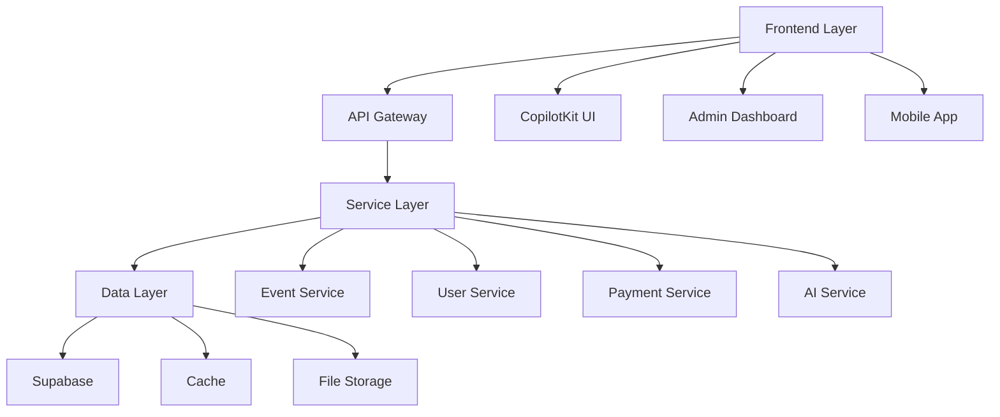
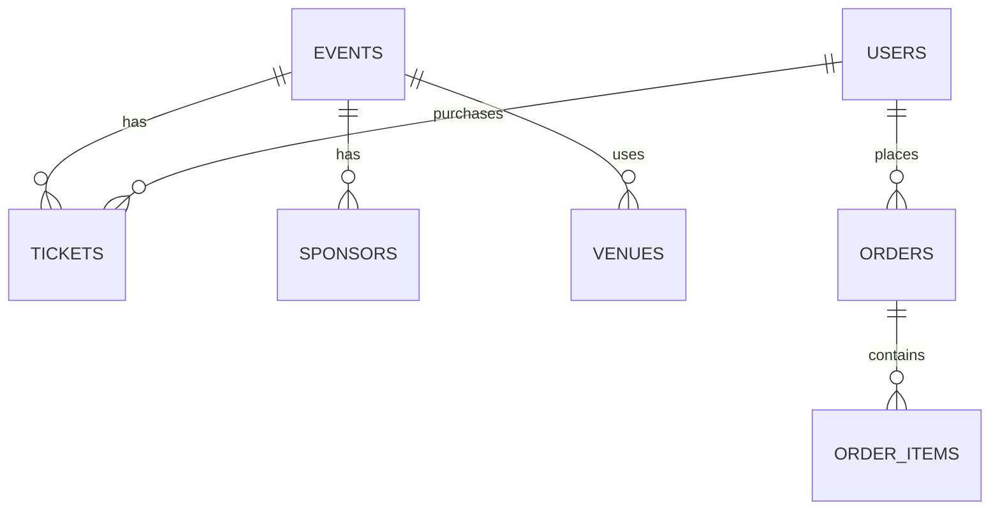
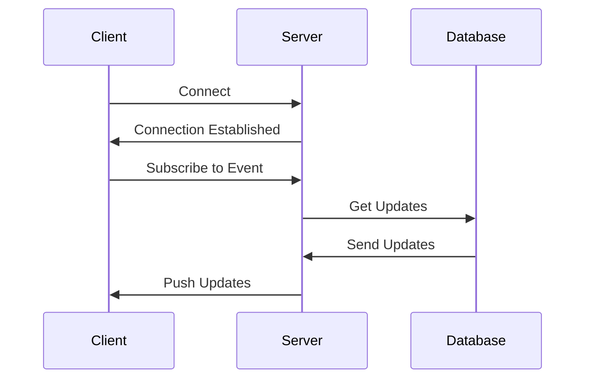
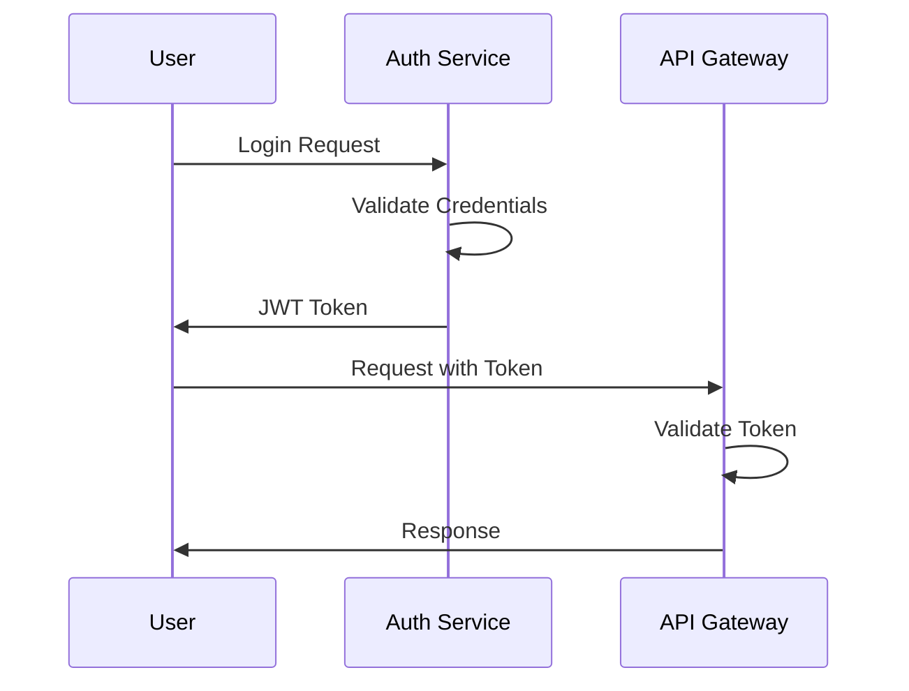
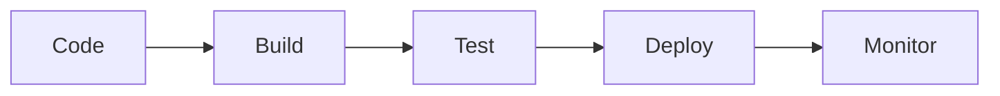

# Technical Implementation & Architecture

## Table of Contents
1. [System Architecture](#system-architecture)
2. [Technology Stack](#technology-stack)
3. [Database Schema](#database-schema)
4. [API Design](#api-design)
5. [Security Implementation](#security-implementation)

## System Architecture



## Technology Stack Details

### 1. Frontend Technologies
| Component | Technology | Purpose |
|-----------|------------|---------|
| UI Framework | CopilotKit | AI-powered interface |
| State Management | Redux | Global state |
| Styling | Tailwind CSS | UI components |
| Testing | Jest | Unit testing |

### 2. Backend Technologies
| Component | Technology | Purpose |
|-----------|------------|---------|
| Database | Supabase | Data storage |
| API Framework | Node.js | Backend services |
| Authentication | Supabase Auth | User management |
| Caching | Redis | Performance |

## Database Schema



### Core Tables

1. **Events Table**
```sql
CREATE TABLE events (
    id UUID PRIMARY KEY,
    name VARCHAR(255),
    description TEXT,
    start_date TIMESTAMP,
    end_date TIMESTAMP,
    venue_id UUID,
    status VARCHAR(50),
    created_at TIMESTAMP DEFAULT NOW()
);
```

2. **Users Table**
```sql
CREATE TABLE users (
    id UUID PRIMARY KEY,
    email VARCHAR(255) UNIQUE,
    name VARCHAR(255),
    role VARCHAR(50),
    created_at TIMESTAMP DEFAULT NOW()
);
```

## API Design

### 1. RESTful Endpoints

| Endpoint | Method | Description |
|----------|--------|-------------|
| /api/events | GET | List events |
| /api/events/:id | GET | Get event details |
| /api/events | POST | Create event |
| /api/events/:id | PUT | Update event |
| /api/events/:id | DELETE | Delete event |

### 2. WebSocket Events



## Security Implementation

### 1. Authentication Flow


### 2. Security Measures

| Layer | Security Measure | Implementation |
|-------|-----------------|----------------|
| Network | SSL/TLS | HTTPS |
| API | Rate Limiting | Express Rate Limit |
| Data | Encryption | AES-256 |
| Auth | JWT | Supabase Auth |

## Performance Optimization

### 1. Caching Strategy
- Redis for session data
- CDN for static assets
- Database query caching

### 2. Load Balancing
- Horizontal scaling
- Auto-scaling groups
- Load balancer configuration

## Monitoring & Logging

### 1. Metrics
- Response times
- Error rates
- Resource usage
- User activity

### 2. Alerts
- Error thresholds
- Performance degradation
- Security incidents
- Resource exhaustion

## Deployment Strategy

### 1. Environments
- Development
- Staging
- Production

### 2. CI/CD Pipeline


## Next Steps
1. Set up development environment
2. Implement core services
3. Configure security measures
4. Deploy monitoring tools
