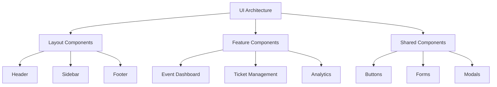
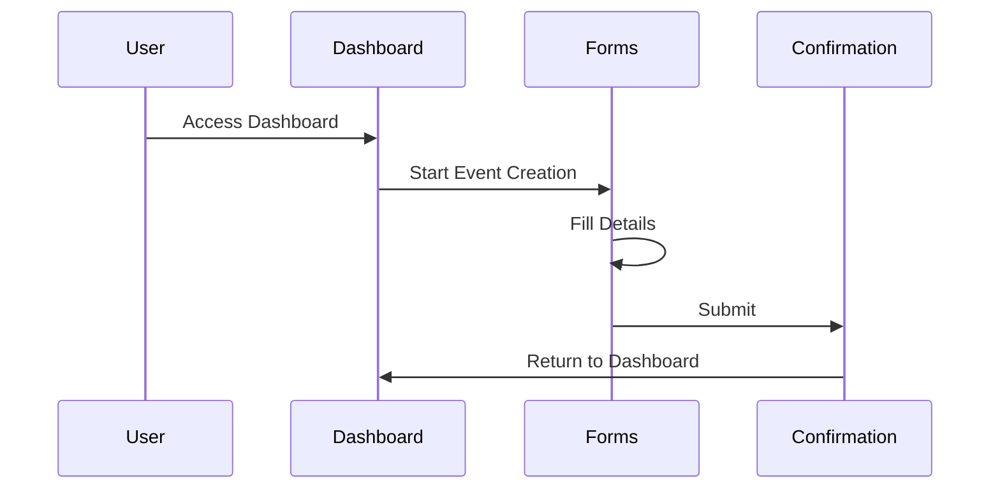
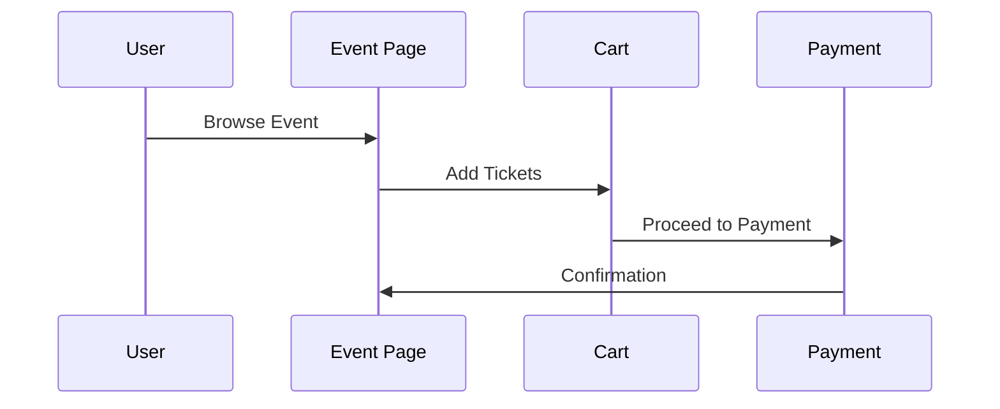
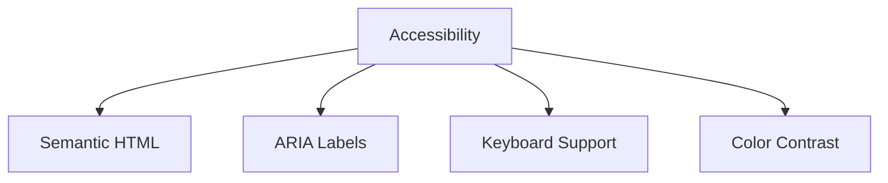

# User Experience & Interface Design

## Table of Contents
1. [User Interface Architecture](#user-interface-architecture)
2. [User Journeys](#user-journeys)
3. [Design System](#design-system)
4. [Accessibility](#accessibility)
5. [Mobile Experience](#mobile-experience)

## User Interface Architecture

## User Journeys

### 1. Event Creation Flow

### 2. Ticket Purchase Flow

## Design System

### 1. Color Palette
| Color | Hex | Usage |
|-------|-----|-------|
| Primary | #4F46E5 | Main actions |
| Secondary | #10B981 | Success states |
| Accent | #F59E0B | Highlights |
| Neutral | #6B7280 | Text |

### 2. Typography
| Element | Font | Size | Weight |
|---------|------|------|---------|
| Headings | Inter | 24-48px | 700 |
| Body | Inter | 16px | 400 |
| Buttons | Inter | 14px | 600 |

## Component Library

### 1. Core Components
| Component | Description | States |
|-----------|-------------|---------|
| Button | Primary action | Default, Hover, Active |
| Input | Text entry | Default, Focus, Error |
| Card | Content container | Default, Hover, Selected |

### 2. Feature Components
| Component | Description | Features |
|-----------|-------------|----------|
| Event Card | Event preview | Image, Title, Date |
| Ticket Selector | Ticket purchase | Quantity, Type |
| Calendar | Date selection | Month view, Week view |

## Accessibility Guidelines

### 1. WCAG Compliance
- Level AA compliance
- Keyboard navigation
- Screen reader support
- Color contrast

### 2. Implementation

## Mobile Experience

### 1. Responsive Design
| Breakpoint | Layout | Features |
|------------|--------|----------|
| Mobile | Single column | Core features |
| Tablet | Two column | Enhanced features |
| Desktop | Multi column | Full features |

### 2. Mobile-First Components
- Bottom navigation
- Swipe gestures
- Touch targets
- Offline support

## User Testing

### 1. Testing Methods
- Usability testing
- A/B testing
- User interviews
- Analytics

### 2. Metrics
| Metric | Target | Measurement |
|--------|--------|-------------|
| Task Success | 90% | User testing |
| Time on Task | < 2 min | Analytics |
| Error Rate | < 5% | Error tracking |

## Performance Optimization

### 1. Loading Strategy
- Lazy loading
- Code splitting
- Image optimization
- Caching

### 2. Performance Metrics
| Metric | Target | Tool |
|--------|--------|------|
| FCP | < 1.8s | Lighthouse |
| TTI | < 3.8s | Lighthouse |
| TBT | < 300ms | Lighthouse |

## Design Documentation

### 1. Component Documentation
- Usage guidelines
- Props interface
- Examples
- Best practices

### 2. Style Guide
- Design principles
- Component usage
- Typography
- Spacing

## Next Steps
1. Implement core components
2. Conduct user testing
3. Optimize performance
4. Enhance accessibility
