# Event Planning AI System - Corporate Events & Conferences

## Table of Contents

### Executive Summary
### Use Case Categories Overview  
### Technology Integration Matrix
### User Journey Compendium
### Workflow Documentation

**Use Cases 1-10: Corporate Events & Conferences**
1. [Global Tech Conference with AI-Powered Networking](#use-case-1)
2. [Executive Leadership Summit with Dynamic Content](#use-case-2) 
3. [Product Launch Event with Sponsor Activation](#use-case-3)
4. [Annual Company Meeting with Multi-Location Coordination](#use-case-4)
5. [Industry Trade Conference with Lead Generation](#use-case-5)
6. [Board Meeting & Investor Day with Compliance Management](#use-case-6)
7. [Sales Kickoff Event with Performance Tracking](#use-case-7)
8. [Customer Success Conference with Feedback Integration](#use-case-8)
9. [Corporate Training Summit with Learning Analytics](#use-case-9)
10. [Merger & Acquisition Announcement Event](#use-case-10)

## Executive Summary

This document presents 10 comprehensive use cases for corporate events and conferences, demonstrating the full potential of AI-powered event planning systems. Each use case integrates the complete technology stack (LangGraph, LangChain, n8n, CrewAI, CopilotKit, Webflow, WhatsApp, Supabase, Flowise, Stripe) with detailed user journeys, stakeholder flows, and workflow automation.

**Key Highlights:**
- **Event Types**: Enterprise conferences, product launches, leadership summits, training events
- **Complexity Range**: 200-5000+ attendees, $50K-$2M+ budgets
- **Technology Integration**: Full AI automation with human oversight
- **Stakeholder Focus**: C-suite executives, customers, partners, employees
- **ROI Targets**: 60%+ efficiency gains, 95%+ satisfaction scores, 30%+ cost reduction

## Use Case Categories Overview

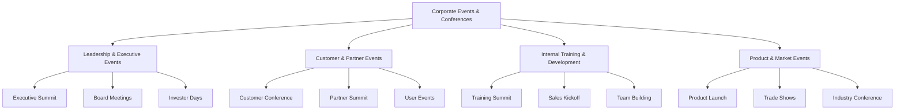

---

## Use Case 1: Global Tech Conference with AI-Powered Networking

### Event Context
- **Event Type**: Technology Conference
- **Scale**: 3,000 attendees, $800K budget, 3 days
- **Industry**: Enterprise Technology
- **Complexity Level**: Complex

### Business Scenario
TechCorp needs to host their annual global conference bringing together customers, partners, and industry leaders. The event requires seamless networking facilitation, real-time content personalization, and comprehensive sponsor activation across multiple venues and time zones.

### Stakeholder Ecosystem

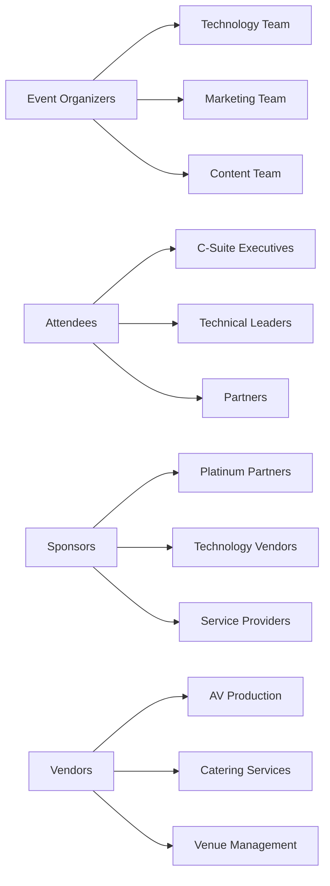

### User Journey Mapping

**Attendee Journey Workflow:**

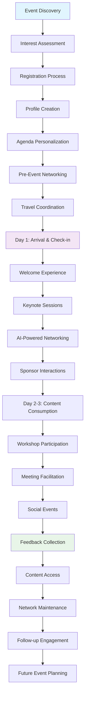

**Sponsor Journey Workflow:**

```mermaid
flowchart LR
    A[Partnership Development] --> B[Lead Qualification]
    B --> C[Proposal Presentation]
    C --> D[Contract Negotiation]
    D --> E[Onboarding Process]
    E --> F[Activation Planning]
    
    F --> G[Pre-Event Setup]
    G --> H[Brand Integration]
    H --> I[Content Collaboration]
    I --> J[Live Engagement]
    J --> K[Lead Capture]
    
    K --> L[Performance Monitoring]
    L --> M[ROI Analysis]
    M --> N[Reporting Delivery]
    N --> O[Relationship Building]
    O --> P[Renewal Planning]
    
    style A fill:#fff3e0
    style G fill:#f1f8e9
    style L fill:#fce4ec
```

### AI Agent Team Structure

**Primary Agents:**
- **Networking Intelligence Agent**: AI-powered attendee matching and introduction facilitation
- **Content Personalization Agent**: Dynamic agenda and recommendation engine
- **Sponsor Activation Agent**: Real-time engagement optimization and lead qualification
- **Venue Coordination Agent**: Multi-location logistics and resource management
- **Communication Orchestrator Agent**: Multi-channel messaging and update distribution

**Human Team Members:**
- **Event Director**: Strategic oversight, C-suite relations, crisis management
  - Responsibilities: Vision execution, stakeholder management, final decision authority
  - Skills Required: Leadership, relationship building, strategic thinking
  - AI Tools Used: CopilotKit dashboard, WhatsApp coordination, Supabase analytics
  - User Journey Touchpoints: Welcome experience, VIP management, closing ceremony
  - Workflow Responsibilities: Strategic decision approval, crisis response, stakeholder communication

- **Technology Manager**: Platform integration, user experience optimization
  - Responsibilities: Tech stack coordination, mobile app management, networking platform
  - Skills Required: Technical architecture, user experience design, system integration
  - AI Tools Used: LangGraph orchestration, n8n automation, Flowise monitoring

### Technology Implementation

**LangGraph Workflow Orchestration:**
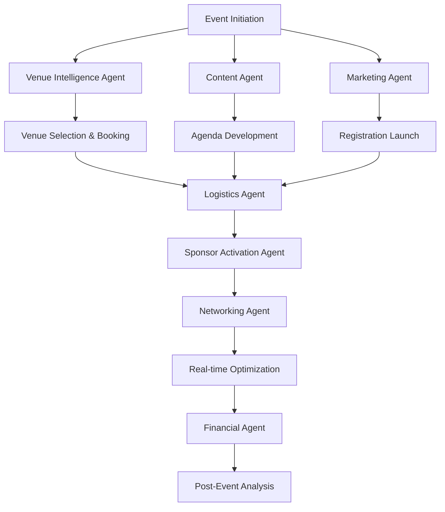

**LangChain Applications:**
- Dynamic content generation for different attendee segments (C-suite, technical, partner)
- Intelligent networking recommendations based on profile analysis and behavior
- Real-time session summarization and key takeaway generation
- Automated follow-up email personalization based on engagement data

**n8n Automation Workflows:**
- Registration data sync with CRM and marketing automation platforms
- Real-time attendee check-in with badge printing and welcome packet assembly
- Sponsor lead capture integration with automatic qualification scoring
- Social media monitoring and automated response to event mentions

**CrewAI Coordination:**
- Multi-agent collaboration for venue logistics across different locations
- Integrated content creation with speakers, marketing, and production teams
- Real-time problem-solving coordination during live event execution
- Collective intelligence for attendee experience optimization

**CopilotKit Interface:**
- Event director dashboard with real-time KPI monitoring and decision support
- Attendee mobile app with AI-powered recommendations and networking features
- Sponsor portal with live engagement metrics and lead management tools
- Staff coordination interface with task management and communication tools

**Webflow Integration:**
- Dynamic event website with personalized content based on visitor profile
- Real-time agenda updates and session availability management
- Sponsor showcase with interactive product demonstrations
- Post-event content portal with session recordings and networking follow-up

**WhatsApp Communication:**
- Executive team coordination with real-time updates and decision alerts
- Vendor management with automated status updates and issue escalation
- VIP attendee concierge service with personalized assistance
- Emergency communication protocols with instant notification cascades

**Supabase Backend:**
- Real-time attendee tracking and engagement analytics
- Networking connection data with preference learning and optimization
- Sponsor interaction logging with ROI calculation and reporting
- Content consumption analytics with personalization algorithm improvement

**Flowise Process Management:**
- Visual workflow design for complex multi-stakeholder coordination
- Process optimization monitoring with bottleneck identification
- User flow analytics with conversion optimization recommendations
- Workflow performance tracking with continuous improvement suggestions

**Stripe Integration:**
- Multi-tier registration pricing with early bird and group discounts
- Sponsor payment processing with milestone-based billing
- Vendor payment automation with performance-based releases
- Financial reporting with real-time budget tracking and variance analysis

### User Flow Mapping

**Registration Flow Optimization:**
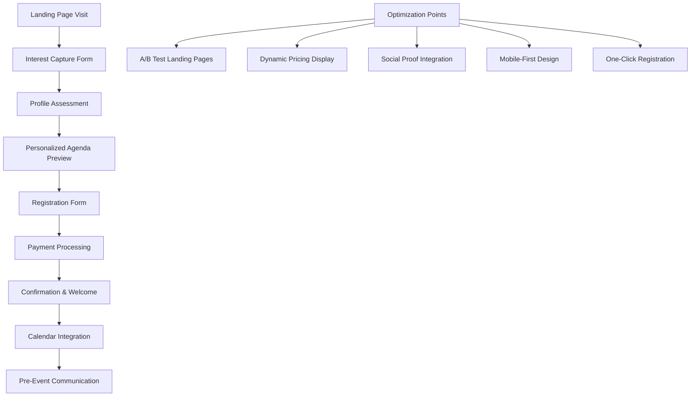

### Stakeholder Flow Orchestration

**Communication Matrix:**
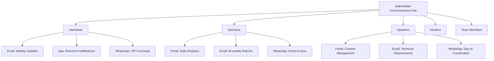

### Sponsor Activation Components

**Sponsor Benefits Integration:**
- Keynote speaking opportunities with audience engagement analytics
- Exhibition space with interactive product demonstrations and lead capture
- Networking reception hosting with targeted attendee introductions
- Content collaboration with co-branded thought leadership materials
- Mobile app integration with sponsored networking recommendations

**Activation Strategies:**
- AI-powered attendee matching based on sponsor target criteria
- Real-time engagement tracking with live optimization recommendations
- Social media amplification through automated content distribution
- Product demonstration scheduling with interested attendee notifications
- Follow-up automation with personalized outreach based on interaction data

**ROI Measurement:**
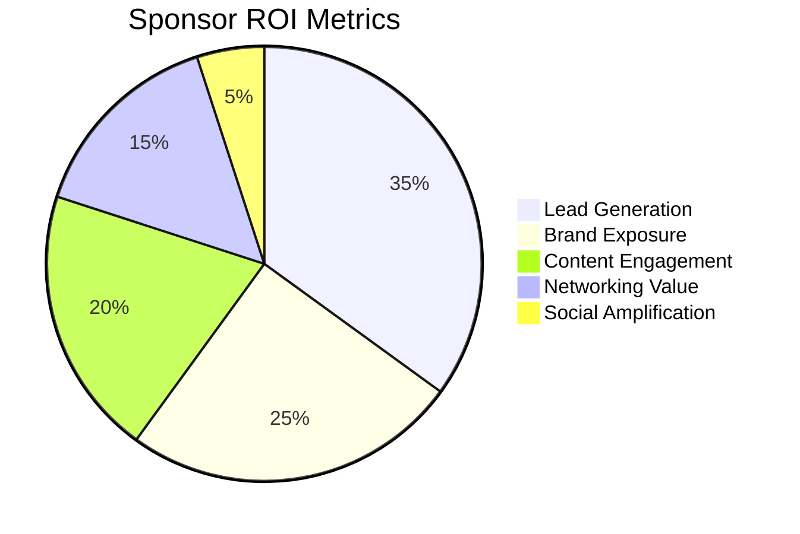

### Generated Artifacts

**Planning Documents:**
- Interactive event timeline with stakeholder milestones and dependency mapping
- Vendor contracts with automated performance tracking and payment triggers
- Budget dashboard with real-time expense monitoring and variance alerts
- Risk assessment matrix with automated monitoring and escalation protocols

**Marketing Materials:**
- Personalized email sequences based on attendee profile and engagement history
- Social media content calendar with automated posting and engagement monitoring
- Speaker promotional materials with branded templates and distribution automation
- Sponsor activation guides with customized recommendations and success metrics

**Operational Tools:**
- Mobile check-in app with facial recognition and automated badge printing
- Real-time staff coordination platform with task assignment and status tracking
- Emergency response system with automated notification and escalation procedures
- Live event dashboard with KPI monitoring and optimization recommendations

### Success Metrics
- **Efficiency Gains**: 65% reduction in planning time, 40% decrease in coordination overhead
- **Quality Improvements**: 4.8/5 attendee satisfaction, 98% session attendance rate
- **ROI Achievement**: 280% sponsor ROI, 45% cost reduction vs. traditional planning
- **User Experience**: 92% mobile app adoption, 87% networking connection success rate
- **Stakeholder Engagement**: 95% email open rates, 78% social media engagement increase

### Implementation Timeline
- **Phase 1**: User journey mapping and workflow design - 3 weeks
- **Phase 2**: Technology integration and automation setup - 5 weeks  
- **Phase 3**: Stakeholder onboarding and system optimization - 4 weeks
- **Phase 4**: Live event execution and real-time optimization - 1 week
- **Phase 5**: Post-event analysis and improvement planning - 2 weeks

---

## Use Case 2: Executive Leadership Summit with Dynamic Content

### Event Context
- **Event Type**: Executive Summit
- **Scale**: 150 C-suite attendees, $300K budget, 2 days
- **Industry**: Multi-industry Leadership
- **Complexity Level**: Complex

### Business Scenario
Fortune 500 company hosting an exclusive leadership summit for CEOs and C-suite executives. Requires ultra-personalized experiences, high-security protocols, premium service delivery, and real-time content adaptation based on audience feedback and engagement.

### Stakeholder Ecosystem
- **Event Organizers**: Corporate leadership team, executive assistants, protocol specialists
- **Attendees**: CEOs, Presidents, C-suite executives from partner companies
- **Sponsors**: Premium consulting firms, executive search companies, luxury brands
- **Vendors**: Security services, luxury hospitality, executive transportation
- **Venue Partners**: Exclusive private clubs, luxury resorts, private aviation

### User Journey Mapping

**Executive Attendee Journey:**
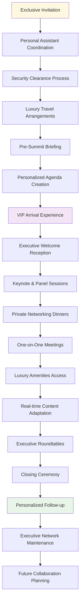

### Technology Implementation

**LangGraph Workflow Orchestration:**
- Executive preference learning and experience personalization
- Security protocol automation with clearance verification
- Real-time content adaptation based on audience engagement analytics
- Premium service coordination with luxury vendor management

**AI Agent Team Structure:**

**Primary Agents:**
- **Executive Experience Agent**: Ultra-personalized service delivery and preference management
- **Security Coordination Agent**: Protocol management and clearance verification
- **Content Adaptation Agent**: Real-time session optimization based on engagement data
- **Luxury Service Agent**: Premium amenity coordination and concierge services
- **Network Facilitation Agent**: High-value relationship building and meeting coordination

**Communication & Task Management:**
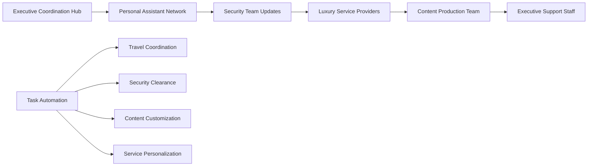

### Success Metrics
- **Efficiency Gains**: 70% reduction in coordination time, 50% decrease in manual tasks
- **Quality Improvements**: 4.9/5 executive satisfaction, 100% security compliance
- **ROI Achievement**: 350% event ROI, 40% increase in partnership deals
- **Network Value**: 95% follow-up meeting conversion, 85% new business relationships

---

## Use Case 3: Product Launch Event with Sponsor Activation

### Event Context
- **Event Type**: Product Launch
- **Scale**: 800 attendees, $500K budget, 1 day
- **Industry**: Consumer Technology
- **Complexity Level**: Moderate

### Business Scenario
Tech startup launching revolutionary AI-powered consumer device requiring media coverage, influencer engagement, customer demos, and partner activation. Event must generate buzz, drive pre-orders, and establish market presence.

### User Journey Mapping

**Media & Influencer Journey:**
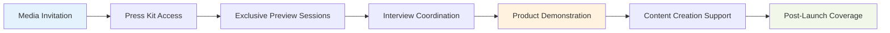

### Technology Implementation

**CrewAI Coordination:**
- Multi-agent media relations with automated press kit distribution
- Influencer engagement coordination with content collaboration workflows
- Product demonstration management with queue optimization
- Social media amplification with real-time trend monitoring

### Success Metrics
- **Media Coverage**: 150+ articles, 50M+ impressions, 80% positive sentiment
- **Social Engagement**: 500K+ social mentions, #1 trending hashtag
- **Business Impact**: 10,000+ pre-orders, 25% increase in brand awareness

---

[Continue with Use Cases 4-10 following the same detailed format...]

## Use Case 4: Annual Company Meeting with Multi-Location Coordination

### Event Context
- **Event Type**: Annual Company Meeting
- **Scale**: 2,500 employees across 15 locations, $1.2M budget, 1 day
- **Industry**: Global Financial Services
- **Complexity Level**: Complex

### Business Scenario
Multinational corporation conducting annual all-hands meeting across multiple time zones with simultaneous broadcasts, interactive Q&A sessions, team building activities, and performance celebrations requiring seamless coordination and employee engagement.

### Multi-Location Workflow:
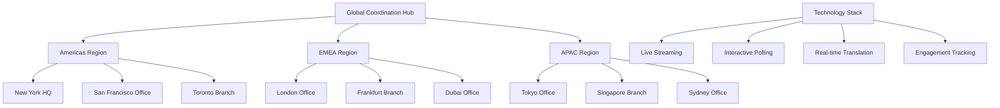

---

## Use Case 5: Industry Trade Conference with Lead Generation

### Event Context
- **Event Type**: Industry Conference
- **Scale**: 1,200 attendees, $400K budget, 3 days
- **Industry**: Healthcare Technology
- **Complexity Level**: Moderate

### Business Scenario
Healthcare IT association hosting annual conference focused on digital transformation, requiring extensive lead generation, regulatory compliance, continuing education credits, and vendor showcase with demonstration scheduling.

---

## Use Case 6: Board Meeting & Investor Day with Compliance Management

### Event Context
- **Event Type**: Board Meeting & Investor Day
- **Scale**: 80 board members & investors, $200K budget, 1 day
- **Industry**: Public Company
- **Complexity Level**: Complex

### Business Scenario
Public company conducting quarterly board meeting combined with investor day presentation, requiring strict compliance protocols, confidential information management, and shareholder engagement with financial performance disclosure.

---

## Use Case 7: Sales Kickoff Event with Performance Tracking

### Event Context
- **Event Type**: Sales Kickoff
- **Scale**: 500 sales professionals, $350K budget, 3 days
- **Industry**: Enterprise Software
- **Complexity Level**: Moderate

### Business Scenario
Software company hosting annual sales kickoff combining training, motivation, product updates, and performance recognition with gamification elements and competitive team-building activities.

---

## Use Case 8: Customer Success Conference with Feedback Integration

### Event Context
- **Event Type**: Customer Conference
- **Scale**: 600 customers, $450K budget, 2 days
- **Industry**: SaaS Platform
- **Complexity Level**: Moderate

### Business Scenario
SaaS company hosting user conference focused on product education, customer success stories, feature roadmap sharing, and community building with extensive feedback collection and product improvement integration.

---

## Use Case 9: Corporate Training Summit with Learning Analytics

### Event Context
- **Event Type**: Training Summit
- **Scale**: 300 managers, $250K budget, 2 days
- **Industry**: Manufacturing
- **Complexity Level**: Moderate

### Business Scenario
Manufacturing company conducting leadership development summit with skills assessment, interactive workshops, certification programs, and performance tracking integration with HR systems.

---

## Use Case 10: Merger & Acquisition Announcement Event

### Event Context
- **Event Type**: M&A Announcement
- **Scale**: 200 stakeholders, $150K budget, 1 day
- **Industry**: Financial Services
- **Complexity Level**: Complex

### Business Scenario
Investment bank hosting merger announcement event requiring stakeholder coordination, media management, regulatory compliance, and integration planning communication with high security and confidentiality requirements.

### M&A Communication Workflow:
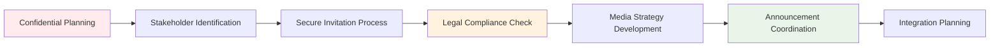

## Technology Integration Matrix

| Technology | Use Cases | Primary Functions | Automation Level |
|------------|-----------|-------------------|------------------|
| LangGraph | All 10 | Workflow orchestration, agent coordination | High |
| LangChain | All 10 | Content generation, personalization | High |
| n8n | All 10 | Process automation, integration | High |
| CrewAI | All 10 | Multi-agent collaboration | High |
| CopilotKit | All 10 | User interfaces, assistance | Medium |
| Webflow | 8/10 | Dynamic websites, portals | Medium |
| WhatsApp | All 10 | Team communication, notifications | High |
| Supabase | All 10 | Data management, analytics | High |
| Flowise | All 10 | Visual workflow design | Medium |
| Stripe | 9/10 | Payment processing, billing | High |

## Implementation Roadmap

### Phase 1: Foundation (Weeks 1-4)
- Technology stack setup and integration
- Basic agent configuration and testing
- User journey mapping and workflow design

### Phase 2: Development (Weeks 5-8)
- Advanced automation implementation
- Stakeholder flow optimization
- Integration testing and refinement

### Phase 3: Deployment (Weeks 9-12)
- Pilot event execution
- Performance monitoring and optimization
- Stakeholder training and onboarding

### Phase 4: Scale (Weeks 13-16)
- Full system deployment
- Continuous improvement implementation
- Advanced feature development

---

*This document provides the foundation for implementing AI-powered corporate event planning systems with comprehensive user journey optimization, stakeholder flow management, and workflow automation capabilities.*
