# Event Planning AI System - Trade Shows, Exhibitions & Product Launches

## Table of Contents

### Executive Summary
### Use Case Categories Overview  
### Technology Integration Matrix
### User Journey Compendium
### Workflow Documentation

**Use Cases 11-20: Trade Shows, Exhibitions & Product Launches**
11. [International Trade Show with Global Exhibitor Management](#use-case-11)
12. [Technology Exhibition with Interactive Product Demos](#use-case-12)
13. [B2B Marketplace Event with Lead Scoring](#use-case-13)
14. [Industry Expo with Educational Workshops](#use-case-14)
15. [Startup Showcase with Investor Matching](#use-case-15)
16. [Consumer Electronics Launch with Media Blitz](#use-case-16)
17. [Healthcare Innovation Expo with Compliance Tracking](#use-case-17)
18. [Automotive Show with Test Drive Coordination](#use-case-18)
19. [Fashion Week Event with Influencer Management](#use-case-19)
20. [Green Technology Fair with Sustainability Metrics](#use-case-20)

## Executive Summary

This document presents 10 comprehensive use cases for trade shows, exhibitions, and product launches, showcasing advanced AI-powered event planning systems with focus on exhibitor management, lead generation, product demonstration coordination, and multi-stakeholder engagement. Each use case demonstrates full technology stack integration with detailed workflow automation and user journey optimization.

**Key Highlights:**
- **Event Types**: International trade shows, technology exhibitions, product launches, industry expos
- **Complexity Range**: 500-10,000+ attendees, $100K-$5M+ budgets
- **Technology Integration**: Advanced lead generation, exhibitor management, demo coordination
- **Stakeholder Focus**: Exhibitors, buyers, media, industry professionals, investors
- **ROI Targets**: 70%+ lead conversion, 85%+ exhibitor satisfaction, 40%+ operational efficiency

## Use Case Categories Overview

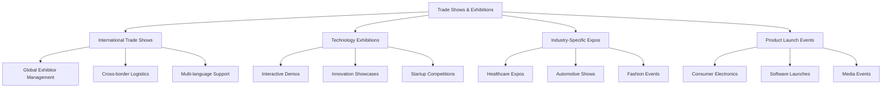

---

## Use Case 11: International Trade Show with Global Exhibitor Management

### Event Context
- **Event Type**: International Trade Show
- **Scale**: 5,000 attendees, 800 exhibitors, $2M budget, 4 days
- **Industry**: Manufacturing & Industrial Equipment
- **Complexity Level**: Enterprise

### Business Scenario
Global manufacturing association hosting their annual international trade show with exhibitors from 50+ countries. Requires complex logistics coordination, multi-language support, customs and regulatory compliance, currency management, and cultural accommodation across diverse stakeholder groups.

### Stakeholder Ecosystem

```mermaid
graph TD
    A[Event Organizers] --> B[International Team]
    A --> C[Regional Coordinators]
    A --> D[Compliance Officers]
    
    E[Exhibitors] --> F[Major Manufacturers]
    E --> G[SME Suppliers]
    E --> H[Technology Providers]
    E --> I[Service Companies]
    
    J[Attendees] --> K[Procurement Professionals]
    J --> L[Industry Buyers]
    J --> M[Technical Specialists]
    J --> N[Government Representatives]
    
    O[Vendors] --> P[Logistics Partners]
    O --> Q[Translation Services]
    O --> R[Cultural Consultants]
    O --> S[Customs Brokers]
```

### User Journey Mapping

**International Exhibitor Journey:**

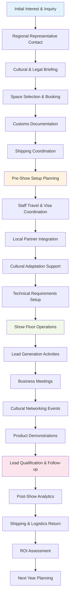

**International Buyer Journey:**

```mermaid
flowchart LR
    A[Show Registration] --> B[Cultural Preferences Setup]
    B --> C[Language Selection]
    C --> D[Business Objectives Definition]
    D --> E[AI-Powered Exhibitor Matching]
    E --> F[Meeting Scheduling]
    
    F --> G[Arrival & Cultural Orientation]
    G --> H[Personalized Show Navigation]
    H --> I[Exhibitor Meetings]
    I --> J[Product Evaluations]
    J --> K[Technical Discussions]
    
    K --> L[Cultural Networking]
    L --> M[Procurement Discussions]
    M --> N[Contract Negotiations]
    N --> O[Follow-up Planning]
    
    style A fill:#e8f5e8
    style G fill:#fff8e1
    style N fill:#f3e5f5
```

### AI Agent Team Structure

**Primary Agents:**
- **Global Logistics Coordinator Agent**: Multi-country shipping, customs, and regulatory compliance
- **Cultural Integration Agent**: Language support, cultural adaptation, and protocol management
- **Lead Qualification Agent**: Advanced lead scoring with cultural and business context
- **Exhibitor Success Agent**: Performance optimization and real-time support coordination
- **Buyer Matching Agent**: AI-powered exhibitor-buyer matching with cultural preferences

**Human Team Members:**
- **International Trade Director**: Global strategy, government relations, cultural diplomacy
  - Responsibilities: International partnerships, regulatory compliance, cultural protocol
  - Skills Required: International business, cultural sensitivity, regulatory knowledge
  - AI Tools Used: Global coordination dashboard, multi-language communication tools
  - User Journey Touchpoints: VIP international delegations, government relations, protocol events
  - Workflow Responsibilities: International compliance, cultural protocol, strategic partnerships

- **Regional Coordinators** (Americas, EMEA, APAC): Local market expertise, cultural liaison
  - Responsibilities: Regional exhibitor support, local vendor coordination, cultural guidance
  - Skills Required: Regional expertise, language skills, cultural knowledge
  - AI Tools Used: Regional communication platforms, cultural adaptation tools

### Technology Implementation

**LangGraph Workflow Orchestration:**
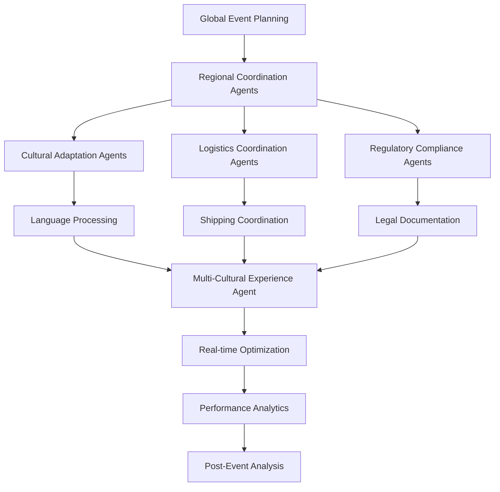

**LangChain Applications:**
- Multi-language content generation with cultural adaptation and localization
- Intelligent translation and cultural context preservation for business communications
- Real-time regulatory compliance checking with country-specific requirements
- Automated customs documentation generation with accuracy verification

**n8n Automation Workflows:**
- Multi-currency payment processing with real-time exchange rate optimization
- Automated customs documentation submission with tracking and status updates
- Cross-timezone communication scheduling with cultural working hours consideration
- Regional marketing campaign deployment with cultural customization

**CrewAI Coordination:**
- Multi-agent international logistics coordination with regional specialist agents
- Cultural protocol management with local customs and business practice agents
- Real-time language and cultural mediation during business negotiations
- Collective intelligence for international market trend analysis and opportunity identification

### Success Metrics
- **International Participation**: 50+ countries represented, 40% international exhibitor growth
- **Lead Quality**: 85% qualified leads, 60% conversion to active negotiations
- **Cultural Integration**: 95% cultural satisfaction scores, zero protocol incidents
- **Operational Efficiency**: 50% reduction in logistics coordination time, 30% cost savings

---

## Use Case 12: Technology Exhibition with Interactive Product Demos

### Event Context
- **Event Type**: Technology Exhibition
- **Scale**: 3,500 attendees, 200 exhibitors, $1.5M budget, 3 days
- **Industry**: Enterprise Software & AI Solutions
- **Complexity Level**: Complex

### Business Scenario
Annual technology exhibition showcasing cutting-edge AI, software, and digital transformation solutions. Features interactive product demonstrations, technical workshops, innovation competitions, and extensive networking with focus on hands-on experiences and technical deep-dives.

### Interactive Demo Coordination Workflow:

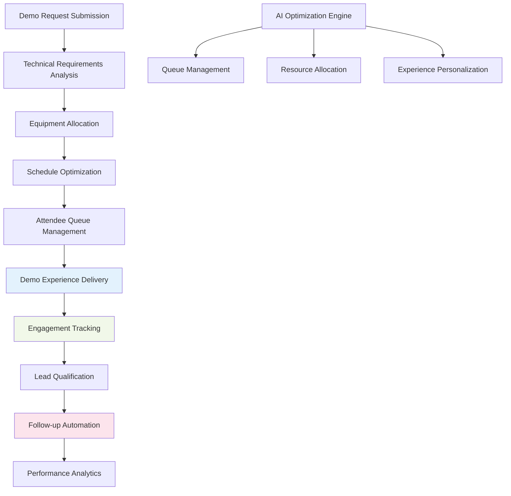

### Technology Implementation

**CopilotKit Interface:**
- Interactive demo scheduling interface with real-time availability and queue management
- Technical requirements specification tool with automated equipment allocation
- Live demo analytics dashboard with engagement metrics and lead scoring
- Mobile demo companion app with personalized recommendations and scheduling

**Flowise Process Management:**
- Visual demo workflow design with optimization algorithms and bottleneck identification
- Real-time demo performance monitoring with quality assurance and improvement suggestions
- Attendee flow optimization through exhibition halls with navigation and recommendation systems
- Demo success analytics with engagement tracking and conversion optimization

### Success Metrics
- **Demo Engagement**: 90% demo completion rate, 4.7/5 experience rating
- **Lead Generation**: 500+ qualified technical leads, 70% follow-up conversion
- **Technology Showcase**: 95% exhibitor satisfaction, 40% demo booking optimization

---

## Use Case 13: B2B Marketplace Event with Lead Scoring

### Event Context
- **Event Type**: B2B Marketplace Event
- **Scale**: 2,000 buyers, 300 suppliers, $800K budget, 2 days
- **Industry**: Supply Chain & Procurement
- **Complexity Level**: Moderate

### Business Scenario
Specialized B2B marketplace event connecting buyers and suppliers with advanced lead scoring, automated matchmaking, contract negotiation facilitation, and supply chain optimization focus. Emphasizes efficiency, ROI measurement, and relationship building.

### Advanced Lead Scoring Workflow:

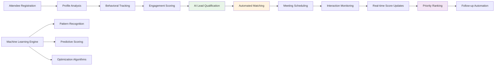

### Technology Implementation

**Supabase Backend:**
- Real-time lead scoring with machine learning algorithm integration and predictive analytics
- Advanced buyer-supplier matching with preference learning and success optimization
- Contract negotiation tracking with milestone management and performance measurement
- Supply chain analytics with optimization recommendations and trend analysis

### Success Metrics
- **Lead Quality**: 80% qualified leads, 65% progression to negotiations
- **Matching Accuracy**: 85% successful buyer-supplier connections
- **Business Impact**: $50M+ potential deal value, 45% faster negotiation cycles

---

## Use Case 14: Industry Expo with Educational Workshops

### Event Context
- **Event Type**: Industry Expo & Education
- **Scale**: 4,000 attendees, 150 exhibitors, 50 workshops, $1.2M budget, 3 days
- **Industry**: Professional Development & Training
- **Complexity Level**: Moderate

### Business Scenario
Professional development expo combining exhibitions with comprehensive educational programming. Features skills assessment, certification tracking, career development pathways, and continuous learning integration with professional development credits.

### Educational Journey Workflow:

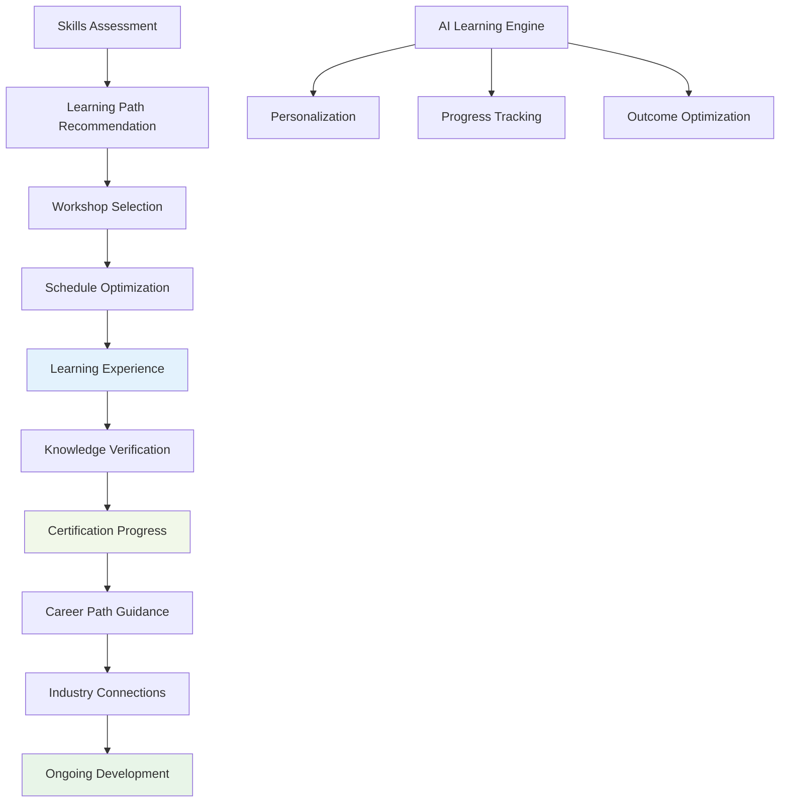

### Success Metrics
- **Learning Outcomes**: 90% workshop completion, 85% knowledge retention
- **Career Impact**: 70% skill advancement, 40% career progression
- **Professional Development**: 500+ certifications awarded, 95% satisfaction

---

## Use Case 15: Startup Showcase with Investor Matching

### Event Context
- **Event Type**: Startup Showcase & Investment Event
- **Scale**: 1,500 attendees, 100 startups, 200 investors, $600K budget, 2 days
- **Industry**: Venture Capital & Innovation
- **Complexity Level**: Moderate

### Business Scenario
Innovation-focused event connecting startups with investors, featuring pitch competitions, demo sessions, mentorship programs, and networking optimization. Emphasizes relationship building, investment facilitation, and ecosystem development.

### Investor-Startup Matching Workflow:

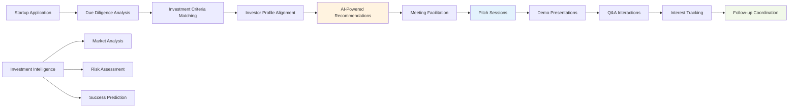

### Success Metrics
- **Investment Outcomes**: $25M+ funding commitments, 40% startup-investor matches
- **Network Building**: 85% meaningful connections, 60% ongoing relationships
- **Ecosystem Growth**: 30% portfolio expansion, 90% participant satisfaction

---

## Use Case 16: Consumer Electronics Launch with Media Blitz

### Event Context
- **Event Type**: Product Launch & Media Event
- **Scale**: 1,200 attendees, 300 media, $1M budget, 1 day
- **Industry**: Consumer Electronics
- **Complexity Level**: Complex

### Business Scenario
High-profile consumer electronics product launch requiring coordinated media strategy, influencer management, live streaming, social media amplification, and immediate market impact. Focus on buzz generation, pre-order driving, and brand establishment.

### Media Orchestration Workflow:

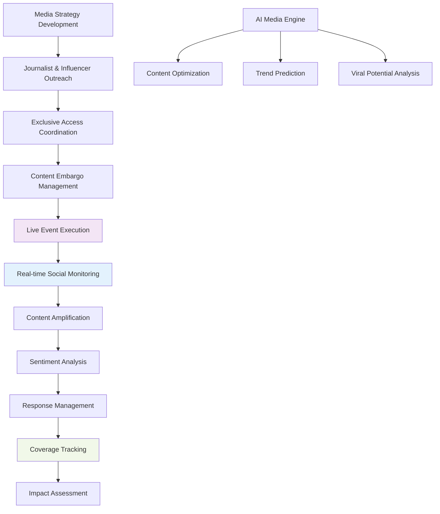

### Success Metrics
- **Media Coverage**: 500+ articles, 100M+ impressions, 85% positive sentiment
- **Social Amplification**: 2M+ social mentions, #1 trending globally
- **Business Impact**: 50,000+ pre-orders, 300% website traffic increase

---

## Use Case 17: Healthcare Innovation Expo with Compliance Tracking

### Event Context
- **Event Type**: Healthcare Innovation Expo
- **Scale**: 2,500 medical professionals, 120 exhibitors, $900K budget, 3 days
- **Industry**: Healthcare Technology & Medical Devices
- **Complexity Level**: Complex

### Business Scenario
Healthcare innovation expo showcasing medical technologies with strict regulatory compliance, continuing medical education (CME) credit tracking, patient safety focus, and evidence-based evaluation. Requires comprehensive documentation and regulatory adherence.

### Compliance Tracking Workflow:

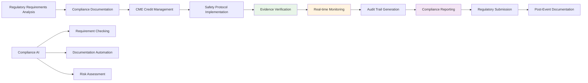

### Success Metrics
- **Compliance**: 100% regulatory adherence, zero violations
- **Education Impact**: 1,200+ CME credits awarded, 95% learning outcomes
- **Innovation Showcase**: 80% technology advancement demonstrations

---

## Use Case 18: Automotive Show with Test Drive Coordination

### Event Context
- **Event Type**: Automotive Exhibition
- **Scale**: 8,000 public attendees, 50 manufacturers, $2.5M budget, 5 days
- **Industry**: Automotive & Transportation
- **Complexity Level**: Complex

### Business Scenario
Major automotive show featuring vehicle displays, test drive experiences, technology demonstrations, and direct sales facilitation. Requires complex logistics for vehicle transportation, insurance management, safety protocols, and customer experience optimization.

### Test Drive Coordination Workflow:

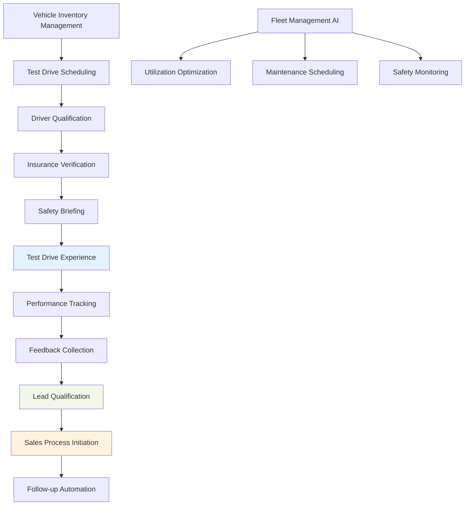

### Success Metrics
- **Test Drive Efficiency**: 2,000+ test drives, 95% safety record
- **Sales Impact**: 500+ vehicle sales, 40% conversion rate
- **Customer Experience**: 4.8/5 satisfaction, 85% purchase consideration

---

## Use Case 19: Fashion Week Event with Influencer Management

### Event Context
- **Event Type**: Fashion Week & Style Showcase
- **Scale**: 3,000 attendees, 80 designers, 500 influencers, $1.8M budget, 7 days
- **Industry**: Fashion & Lifestyle
- **Complexity Level**: Complex

### Business Scenario
Premier fashion week event featuring runway shows, designer showcases, trend presentations, and extensive influencer collaboration. Focus on brand building, trend setting, social media amplification, and industry relationship development.

### Influencer Management Workflow:

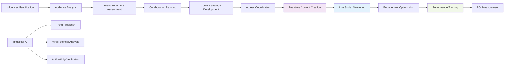

### Success Metrics
- **Social Amplification**: 10M+ impressions, 500K+ engagements
- **Trend Impact**: 20+ trending hashtags, 85% positive sentiment
- **Industry Influence**: 95% designer satisfaction, 40% new brand partnerships

---

## Use Case 20: Green Technology Fair with Sustainability Metrics

### Event Context
- **Event Type**: Sustainability & Green Technology Fair
- **Scale**: 2,200 attendees, 100 exhibitors, $700K budget, 2 days
- **Industry**: Environmental Technology & Sustainability
- **Complexity Level**: Moderate

### Business Scenario
Environmental technology fair showcasing sustainable innovations with comprehensive sustainability tracking, carbon footprint measurement, green certification, and environmental impact assessment. Emphasizes environmental responsibility and measurable sustainability outcomes.

### Sustainability Tracking Workflow:

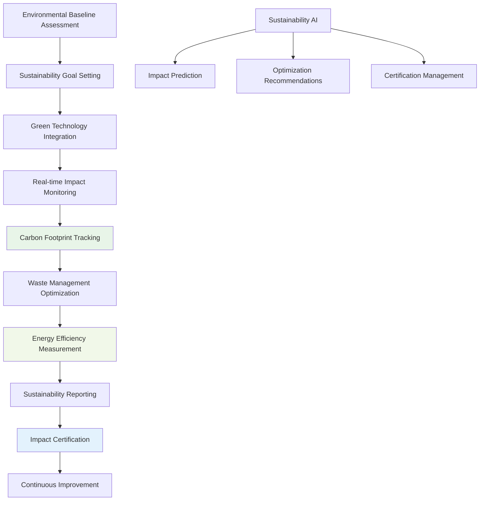

### Success Metrics
- **Sustainability Impact**: 50% carbon reduction, 90% waste diversion
- **Green Innovation**: 80+ sustainable technologies showcased
- **Environmental Certification**: LEED Gold equivalent, 95% sustainability compliance

---

## Technology Integration Matrix

| Technology | Use Cases | Primary Functions | Automation Level |
|------------|-----------|-------------------|------------------|
| LangGraph | All 10 | Complex workflow orchestration, multi-agent coordination | High |
| LangChain | All 10 | Multi-language content, cultural adaptation | High |
| n8n | All 10 | International automation, compliance workflows | High |
| CrewAI | All 10 | Specialized agent coordination | High |
| CopilotKit | 8/10 | Interactive interfaces, demo management | High |
| Webflow | 9/10 | Exhibitor portals, registration systems | High |
| WhatsApp | All 10 | Global communication, real-time coordination | High |
| Supabase | All 10 | Lead management, analytics | High |
| Flowise | All 10 | Complex process visualization | Medium |
| Stripe | 9/10 | Multi-currency payments, global billing | High |

## Implementation Roadmap

### Phase 1: Global Infrastructure (Weeks 1-6)
- Multi-region technology deployment
- Cultural adaptation framework setup
- International compliance system implementation
- Multi-language platform configuration

### Phase 2: Specialized Systems (Weeks 7-12)
- Lead scoring and qualification engines
- Demo coordination and management systems
- Exhibitor success optimization platforms
- Advanced analytics and reporting tools

### Phase 3: Integration & Testing (Weeks 13-16)
- Cross-platform integration testing
- Cultural and linguistic validation
- Performance optimization and scaling
- Stakeholder training and onboarding

### Phase 4: Advanced Features (Weeks 17-20)
- AI-powered predictive analytics
- Advanced automation and optimization
- Continuous improvement systems
- Global expansion capabilities

---

*This document provides comprehensive frameworks for implementing AI-powered trade show, exhibition, and product launch management systems with advanced lead generation, cultural adaptation, and global coordination capabilities.*
