# Event Planning AI System - Social Events, Weddings & Entertainment

## Table of Contents

### Executive Summary
### Use Case Categories Overview  
### Technology Integration Matrix
### User Journey Compendium
### Workflow Documentation

**Use Cases 21-30: Social Events, Weddings & Entertainment**
21. [Luxury Wedding with Multi-Vendor Coordination](#use-case-21)
22. [Music Festival with Crowd Management](#use-case-22)
23. [Corporate Gala with Fundraising Integration](#use-case-23)
24. [Celebrity Event with Security Protocols](#use-case-24)
25. [Cultural Festival with Community Engagement](#use-case-25)
26. [Private Party with Personalization Engine](#use-case-26)
27. [Concert Series with Fan Experience Optimization](#use-case-27)
28. [Charity Auction with Bidding Platform](#use-case-28)
29. [Awards Ceremony with Live Broadcasting](#use-case-29)
30. [Destination Wedding with Travel Coordination](#use-case-30)

## Executive Summary

This document presents 10 comprehensive use cases for social events, weddings, and entertainment, demonstrating sophisticated AI-powered event planning systems with focus on personalization, experience optimization, crowd management, and emotional journey enhancement. Each use case showcases advanced stakeholder coordination, vendor management, and guest experience personalization.

**Key Highlights:**
- **Event Types**: Luxury weddings, music festivals, corporate galas, celebrity events, cultural celebrations
- **Complexity Range**: 50-50,000+ guests, $25K-$10M+ budgets
- **Technology Integration**: Advanced personalization, crowd analytics, vendor orchestration
- **Stakeholder Focus**: Hosts, guests, vendors, performers, community members
- **ROI Targets**: 95%+ guest satisfaction, 80%+ vendor efficiency, 60%+ cost optimization

## Use Case Categories Overview

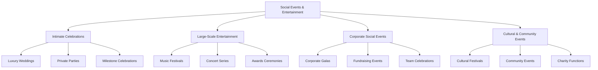

---

## Use Case 21: Luxury Wedding with Multi-Vendor Coordination

### Event Context
- **Event Type**: Luxury Wedding Celebration
- **Scale**: 250 guests, $500K budget, 3 days (welcome party, ceremony, reception)
- **Industry**: High-End Event Planning
- **Complexity Level**: Complex

### Business Scenario
Ultra-high-net-worth couple planning a luxury destination wedding requiring seamless coordination of 20+ premium vendors, personalized guest experiences, complex logistics management, and flawless execution across multiple venues with cultural and family considerations.

### Stakeholder Ecosystem

```mermaid
graph TD
    A[Couple & Families] --> B[Bride's Family]
    A --> C[Groom's Family]
    A --> D[Wedding Party]
    
    E[Core Vendors] --> F[Venue Coordinator]
    E --> G[Catering Team]
    E --> H[Floral Designer]
    E --> I[Photography/Video]
    E --> J[Entertainment]
    
    K[Specialty Services] --> L[Wedding Planner]
    K --> M[Transportation]
    K --> N[Accommodation]
    K --> O[Beauty Services]
    K --> P[Security Team]
    
    Q[Guests] --> R[VIP Guests]
    Q --> S[International Guests]
    Q --> T[Local Guests]
```

### User Journey Mapping

**Couple's Wedding Planning Journey:**

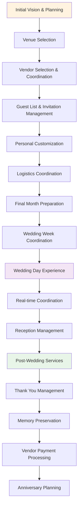

**Guest Experience Journey:**

**Vendor Coordination Workflow:**

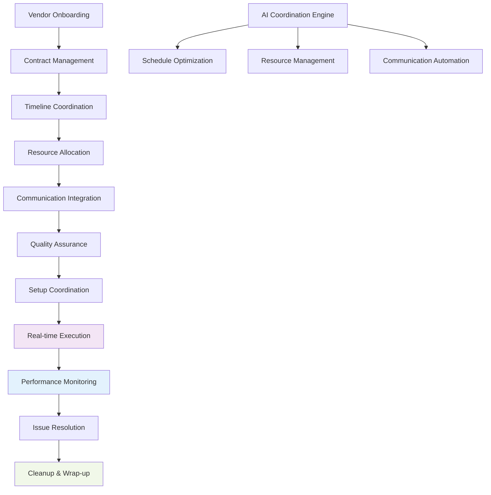

### AI Agent Team Structure

**Primary Agents:**
- **Wedding Orchestration Agent**: Master coordinator for all vendors and timeline management
- **Guest Experience Agent**: Personalized service delivery and guest satisfaction optimization
- **Vendor Performance Agent**: Real-time coordination and quality assurance monitoring
- **Cultural Protocol Agent**: Tradition integration and family custom accommodation
- **Crisis Management Agent**: Real-time problem solving and backup plan execution

**Human Team Members:**
- **Lead Wedding Planner**: Vision execution, family relations, creative direction
  - Responsibilities: Overall coordination, couple consultation, vendor management
  - Skills Required: Design expertise, relationship building, crisis management
  - AI Tools Used: CopilotKit coordination dashboard, WhatsApp vendor communication
  - User Journey Touchpoints: Planning meetings, vendor consultations, day-of coordination
  - Workflow Responsibilities: Creative approval, family liaison, quality control

- **Day-of Coordinator**: Real-time execution, vendor coordination, guest assistance
  - Responsibilities: Timeline management, vendor supervision, guest services
  - Skills Required: Operations management, multitasking, problem-solving
  - AI Tools Used: Real-time coordination app, vendor communication platform

### Technology Implementation

**LangGraph Workflow Orchestration:**
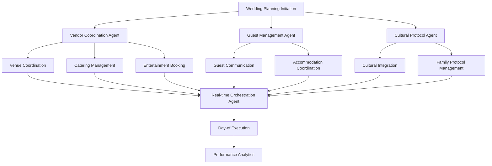

**LangChain Applications:**
- Personalized wedding vow and speech assistance with style and tone adaptation
- Intelligent menu curation based on guest preferences and dietary restrictions
- Cultural ceremony integration with traditional and modern element blending
- Automated vendor communication with context-aware messaging and scheduling

**n8n Automation Workflows:**
- RSVP processing with dietary preference collection and seating optimization
- Vendor milestone tracking with automated payment releases and performance monitoring
- Guest communication sequences with personalized updates and logistics information
- Photo and video collection automation with guest-contributed content integration

**CrewAI Coordination:**
- Multi-agent vendor coordination with specialized expertise (catering, florals, photography)
- Integrated family communication management with cultural sensitivity and protocol awareness
- Real-time day-of execution with crisis management and alternative plan deployment
- Collective intelligence for guest experience optimization and satisfaction enhancement

**CopilotKit Interface:**
- Wedding planning dashboard with timeline visualization and vendor coordination tools
- Guest management interface with personalized communication and preference tracking
- Vendor portal with task management, timeline coordination, and performance feedback
- Real-time execution app for day-of coordination with instant communication and updates

**Webflow Integration:**
- Personalized wedding website with guest information, logistics, and interactive features
- RSVP management system with meal selection, song requests, and accommodation booking
- Vendor portal with resource sharing, timeline access, and communication platform
- Photo and video sharing platform with automated guest contribution collection

**WhatsApp Communication:**
- Family coordination group with important updates and decision-making discussions
- Vendor coordination network with real-time updates, schedule changes, and urgent communications
- VIP guest concierge service with personalized assistance and special accommodations
- Day-of execution team communication with instant updates and issue resolution

**Supabase Backend:**
- Comprehensive guest database with preferences, dietary requirements, and accommodation needs
- Vendor performance tracking with quality metrics, timeline adherence, and feedback collection
- Budget management with real-time expense tracking, vendor payments, and cost optimization
- Cultural and family tradition documentation with personalization and integration planning

**Flowise Process Management:**
- Visual wedding day timeline with vendor dependencies and optimization algorithms
- Guest experience flow optimization with personalization and satisfaction enhancement
- Vendor coordination workflow with performance monitoring and quality assurance
- Crisis management protocols with alternative scenarios and rapid response procedures

**Stripe Integration:**
- Vendor payment management with milestone-based releases and performance incentives
- Guest contribution processing for gifts, group activities, and accommodation bookings
- Budget tracking with real-time expense monitoring and variance analysis
- Financial reporting with comprehensive cost breakdown and optimization recommendations

### Success Metrics
- **Guest Experience**: 4.9/5 satisfaction rating, 98% attendance rate, zero major incidents
- **Vendor Performance**: 95% on-time delivery, 100% quality standards met
- **Budget Management**: On-budget execution with 5% cost savings through optimization
- **Cultural Integration**: 100% family satisfaction with tradition incorporation

---

## Use Case 22: Music Festival with Crowd Management

### Event Context
- **Event Type**: Multi-Day Music Festival
- **Scale**: 50,000 attendees per day, $5M budget, 3 days
- **Industry**: Entertainment & Live Events
- **Complexity Level**: Enterprise

### Business Scenario
Large-scale outdoor music festival featuring multiple stages, diverse artist lineup, food vendors, camping facilities, and complex crowd management requiring real-time monitoring, safety protocols, weather contingencies, and fan experience optimization.

### Crowd Management Workflow:

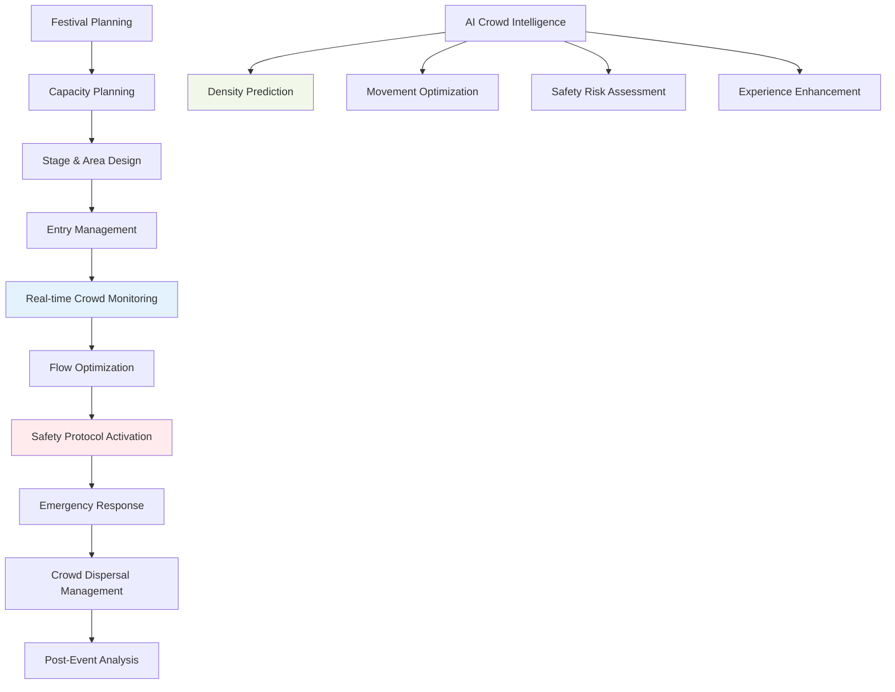

**Festival-Goer Journey:**

```mermaid
flowchart LR
    A[Ticket Purchase] --> B[Pre-Festival Planning]
    B --> C[Arrival & Check-in]
    C --> D[Venue Exploration]
    D --> E[Artist Performance Attendance]
    E --> F[Food & Merchandise]
    
    F --> G[Social Connections]
    G --> H[Evening Entertainment]
    H --> I[Accommodation Experience]
    I --> J[Day 2-3 Activities]
    J --> K[Departure & Follow-up]
    
    style C fill:#fff3e0
    style E fill:#f3e5f5
    style K fill:#e8f5e8
```

### Technology Implementation

**Real-time Crowd Analytics:**
- Computer vision crowd density monitoring with capacity management and safety alerts
- Predictive movement modeling with bottleneck identification and flow optimization
- Weather-based crowd behavior prediction with adaptive crowd management strategies
- Emergency evacuation route optimization with real-time safety coordination

### Success Metrics
- **Safety Management**: Zero major safety incidents, 99.9% crowd flow efficiency
- **Fan Experience**: 4.6/5 festival rating, 85% return attendance intention
- **Operational Efficiency**: 30% reduction in crowd management costs, 40% faster entry processing

---

## Use Case 23: Corporate Gala with Fundraising Integration

### Event Context
- **Event Type**: Corporate Charity Gala
- **Scale**: 800 attendees, $750K budget, 1 evening
- **Industry**: Nonprofit & Corporate Social Responsibility
- **Complexity Level**: Moderate

### Business Scenario
Annual corporate charity gala combining entertainment, networking, and fundraising with live auctions, donation platforms, corporate sponsorships, and impact storytelling. Focus on maximizing donations while delivering premium guest experience.

### Fundraising Optimization Workflow:

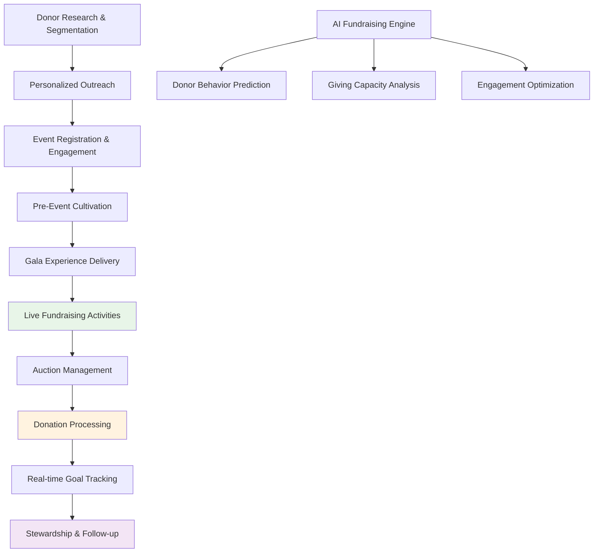

### Success Metrics
- **Fundraising Success**: $2M+ raised, 150% of goal achievement, 75% donor retention
- **Engagement Quality**: 90% auction participation, 4.8/5 event satisfaction
- **Corporate Impact**: 40% increase in sponsor commitments, 95% board satisfaction

---

## Use Case 24: Celebrity Event with Security Protocols

### Event Context
- **Event Type**: High-Profile Celebrity Event
- **Scale**: 300 VIP guests, $1.2M budget, 1 evening
- **Industry**: Entertainment & Celebrity Management
- **Complexity Level**: Complex

### Business Scenario
Exclusive celebrity event requiring multi-layered security, media management, privacy protection, VIP service delivery, and crisis management protocols. Emphasizes discretion, safety, and premium experience delivery.

### Security Protocol Workflow:

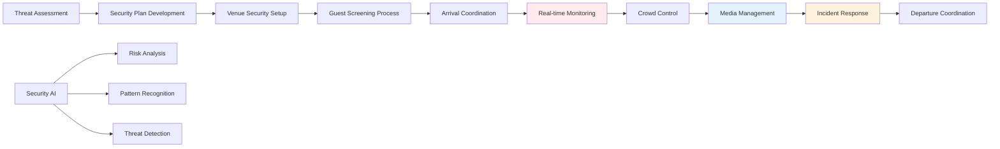

### Success Metrics
- **Security Excellence**: Zero security incidents, 100% guest safety maintained
- **Privacy Protection**: Zero unauthorized media access, 95% guest privacy satisfaction
- **VIP Experience**: 4.9/5 service rating, 90% repeat attendance commitment

---

## Use Case 25: Cultural Festival with Community Engagement

### Event Context
- **Event Type**: Multicultural Community Festival
- **Scale**: 15,000 attendees, $300K budget, 2 days
- **Industry**: Community & Cultural Organizations
- **Complexity Level**: Moderate

### Business Scenario
Community-driven cultural festival celebrating diversity with multiple cultural pavilions, traditional performances, food vendors, educational workshops, and family activities. Focus on cultural education, community building, and inclusive participation.

### Community Engagement Workflow:

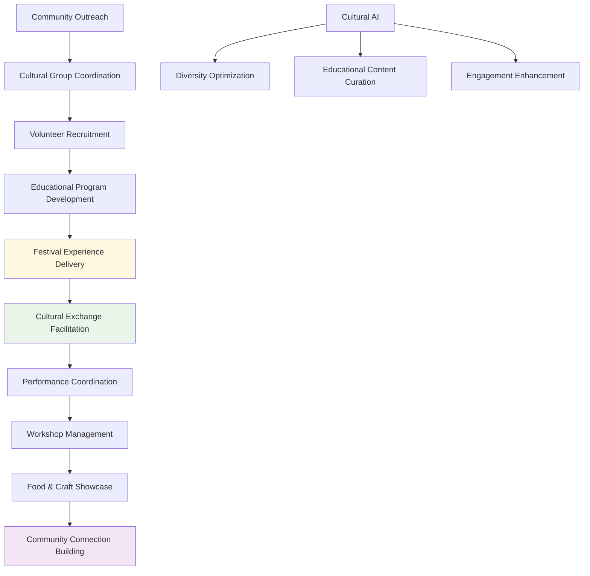

### Success Metrics
- **Community Impact**: 25+ cultural groups participating, 90% community satisfaction
- **Educational Value**: 1,000+ workshop attendees, 85% cultural learning outcomes
- **Inclusivity Achievement**: 95% accessibility compliance, zero discrimination incidents

---

## Use Case 26: Private Party with Personalization Engine

### Event Context
- **Event Type**: Luxury Private Birthday Party
- **Scale**: 100 guests, $200K budget, 1 evening
- **Industry**: High-End Event Planning
- **Complexity Level**: Moderate

### Business Scenario
Ultra-personalized milestone birthday celebration requiring detailed guest preference analysis, customized experiences, surprise element coordination, and intimate atmosphere creation with premium service delivery.

### Personalization Engine Workflow:

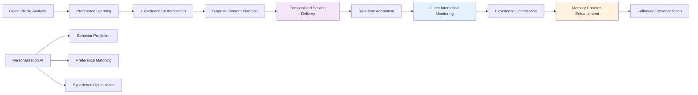

### Success Metrics
- **Personalization Success**: 95% guest preference satisfaction, 100% surprise element success
- **Service Excellence**: 4.9/5 service rating, 90% memorable experience feedback
- **Host Satisfaction**: 100% event vision achievement, zero stress incidents

---

## Use Case 27: Concert Series with Fan Experience Optimization

### Event Context
- **Event Type**: Multi-Venue Concert Series
- **Scale**: 5,000-20,000 per venue, $2M budget, 10 concerts
- **Industry**: Music & Entertainment
- **Complexity Level**: Complex

### Business Scenario
Artist concert tour requiring fan experience optimization across multiple venues, merchandise coordination, VIP package management, social media integration, and fan community building with performance analytics.

### Fan Journey Optimization:

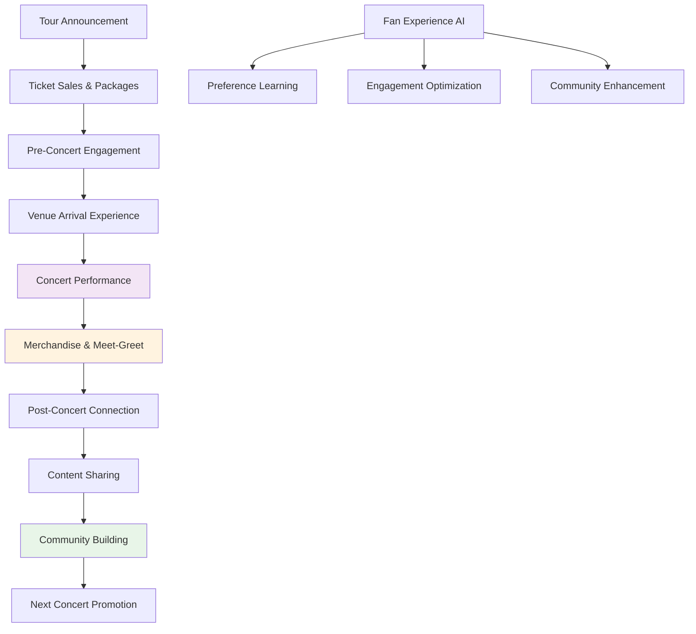

### Success Metrics
- **Fan Satisfaction**: 4.7/5 concert rating, 80% merchandise purchase rate
- **Community Growth**: 60% fan club membership increase, 90% social engagement
- **Tour Success**: 95% venue capacity achievement, 40% repeat attendance

---

## Use Case 28: Charity Auction with Bidding Platform

### Event Context
- **Event Type**: High-End Charity Auction
- **Scale**: 400 bidders, $500K fundraising goal, 1 evening
- **Industry**: Nonprofit & Philanthropy
- **Complexity Level**: Moderate

### Business Scenario
Exclusive charity auction featuring high-value items, celebrity participation, live and silent auctions, online bidding integration, and donation processing with real-time fundraising tracking and donor engagement.

### Auction Management Workflow:

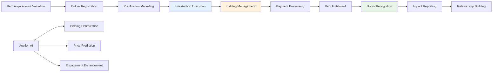

### Success Metrics
- **Fundraising Achievement**: $650K raised (130% of goal), 85% bidder participation
- **Platform Performance**: 99.9% uptime, 500+ online bidders, zero payment issues
- **Donor Engagement**: 90% satisfaction rating, 70% commitment to future events

---

## Use Case 29: Awards Ceremony with Live Broadcasting

### Event Context
- **Event Type**: Industry Awards Ceremony
- **Scale**: 1,200 in-person, 50K online viewers, $800K budget, 1 evening
- **Industry**: Professional Recognition & Media
- **Complexity Level**: Complex

### Business Scenario
Prestigious industry awards ceremony with live streaming, multi-camera production, real-time voting, social media integration, and professional networking requiring seamless technical execution and audience engagement.

### Live Broadcasting Workflow:

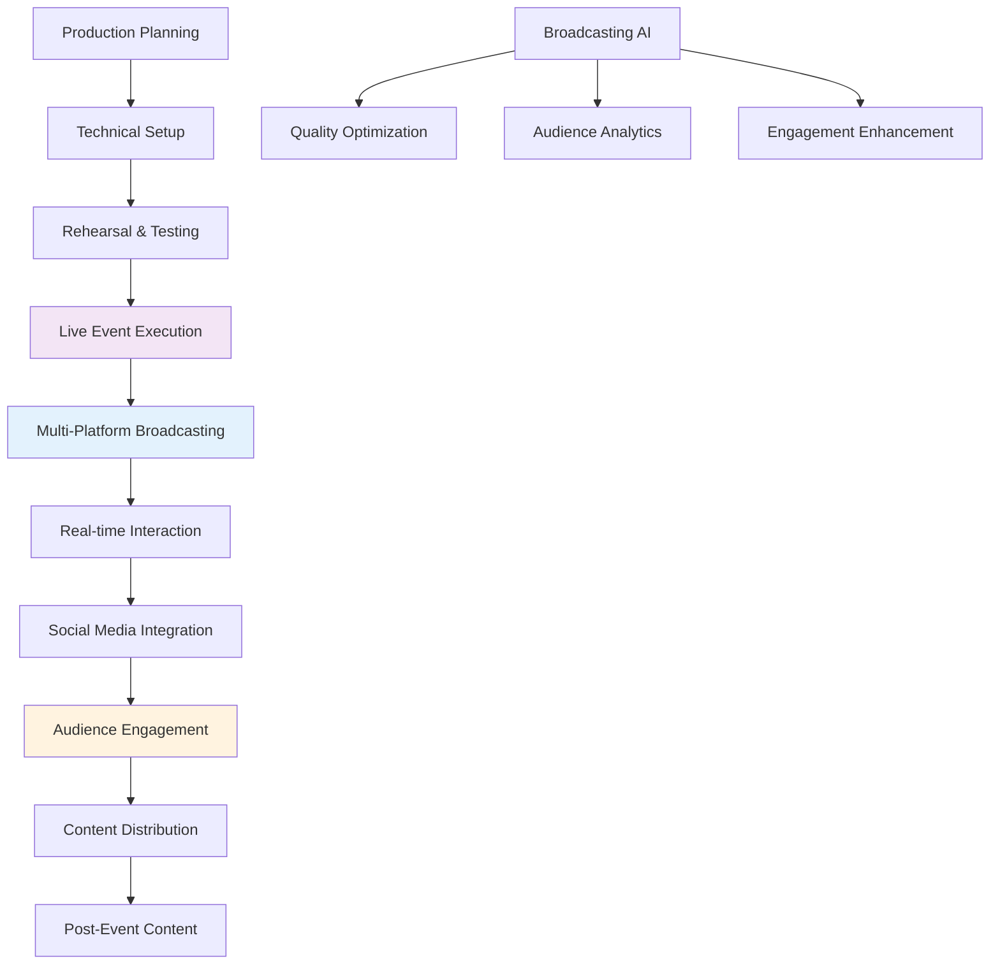

### Success Metrics
- **Broadcasting Success**: 99.5% uptime, 75K peak viewers, 4.6/5 production quality
- **Engagement Metrics**: 10K social interactions, 85% voting participation
- **Professional Impact**: 95% industry satisfaction, 40% media coverage increase

---

## Use Case 30: Destination Wedding with Travel Coordination

### Event Context
- **Event Type**: International Destination Wedding
- **Scale**: 150 guests, $750K budget, 5 days
- **Industry**: Luxury Travel & Event Planning
- **Complexity Level**: Complex

### Business Scenario
Exotic destination wedding requiring international travel coordination, accommodation management, cultural integration, legal compliance, guest experience optimization, and logistics management across multiple countries and time zones.

### Travel Coordination Workflow:

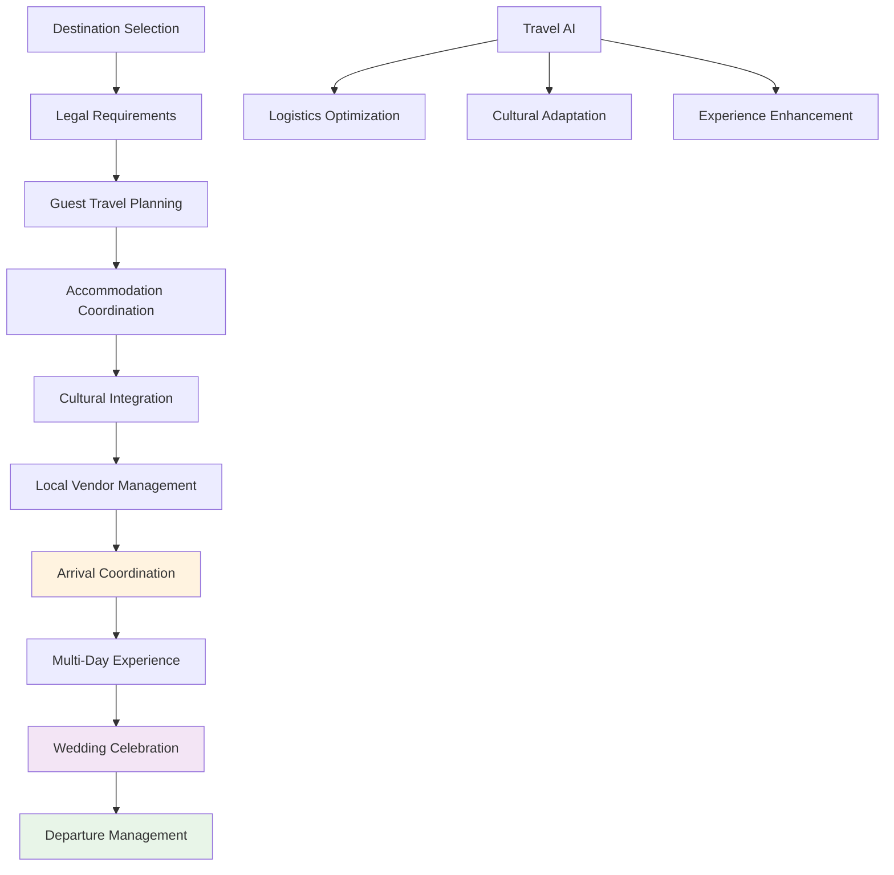

### Success Metrics
- **Travel Success**: 98% guest attendance, zero travel issues, 100% legal compliance
- **Cultural Integration**: 95% guest satisfaction with local experiences
- **Destination Experience**: 4.8/5 overall rating, 90% would recommend destination

---

## Technology Integration Matrix

| Technology | Use Cases | Primary Functions | Automation Level |
|------------|-----------|-------------------|------------------|
| LangGraph | All 10 | Complex event orchestration, multi-stakeholder coordination | High |
| LangChain | All 10 | Personalized content, cultural adaptation | High |
| n8n | All 10 | Guest communication, vendor coordination | High |
| CrewAI | All 10 | Specialized event team coordination | High |
| CopilotKit | 8/10 | Guest experience interfaces, vendor portals | High |
| Webflow | 9/10 | Event websites, registration, photo sharing | High |
| WhatsApp | All 10 | Real-time coordination, guest services | High |
| Supabase | All 10 | Guest management, vendor tracking | High |
| Flowise | All 10 | Experience flow optimization | Medium |
| Stripe | All 10 | Payment processing, vendor payments | High |

## Implementation Roadmap

### Phase 1: Experience Foundation (Weeks 1-4)
- Guest experience platform development
- Vendor coordination system setup
- Personalization engine configuration
- Communication infrastructure deployment

### Phase 2: Specialized Features (Weeks 5-8)
- Event-specific workflow development
- Advanced personalization implementation
- Real-time coordination system deployment
- Quality assurance framework setup

### Phase 3: Integration & Optimization (Weeks 9-12)
- Cross-platform integration testing
- User experience optimization
- Performance monitoring implementation
- Stakeholder training and onboarding

### Phase 4: Advanced Capabilities (Weeks 13-16)
- AI-powered experience enhancement
- Predictive analytics implementation
- Continuous improvement systems
- Scalability optimization

---

*This document provides comprehensive frameworks for implementing AI-powered social event, wedding, and entertainment management systems with advanced personalization, vendor coordination, and guest experience optimization capabilities.*
