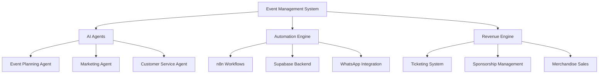

# AI-Powered Event Management System Overview

## Table of Contents
1. [System Architecture](#system-architecture)
2. [Core Components](#core-components)
3. [Technology Stack](#technology-stack)
4. [Implementation Roadmap](#implementation-roadmap)
5. [Revenue Generation Model](#revenue-generation-model)

## System Architecture

## Core Components

### 1. AI Agents
- Event Planning Agent
- Marketing Agent
- Customer Service Agent
- Revenue Optimization Agent

### 2. Automation Engine
- Workflow Automation
- Data Management
- Communication Systems
- Integration Hub

### 3. Revenue Generation
- Ticketing System
- Sponsorship Management
- Merchandise Sales
- Analytics & Reporting

## Technology Stack

| Component | Technology | Purpose |
|-----------|------------|---------|
| Frontend | CopilotKit | AI-powered user interface |
| Backend | Supabase | Database & Authentication |
| Automation | n8n | Workflow automation |
| AI Framework | LangChain/LangGraph | Multi-agent system |
| Communication | WhatsApp API | Customer engagement |
| Analytics | Custom Dashboard | Business intelligence |

## Implementation Phases

1. **Phase 1: Foundation** (Weeks 1-4)
   - System architecture setup
   - Database implementation
   - Basic AI agent development

2. **Phase 2: Core Features** (Weeks 5-8)
   - Workflow automation
   - Revenue system integration
   - Basic user interface

3. **Phase 3: Advanced Features** (Weeks 9-12)
   - Advanced AI capabilities
   - Enhanced automation
   - Analytics implementation

4. **Phase 4: Optimization** (Weeks 13-16)
   - System optimization
   - Performance tuning
   - Security enhancements

## Key Features

### Event Management
- Automated event planning
- Resource allocation
- Timeline management
- Budget tracking

### Marketing & Communication
- AI-powered marketing campaigns
- Social media integration
- Automated customer communication
- Analytics tracking

### Revenue Generation
- Dynamic pricing
- Sponsorship management
- Merchandise sales
- Revenue analytics

## Success Metrics

| Metric | Target | Measurement |
|--------|--------|-------------|
| Event Planning Time | -50% | Time saved in planning |
| Revenue Growth | +30% | Year-over-year growth |
| Customer Satisfaction | 90% | NPS score |
| Automation Rate | 80% | Automated tasks |

## Next Steps
1. Review detailed implementation plans in subsequent documents
2. Begin Phase 1 implementation
3. Set up monitoring and analytics
4. Train AI agents with initial data
