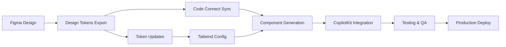

# CopilotKit Travel Planner - Figma to React Enhancement Plan

## 🎯 Executive Summary

This comprehensive plan outlines the enhancement of the CopilotKit travel planner using Figma Code Connect and modern React best practices. The goal is to create a Mindtrip.ai-inspired interface with seamless design-to-code workflow for the I Love Medellín platform.

---

## 📋 Table of Contents

1. [Project Setup & Prerequisites](#project-setup)
2. [Figma Design System Architecture](#figma-design-system)
3. [Component Library Structure](#component-library)
4. [Figma Code Connect Implementation](#code-connect)
5. [CopilotKit Integration Strategy](#copilotkit-integration)
6. [Development Workflow](#development-workflow)
7. [Implementation Timeline](#timeline)
8. [Quality Assurance](#quality-assurance)

---

## 🚀 Project Setup & Prerequisites {#project-setup}

### Required Tools & Accounts

```yaml
Design Tools:
  - Figma Professional (with Dev Mode)
  - Figma Code Connect plugin
  - Figma Tokens plugin (for design tokens)

Development Environment:
  - Node.js 18+
  - React 18+ with TypeScript
  - Next.js 14+ (App Router)
  - Tailwind CSS 3.4+
  - CopilotKit SDK

Version Control:
  - Git with conventional commits
  - GitHub/GitLab with CI/CD
  - Figma version history sync
```

### Initial Project Structure

```bash
travel-planner/
├── .figma/
│   ├── code-connect/          # Figma Code Connect configs
│   └── tokens/                # Design tokens
├── src/
│   ├── components/
│   │   ├── atoms/            # Basic UI elements
│   │   ├── molecules/        # Composite components
│   │   ├── organisms/        # Complex sections
│   │   └── templates/        # Page layouts
│   ├── copilot/
│   │   ├── actions/          # CopilotKit actions
│   │   ├── hooks/            # Custom hooks
│   │   └── providers/        # Context providers
│   ├── styles/
│   │   ├── tokens/           # Design tokens
│   │   └── globals.css       # Global styles
│   └── lib/
│       ├── figma/            # Figma utilities
│       └── utils/            # Helper functions
```

---

## 🎨 Figma Design System Architecture {#figma-design-system}

### 1. File Organization

```
Figma Project: I Love Medellín Travel Planner
├── 📁 Design System
│   ├── 🎨 Foundations
│   │   ├── Colors
│   │   ├── Typography
│   │   ├── Spacing
│   │   ├── Shadows
│   │   └── Border Radius
│   ├── 🧩 Components
│   │   ├── Atoms
│   │   ├── Molecules
│   │   ├── Organisms
│   │   └── Templates
│   └── 📐 Tokens
├── 📁 Web Design
│   ├── Desktop (1440x1024)
│   ├── Tablet (768x1024)
│   └── Components States
├── 📁 Mobile Design
│   ├── iOS (375x812)
│   ├── Android (360x800)
│   └── Components States
└── 📁 Prototypes
    ├── User Flows
    └── Interactions
```

### 2. Design Tokens Structure

```json
{
  "global": {
    "color": {
      "primary": {
        "50": { "value": "#E8F5E9" },
        "500": { "value": "#4CAF50" },
        "900": { "value": "#1B5E20" }
      },
      "semantic": {
        "success": { "value": "{color.green.500}" },
        "warning": { "value": "{color.amber.500}" },
        "error": { "value": "{color.red.500}" }
      }
    },
    "spacing": {
      "xs": { "value": "4px" },
      "sm": { "value": "8px" },
      "md": { "value": "16px" },
      "lg": { "value": "24px" },
      "xl": { "value": "32px" }
    },
    "typography": {
      "fontFamily": {
        "sans": { "value": "Inter, system-ui, sans-serif" },
        "mono": { "value": "JetBrains Mono, monospace" }
      },
      "fontSize": {
        "xs": { "value": "12px" },
        "sm": { "value": "14px" },
        "base": { "value": "16px" },
        "lg": { "value": "18px" },
        "xl": { "value": "24px" },
        "2xl": { "value": "32px" }
      }
    },
    "borderRadius": {
      "sm": { "value": "4px" },
      "md": { "value": "8px" },
      "lg": { "value": "16px" },
      "full": { "value": "9999px" }
    }
  }
}
```

### 3. Component Naming Convention

```
Pattern: [Category]/[Component]/[Variant]/[State]

Examples:
- Chat/Bubble/Incoming/Default
- Chat/Bubble/Outgoing/Loading
- Itinerary/Card/Activity/Hover
- Itinerary/Card/Hotel/Selected
- Button/Primary/Large/Disabled
- Input/Text/Default/Error
```

---

## 🧱 Component Library Structure {#component-library}

### Atomic Design Hierarchy

#### 1. Atoms (Basic Building Blocks)

```typescript
// components/atoms/Button/Button.tsx
interface ButtonProps {
  variant: 'primary' | 'secondary' | 'ghost';
  size: 'sm' | 'md' | 'lg';
  loading?: boolean;
  icon?: React.ReactNode;
  children: React.ReactNode;
}

// components/atoms/Avatar/Avatar.tsx
interface AvatarProps {
  src?: string;
  alt: string;
  size: 'sm' | 'md' | 'lg';
  status?: 'online' | 'offline' | 'typing';
}

// components/atoms/Badge/Badge.tsx
interface BadgeProps {
  variant: 'confirmed' | 'draft' | 'suggested';
  children: React.ReactNode;
}
```

#### 2. Molecules (Composite Components)

```typescript
// components/molecules/ChatBubble/ChatBubble.tsx
interface ChatBubbleProps {
  message: string;
  sender: 'user' | 'ai';
  timestamp: Date;
  isTyping?: boolean;
  actions?: ChatAction[];
}

// components/molecules/ItineraryCard/ItineraryCard.tsx
interface ItineraryCardProps {
  type: 'day' | 'activity' | 'hotel' | 'restaurant';
  title: string;
  subtitle?: string;
  image?: string;
  time?: string;
  status?: 'confirmed' | 'draft';
  onEdit?: () => void;
  onReplace?: () => void;
  onDelete?: () => void;
}

// components/molecules/SearchBar/SearchBar.tsx
interface SearchBarProps {
  placeholder: string;
  suggestions?: string[];
  onSearch: (query: string) => void;
  copilotEnabled?: boolean;
}
```

#### 3. Organisms (Complex Sections)

```typescript
// components/organisms/ChatInterface/ChatInterface.tsx
interface ChatInterfaceProps {
  messages: Message[];
  onSendMessage: (message: string) => void;
  isAiTyping: boolean;
  suggestions?: Suggestion[];
}

// components/organisms/ItineraryBuilder/ItineraryBuilder.tsx
interface ItineraryBuilderProps {
  days: ItineraryDay[];
  onReorderDays: (order: number[]) => void;
  onEditCard: (dayId: string, cardId: string) => void;
  onReplaceCard: (dayId: string, cardId: string) => void;
}

// components/organisms/TripHeader/TripHeader.tsx
interface TripHeaderProps {
  tripName: string;
  destination: string;
  dates: { start: Date; end: Date };
  onSave: () => void;
  onShare: () => void;
}
```

#### 4. Templates (Page Layouts)

```typescript
// components/templates/TravelPlannerLayout/TravelPlannerLayout.tsx
interface TravelPlannerLayoutProps {
  chatPanel: React.ReactNode;
  itineraryPanel: React.ReactNode;
  mobileView?: 'chat' | 'itinerary';
}
```

---

## 🔗 Figma Code Connect Implementation {#code-connect}

### 1. Setup Code Connect

```bash
# Install dependencies
npm install --save-dev @figma/code-connect
npm install @copilotkit/react-core @copilotkit/react-ui

# Initialize Code Connect
npx figma connect init
```

### 2. Component Mapping Examples

#### Chat Bubble Component

```typescript
// components/molecules/ChatBubble/ChatBubble.figma.tsx
import figma from '@figma/code-connect/react';
import { ChatBubble } from './ChatBubble';

figma.connect(ChatBubble, 'https://figma.com/file/YOUR_FILE/Chat-Bubble', {
  props: {
    message: figma.string('Message'),
    sender: figma.enum('Sender', {
      User: 'user',
      AI: 'ai'
    }),
    isTyping: figma.boolean('Is Typing'),
    timestamp: figma.string('Timestamp')
  },
  example: ({ message, sender, isTyping, timestamp }) => (
    <ChatBubble
      message={message}
      sender={sender}
      isTyping={isTyping}
      timestamp={new Date(timestamp)}
    />
  )
});
```

#### Itinerary Card Component

```typescript
// components/molecules/ItineraryCard/ItineraryCard.figma.tsx
import figma from '@figma/code-connect/react';
import { ItineraryCard } from './ItineraryCard';

figma.connect(ItineraryCard, 'https://figma.com/file/YOUR_FILE/Itinerary-Card', {
  props: {
    type: figma.enum('Card Type', {
      Day: 'day',
      Activity: 'activity',
      Hotel: 'hotel',
      Restaurant: 'restaurant'
    }),
    title: figma.string('Title'),
    subtitle: figma.string('Subtitle'),
    image: figma.string('Image URL'),
    time: figma.string('Time'),
    status: figma.enum('Status', {
      Confirmed: 'confirmed',
      Draft: 'draft'
    })
  },
  example: ({ type, title, subtitle, image, time, status }) => (
    <ItineraryCard
      type={type}
      title={title}
      subtitle={subtitle}
      image={image}
      time={time}
      status={status}
      onEdit={() => console.log('Edit')}
      onReplace={() => console.log('Replace')}
      onDelete={() => console.log('Delete')}
    />
  )
});
```

### 3. Design Token Integration

```typescript
// lib/figma/tokens.ts
import { tokens } from '../../.figma/tokens/tokens.json';

export const theme = {
  colors: {
    primary: tokens.global.color.primary,
    semantic: tokens.global.color.semantic
  },
  spacing: tokens.global.spacing,
  typography: tokens.global.typography,
  borderRadius: tokens.global.borderRadius
};

// tailwind.config.js
import { theme } from './lib/figma/tokens';

export default {
  content: ['./src/**/*.{js,ts,jsx,tsx}'],
  theme: {
    extend: {
      colors: theme.colors,
      spacing: theme.spacing,
      fontFamily: theme.typography.fontFamily,
      fontSize: theme.typography.fontSize,
      borderRadius: theme.borderRadius
    }
  }
};
```

---

## 🎨 Figma Best Practices & New Features (Config 2025)

### 1. Dev Mode MCP Server Integration (Beta)

The new Dev Mode MCP Server allows AI agents to directly access Figma design data:

```json
// MCP Server Configuration
{
  "mcpServers": {
    "Figma": {
      "url": "http://127.0.0.1:3845/sse"
    }
  }
}
```

**Setup Process:**
1. Update Figma desktop app to latest version
2. Enable in Figma menu: Preferences → Enable Dev Mode MCP Server
3. Configure your code editor (VS Code, Cursor, or Windsurf)
4. Use AI to generate code from selected frames

### 2. Grid Layout System (New)

Leverage Figma's new Grid feature for responsive layouts:

```typescript
// Using Grid in component design
interface GridLayoutProps {
  columns: number;
  rows: number;
  gap: string;
  children: React.ReactNode;
}

export const GridLayout: React.FC<GridLayoutProps> = ({ 
  columns, 
  rows, 
  gap, 
  children 
}) => {
  return (
    <div 
      className="grid"
      style={{
        gridTemplateColumns: `repeat(${columns}, 1fr)`,
        gridTemplateRows: `repeat(${rows}, 1fr)`,
        gap
      }}
    >
      {children}
    </div>
  );
};
```

### 3. Figma Make Integration (Coming Soon)

Prepare for Figma Make's prompt-to-code capabilities:

```typescript
// Future integration pattern
interface FigmaMakeConfig {
  prompt: string;
  framework: 'react' | 'vue' | 'svelte';
  styling: 'tailwind' | 'css-modules' | 'styled-components';
  includeInteractions: boolean;
}

// Example usage (when available)
const generateFromPrompt = async (config: FigmaMakeConfig) => {
  // Figma Make will generate functional prototypes
  // that can be integrated with CopilotKit
};
```

### 4. Enhanced Dev Mode Features

**Compare Changes:**
- Track design updates with frame history
- Compare with main component
- Clear detachment history

**Code Settings:**
- Language preferences (CSS, Tailwind, React, etc.)
- Unit preferences (px, rem, %)
- Custom code snippets via Code Connect

### 5. Best Practices from Figma Documentation

#### Component Organization
```
✅ DO:
- Use consistent naming: [Category]/[Component]/[Variant]/[State]
- Apply Auto Layout for responsive behavior
- Create component variants for all states
- Document component usage in descriptions

❌ DON'T:
- Mix naming conventions
- Skip Auto Layout setup
- Create separate components for states
- Leave components undocumented
```

#### Dev Mode Workflow
1. **Design Handoff:**
   - Mark frames as "Ready for development"
   - Add dev resources and links
   - Use sections to organize work

2. **Inspection Process:**
   - Select specific breakpoints
   - Copy relevant code snippets
   - Access component documentation
   - View design token values

3. **Collaboration:**
   - Use Dev Mode plugins for enhanced functionality
   - Link to GitHub for code references
   - Connect Storybook for live components
   - Enable VS Code extension for in-IDE inspection

### 6. Performance Optimization Tips

```typescript
// Optimize Figma file performance
const figmaOptimizationChecklist = {
  components: {
    useInstances: true,
    limitNesting: 10, // Max nesting depth
    cleanupHidden: true // Remove hidden layers
  },
  images: {
    compress: true,
    useWebP: true,
    lazyLoad: true
  },
  variants: {
    combineRelated: true,
    useBoolean: true, // For on/off states
    limitTotal: 100 // Per component
  }
};
```

---

## 🤖 CopilotKit Integration Strategy {#copilotkit-integration}

### 1. CopilotKit Provider Setup

```typescript
// app/providers.tsx
'use client';

import { CopilotKit } from '@copilotkit/react-core';
import { CopilotPopup } from '@copilotkit/react-ui';
import '@copilotkit/react-ui/styles.css';

export function Providers({ children }: { children: React.ReactNode }) {
  return (
    <CopilotKit runtimeUrl="/api/copilotkit">
      {children}
      <CopilotPopup
        defaultOpen={false}
        clickOutsideToClose={false}
        labels={{
          title: "Travel Planning Assistant",
          initial: "Hi! I can help you plan your perfect trip to Medellín. What kind of experience are you looking for?"
        }}
      />
    </CopilotKit>
  );
}
```

### 2. Custom Copilot Actions

```typescript
// copilot/actions/itinerary.actions.ts
import { useCopilotAction } from '@copilotkit/react-core';

export function useItineraryActions() {
  useCopilotAction({
    name: "replaceItineraryDay",
    description: "Replace activities for a specific day",
    parameters: [
      {
        name: "dayNumber",
        type: "number",
        description: "Day number to replace"
      },
      {
        name: "preferences",
        type: "string",
        description: "New preferences for the day"
      }
    ],
    handler: async ({ dayNumber, preferences }) => {
      // Implementation
      await replaceDay(dayNumber, preferences);
    }
  });

  useCopilotAction({
    name: "translateTrip",
    description: "Translate the entire itinerary",
    parameters: [
      {
        name: "targetLanguage",
        type: "string",
        description: "Target language (es, en, fr, etc.)"
      }
    ],
    handler: async ({ targetLanguage }) => {
      await translateItinerary(targetLanguage);
    }
  });

  useCopilotAction({
    name: "addActivity",
    description: "Add a new activity to a specific day",
    parameters: [
      {
        name: "dayNumber",
        type: "number"
      },
      {
        name: "activityType",
        type: "string"
      },
      {
        name: "preferences",
        type: "string"
      }
    ],
    handler: async ({ dayNumber, activityType, preferences }) => {
      await addActivityToDay(dayNumber, activityType, preferences);
    }
  });
}
```

### 3. Copilot-Enhanced Components

```typescript
// components/organisms/ChatInterface/CopilotChatInterface.tsx
import { useCopilotChat } from '@copilotkit/react-core';
import { ChatInterface } from './ChatInterface';

export function CopilotChatInterface() {
  const {
    messages,
    sendMessage,
    isLoading
  } = useCopilotChat();

  const suggestions = [
    "Plan a 5-day cultural trip",
    "Find the best restaurants in El Poblado",
    "Add hiking activities to my itinerary",
    "Translate my trip to Spanish"
  ];

  return (
    <ChatInterface
      messages={messages}
      onSendMessage={sendMessage}
      isAiTyping={isLoading}
      suggestions={suggestions}
    />
  );
}
```

---

## 🔄 Development Workflow {#development-workflow}

### 1. Design-to-Code Pipeline



### 2. Git Workflow

```bash
# Feature branch naming
feature/chat-interface-enhancement
feature/itinerary-drag-drop
fix/copilot-action-error
chore/update-figma-tokens

# Commit message format
feat: add drag-and-drop to itinerary cards
fix: resolve CopilotKit action timeout
style: update chat bubble animations
docs: add Figma Code Connect guide
```

### 3. CI/CD Pipeline

```yaml
# .github/workflows/figma-sync.yml
name: Figma Design Sync

on:
  schedule:
    - cron: '0 */6 * * *' # Every 6 hours
  workflow_dispatch:

jobs:
  sync-tokens:
    runs-on: ubuntu-latest
    steps:
      - uses: actions/checkout@v3
      - name: Sync Figma Tokens
        run: npm run figma:sync-tokens
      - name: Generate Types
        run: npm run figma:generate-types
      - name: Create PR if changes
        uses: peter-evans/create-pull-request@v5
        with:
          title: 'chore: update Figma design tokens'
          commit-message: 'chore: sync latest design tokens from Figma'
```

---

## 📅 Implementation Timeline {#timeline}

### Phase 1: Foundation (Week 1-2)
- [ ] Set up Figma file structure
- [ ] Create design system foundations
- [ ] Configure Code Connect
- [ ] Initialize React project with CopilotKit

### Phase 2: Core Components (Week 3-4)
- [ ] Design and code atoms
- [ ] Build chat interface molecules
- [ ] Create itinerary card variants
- [ ] Implement drag-and-drop

### Phase 3: CopilotKit Integration (Week 5-6)
- [ ] Set up Copilot provider
- [ ] Implement custom actions
- [ ] Connect chat to itinerary
- [ ] Add real-time updates

### Phase 4: Mobile Optimization (Week 7)
- [ ] Design mobile layouts
- [ ] Implement responsive components
- [ ] Test touch interactions
- [ ] Optimize performance

### Phase 5: Polish & Launch (Week 8)
- [ ] Accessibility audit
- [ ] Performance optimization
- [ ] User testing
- [ ] Production deployment

---

## ✅ Quality Assurance {#quality-assurance}

### Testing Strategy

```typescript
// Component Testing Example
// components/molecules/ChatBubble/ChatBubble.test.tsx
import { render, screen } from '@testing-library/react';
import { ChatBubble } from './ChatBubble';

describe('ChatBubble', () => {
  it('renders user message correctly', () => {
    render(
      <ChatBubble
        message="Plan a trip to Comuna 13"
        sender="user"
        timestamp={new Date()}
      />
    );
    
    expect(screen.getByText('Plan a trip to Comuna 13')).toBeInTheDocument();
    expect(screen.getByRole('article')).toHaveClass('justify-end');
  });

  it('shows typing indicator for AI', () => {
    render(
      <ChatBubble
        message=""
        sender="ai"
        isTyping={true}
        timestamp={new Date()}
      />
    );
    
    expect(screen.getByTestId('typing-indicator')).toBeInTheDocument();
  });
});
```

### Accessibility Checklist
- [ ] WCAG 2.1 AA compliance
- [ ] Keyboard navigation
- [ ] Screen reader support
- [ ] Color contrast ratios
- [ ] Focus indicators
- [ ] ARIA labels

### Performance Targets
- [ ] Lighthouse score > 90
- [ ] First Contentful Paint < 1.5s
- [ ] Time to Interactive < 3.5s
- [ ] Bundle size < 250KB

---

## 🚀 Launch Readiness

### Pre-Launch Checklist
- [ ] All Figma components mapped
- [ ] CopilotKit actions tested
- [ ] Mobile responsiveness verified
- [ ] Cross-browser compatibility
- [ ] Performance benchmarks met
- [ ] Security audit passed
- [ ] Documentation complete
- [ ] Team training done

### Success Metrics
- Component reusability: >80%
- Design-code parity: 100%
- User task completion: >90%
- AI action success rate: >95%
- Page load time: <2s
- Error rate: <0.1%

---

## 🚀 Enhanced Features from CopilotKit Repositories

### 1. MCP (Model Control Protocol) Integration
Based on the **copilotkit-mcp-demo** and **open-mcp-client** repositories:

```typescript
// components/mcp/McpServerManager.tsx
import { useLocalStorage } from '@/hooks/use-local-storage';
import { ServerConfigsContext } from '@/contexts/ServerConfigsContext';

export interface McpConfig {
  endpoint: string;
  serverName: string;
  authentication?: {
    type: 'api-key' | 'oauth' | 'none';
    credentials?: string;
  };
}

// Integration with travel planning MCP servers
const travelMcpServers = [
  {
    name: 'google-maps',
    endpoint: 'mcp://google-maps',
    capabilities: ['place-search', 'directions', 'reviews']
  },
  {
    name: 'booking-com',
    endpoint: 'mcp://booking-com',
    capabilities: ['hotel-search', 'availability', 'pricing']
  },
  {
    name: 'weather-api',
    endpoint: 'mcp://weather',
    capabilities: ['forecast', 'historical', 'alerts']
  }
];
```

### 2. Banking Demo Authorization Pattern
From **demo-banking**, implement role-based access for travel planning:

```typescript
// contexts/TravelAuthContext.tsx
interface UserRole {
  role: 'traveler' | 'guide' | 'admin' | 'partner';
  permissions: string[];
  department?: 'tours' | 'hotels' | 'restaurants' | 'events';
}

export function TravelAuthProvider({ children }: { children: React.ReactNode }) {
  const userRole = useUserRole();
  
  useCopilotReadable({
    description: "User authorization context",
    value: userRole
  });

  useCopilotAction({
    name: "checkPermission",
    description: "Check if user has permission for action",
    parameters: [
      { name: "action", type: "string", required: true }
    ],
    handler: async ({ action }) => {
      return userRole.permissions.includes(action);
    }
  });

  return (
    <AuthContext.Provider value={userRole}>
      {children}
    </AuthContext.Provider>
  );
}
```

### 3. CoAgents Multi-Agent Architecture
From **coagents-starter-langgraph** and **open-multi-agent-canvas**:

```typescript
// agents/TravelPlannerAgents.tsx
import { useCoAgent, useCoAgentStateRender } from '@copilotkit/react-core';

export function TravelPlannerAgents() {
  // Travel Research Agent
  const { agentState: researchState } = useCoAgent({
    name: "travel_research_agent",
    initialState: {
      destination: "Medellín",
      interests: [],
      budget: null
    }
  });

  // Itinerary Builder Agent
  const { agentState: itineraryState } = useCoAgent({
    name: "itinerary_builder_agent",
    initialState: {
      days: [],
      activities: []
    }
  });

  // Booking Agent
  const { agentState: bookingState } = useCoAgent({
    name: "booking_agent",
    initialState: {
      pendingBookings: [],
      confirmedBookings: []
    }
  });

  // Real-time agent state visualization
  useCoAgentStateRender({
    name: "travel_research_agent",
    node: "research_progress",
    render: ({ state }) => (
      <ResearchProgress 
        destination={state.destination}
        foundActivities={state.foundActivities}
        progress={state.progress}
      />
    )
  });

  return (
    <div className="grid grid-cols-1 lg:grid-cols-3 gap-4">
      <AgentCard agent="research" state={researchState} />
      <AgentCard agent="itinerary" state={itineraryState} />
      <AgentCard agent="booking" state={bookingState} />
    </div>
  );
}
```

### 4. CRM-Style Email Integration
From **demo-crm**, add email composition for travel confirmations:

```typescript
// components/travel/TravelEmailComposer.tsx
import { CopilotTextarea } from '@copilotkit/react-textarea';
import { useCopilotReadable } from '@copilotkit/react-core';

export function TravelEmailComposer({ booking }: { booking: Booking }) {
  useCopilotReadable({
    description: "Current booking details",
    value: booking
  });

  const emailTemplates = {
    confirmation: `Dear ${booking.travelerName},\n\nYour trip to ${booking.destination} is confirmed...`,
    reminder: `Hi ${booking.travelerName},\n\nJust a reminder about your upcoming trip...`,
    followUp: `Hello ${booking.travelerName},\n\nHow was your experience in ${booking.destination}?...`
  };

  return (
    <CopilotTextarea
      className="w-full h-48 p-4 border rounded-lg"
      placeholder="Compose email to traveler..."
      autosuggestionsConfig={{
        textareaPurpose: "Travel booking email composer",
        chatApiConfigs: {
          suggestionsApiConfig: {
            systemPrompt: "You are a travel agent composing professional emails."
          }
        }
      }}
      defaultValue={emailTemplates.confirmation}
    />
  );
}
```

### 5. Social Media Integration Pattern
From **open-fullstack-social-media-agent** concept:

```typescript
// components/social/TravelSocialShare.tsx
export function TravelSocialShare({ itinerary }: { itinerary: Itinerary }) {
  useCopilotAction({
    name: "generateSocialPost",
    description: "Generate social media posts about the trip",
    parameters: [
      { name: "platform", type: "string", enum: ["instagram", "twitter", "facebook"] },
      { name: "style", type: "string", enum: ["casual", "professional", "exciting"] }
    ],
    handler: async ({ platform, style }) => {
      const post = await generateTravelPost(itinerary, platform, style);
      return { content: post, hashtags: generateHashtags(itinerary) };
    }
  });

  return (
    <div className="social-share-panel">
      {/* Social sharing UI */}
    </div>
  );
}
```

### 6. Human-in-the-Loop Approvals
Enhanced approval flow for critical actions:

```typescript
// components/approvals/BookingApproval.tsx
import { useCopilotAction } from '@copilotkit/react-core';

export function BookingApproval() {
  useCopilotAction({
    name: "confirmBooking",
    description: "Confirm hotel or tour booking with user approval",
    parameters: [
      { name: "bookingDetails", type: "object", required: true },
      { name: "totalPrice", type: "number", required: true }
    ],
    renderAndWaitForResponse: ({ args, status, respond }) => (
      <BookingConfirmationModal
        booking={args.bookingDetails}
        price={args.totalPrice}
        isProcessing={status === "executing"}
        onConfirm={() => respond?.({ 
          approved: true, 
          paymentMethod: "card",
          metadata: { timestamp: new Date().toISOString() }
        })}
        onCancel={() => respond?.({ approved: false })}
      />
    )
  });
}
```

### 7. Advanced State Management
From the repositories, implement sophisticated state patterns:

```typescript
// hooks/useTravelPlannerState.ts
export function useTravelPlannerState() {
  const [state, setState] = useState<TravelPlannerState>({
    mode: 'planning', // planning | booking | reviewing
    currentStep: 0,
    itinerary: null,
    bookings: [],
    preferences: {}
  });

  // Make entire state readable to AI
  useCopilotReadable({
    description: "Complete travel planner state",
    value: state
  });

  // Expose state mutations as actions
  useCopilotAction({
    name: "updatePlannerState",
    description: "Update any part of the planner state",
    parameters: [
      { name: "updates", type: "object", required: true }
    ],
    handler: async ({ updates }) => {
      setState(prev => ({ ...prev, ...updates }));
      return { success: true, newState: { ...state, ...updates } };
    }
  });

  return { state, setState };
}
```

---

## 📊 Implementation Best Practices from CopilotKit Examples

### 1. **Agentless Architecture Support**
- Implement MCP clients for direct tool access without backend agents
- Use CopilotKit's built-in MCP support for seamless integration
- Configure multiple MCP servers for different services

### 2. **Multi-Agent Coordination**
- Design agents with specific responsibilities (research, booking, support)
- Implement agent state visualization for transparency
- Use breakpoints for human approval at critical steps

### 3. **Generative UI Components**
- Create dynamic UI that responds to agent state changes
- Implement real-time progress indicators
- Use conditional rendering based on agent decisions

### 4. **Authorization & Security**
- Implement role-based access control
- Secure sensitive operations with approval flows
- Audit trail for all AI-initiated actions

### 5. **Testing Strategy**
```typescript
// Example test for CoAgent integration
describe('TravelPlannerAgent', () => {
  it('should handle multi-destination planning', async () => {
    const { result } = renderHook(() => useCoAgent({
      name: 'travel_planner',
      initialState: { destinations: ['Medellín', 'Cartagena'] }
    }));

    await act(async () => {
      await result.current.planMultiCity();
    });

    expect(result.current.agentState.itinerary).toHaveLength(2);
    expect(result.current.agentState.status).toBe('completed');
  });
});
```

---

## 🎯 Final Recommendations

1. **Start with MCP Integration**: Use the open-mcp-client pattern for tool integration
2. **Implement CoAgents**: For complex multi-step travel planning workflows
3. **Add Human-in-the-Loop**: For booking confirmations and payment approvals
4. **Use Banking Demo Patterns**: For secure, role-based access control
5. **Leverage CRM Features**: For customer communication and follow-ups
6. **Build Incrementally**: Start with basic chat, then add visual components

This comprehensive plan now incorporates the best practices and patterns from CopilotKit's production repositories, providing a robust foundation for building an advanced AI-powered travel planner with Figma integration.