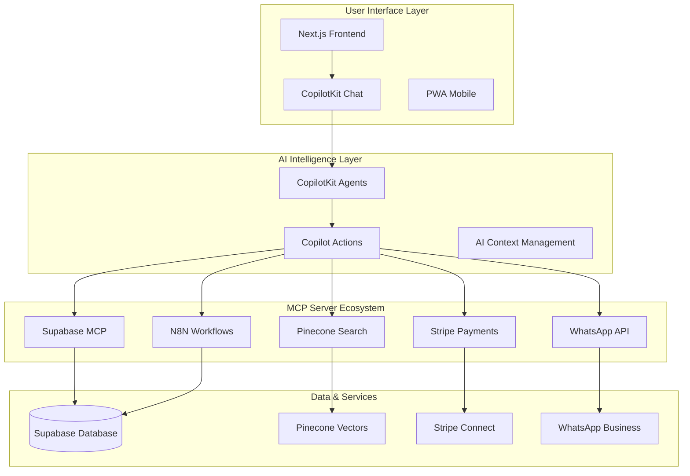

# 📊 Comprehensive CopilotKit Implementation Plan for I Love Medellín
*AI-Powered Tourism Platform with Multi-Vertical Management*

---

## 🎯 Executive Summary

This comprehensive plan details how to implement CopilotKit as the central AI interface for the "I Love Medellín" platform, creating an intelligent tourism assistant that automates 90%+ of booking workflows across four verticals: Tours & Experiences, Real Estate, Restaurant Bookings, and Event Management.

### Key Objectives
- **$75K/month revenue** by Month 6 through AI-optimized conversions
- **95% booking automation** across all verticals
- **24/7 multilingual support** (Spanish/English) 
- **Real-time personalization** using Colombian market data
- **Seamless integration** with existing MCP server ecosystem

---

## 📚 Table of Contents

### Phase 1: Foundation & Architecture (Weeks 1-4)
1. [CopilotKit Core Setup](#copilotkit-core-setup)
2. [MCP Server Integration](#mcp-server-integration)
3. [Supabase Schema for AI Context](#supabase-schema)
4. [Multi-Language Configuration](#multi-language-setup)

### Phase 2: Vertical-Specific AI Agents (Weeks 5-8)
5. [Tours & Experiences Agent](#tours-agent)
6. [Real Estate Assistant](#real-estate-agent)
7. [Restaurant Booking Agent](#restaurant-agent)
8. [Event Management Agent](#event-agent)

### Phase 3: Advanced AI Features (Weeks 9-12)
9. [Universal AI Concierge](#universal-concierge)
10. [Predictive Analytics Integration](#predictive-analytics)
11. [Revenue Optimization AI](#revenue-optimization)
12. [Colombian Market Personalization](#colombian-personalization)

### Phase 4: Integration & Optimization (Weeks 13-16)
13. [Performance Optimization](#performance-optimization)
14. [Testing & Quality Assurance](#testing-qa)
15. [Production Deployment](#production-deployment)
16. [Success Metrics & Monitoring](#success-metrics)

---

## 🏗️ System Architecture Overview

### CopilotKit Integration Stack


---

## Phase 1: Foundation & Architecture

### 🚀 CopilotKit Core Setup

#### Week 1: Basic Installation & Configuration

**Step 1: Install CopilotKit Dependencies**
```bash
# Install core CopilotKit packages
npm install @copilotkit/react-core @copilotkit/react-ui @copilotkit/react-textarea
npm install @copilotkit/backend @copilotkit/openai

# Install Colombian-specific dependencies
npm install i18next react-i18next
npm install date-fns-tz  # For Colombian timezone
```

**Step 2: Configure Root Layout**
```typescript
// app/layout.tsx
'use client';
import { CopilotKit } from "@copilotkit/react-core";
import { CopilotSidebar } from "@copilotkit/react-ui";

const cloudConfig = {
  apiKey: process.env.NEXT_PUBLIC_COPILOT_CLOUD_API_KEY!,
  agents: [
    {
      name: "MedellinTourismAgent",
      description: "Expert assistant for Medellín tourism, events, and real estate",
      model: "gpt-4o",
      systemPrompt: `You are an expert tourism assistant for Medellín, Colombia. 
      You help users discover experiences, book accommodations, find restaurants, and plan events.
      Always respond in the user's preferred language (Spanish or English).
      Use Colombian context: prices in COP, local customs, and Paisa culture.
      Be warm, helpful, and knowledgeable about local hidden gems.`,
    }
  ],
  locale: "es-CO",
  fallbackLocale: "en-US"
};

export default function RootLayout({ children }) {
  return (
    <html>
      <body>
        <CopilotKit cloudConfig={cloudConfig}>
          <div className="flex h-screen">
            <main className="flex-1">{children}</main>
            <CopilotSidebar
              instructions="Asistente experto para turismo en Medellín. Ayuda con reservas, recomendaciones y planificación de viajes."
              labels={{
                title: "Asistente I Love Medellín",
                initial: "¡Hola! ¿Cómo puedo ayudarte a descubrir lo mejor de Medellín?"
              }}
            />
          </div>
        </CopilotKit>
      </body>
    </html>
  );
}
```

**Step 3: Create Backend API Route**
```typescript
// app/api/copilotkit/route.ts
import { NextRequest } from "next/server";
import { CopilotBackend, OpenAIAdapter } from "@copilotkit/backend";

const runtime = "nodejs";

export async function POST(req: NextRequest) {
  const copilotKit = new CopilotBackend({
    actions: [
      // Will be populated in later phases
    ],
  });

  const openaiModel = new OpenAIAdapter({
    model: "gpt-4o",
    apiKey: process.env.OPENAI_API_KEY!,
  });

  return copilotKit.response(req, openaiModel);
}
```

### 🔌 MCP Server Integration

#### Week 2: Connect Existing MCP Servers

**Priority MCP Servers for CopilotKit:**
```typescript
// lib/mcp-integration.ts
export const MCPServerConfig = {
  // Database operations
  supabase: {
    name: "supabase",
    description: "Database operations for bookings, users, and content",
    tools: ["query", "insert", "update", "list-tables"]
  },
  
  // Workflow automation
  n8n: {
    name: "n8n", 
    description: "Automate booking confirmations and notifications",
    tools: ["create-workflow", "execute-workflow", "list-workflows"]
  },
  
  // Payment processing
  stripe: {
    name: "stripe",
    description: "Handle payments and marketplace transactions", 
    tools: ["create-payment-intent", "process-payment", "handle-refunds"]
  },
  
  // Communication
  whatsapp: {
    name: "whatsapp",
    description: "Send confirmations and support messages",
    tools: ["send-message", "send-template", "get-status"]
  },
  
  // AI search
  pinecone: {
    name: "pinecone", 
    description: "Semantic search for experiences and recommendations",
    tools: ["search-records", "upsert-records", "list-indexes"]
  }
};
```

**CopilotKit Action Integration:**
```typescript
// lib/copilot-actions.ts
import { useCopilotAction } from "@copilotkit/react-core";

export const useBookingActions = () => {
  // Universal booking action
  useCopilotAction({
    name: "createBooking",
    description: "Create a booking for any type of experience, property, restaurant, or event",
    parameters: [
      { name: "type", type: "string", enum: ["tour", "property", "restaurant", "event"] },
      { name: "itemId", type: "string", description: "ID of the item being booked" },
      { name: "date", type: "string", description: "Booking date in YYYY-MM-DD format" },
      { name: "participants", type: "number", description: "Number of people" },
      { name: "userInfo", type: "object", description: "User contact and preferences" }
    ],
    handler: async (params) => {
      // Route to appropriate MCP server based on type
      switch (params.type) {
        case "tour":
          return await mcpClient.call("supabase", "create-tour-booking", params);
        case "property": 
          return await mcpClient.call("supabase", "create-property-booking", params);
        case "restaurant":
          return await mcpClient.call("supabase", "create-restaurant-reservation", params);
        case "event":
          return await mcpClient.call("supabase", "create-event-booking", params);
      }
    }
  });

  // Search and recommendation action
  useCopilotAction({
    name: "searchRecommendations", 
    description: "Find personalized recommendations based on user preferences",
    parameters: [
      { name: "query", type: "string", description: "What the user is looking for" },
      { name: "category", type: "string", enum: ["tours", "restaurants", "properties", "events"] },
      { name: "budget", type: "string", description: "Budget range in COP" },
      { name: "location", type: "string", description: "Preferred area in Medellín" }
    ],
    handler: async (params) => {
      // Use Pinecone for semantic search
      const vectorResults = await mcpClient.call("pinecone", "search-records", {
        index: `${params.category}-index`,
        query: params.query,
        filter: {
          budget_range: params.budget,
          location: params.location
        },
        top_k: 10
      });
      
      // Get full details from Supabase
      const fullResults = await mcpClient.call("supabase", "get-items-by-ids", {
        table: params.category,
        ids: vectorResults.matches.map(m => m.id)
      });
      
      return {
        recommendations: fullResults,
        reasoning: `Found ${fullResults.length} great options based on your preferences for ${params.query} in ${params.location}`
      };
    }
  });
};
```

### 🗄️ Supabase Schema for AI Context

#### Week 3: AI-Optimized Database Design

**AI Context Tables:**
```sql
-- Store user conversation context
CREATE TABLE ai_conversations (
  id UUID PRIMARY KEY DEFAULT gen_random_uuid(),
  user_id UUID REFERENCES users(id),
  session_id TEXT NOT NULL,
  language VARCHAR(5) DEFAULT 'es',
  preferences JSONB DEFAULT '{}',
  conversation_history JSONB DEFAULT '[]',
  current_intent VARCHAR(100),
  extracted_entities JSONB DEFAULT '{}',
  created_at TIMESTAMPTZ DEFAULT NOW(),
  updated_at TIMESTAMPTZ DEFAULT NOW()
);

-- Track AI interactions and performance  
CREATE TABLE ai_interactions (
  id UUID PRIMARY KEY DEFAULT gen_random_uuid(),
  conversation_id UUID REFERENCES ai_conversations(id),
  user_message TEXT,
  ai_response TEXT,
  action_taken VARCHAR(100),
  success BOOLEAN,
  response_time_ms INTEGER,
  tokens_used INTEGER,
  user_satisfaction INTEGER CHECK (user_satisfaction BETWEEN 1 AND 5),
  created_at TIMESTAMPTZ DEFAULT NOW()
);

-- Store user preferences and behavior patterns
CREATE TABLE user_ai_profiles (
  user_id UUID PRIMARY KEY REFERENCES users(id),
  preferred_language VARCHAR(5) DEFAULT 'es',
  communication_style VARCHAR(50), -- 'formal', 'casual', 'friendly'
  interests TEXT[],
  budget_preferences JSONB,
  location_preferences TEXT[],
  booking_patterns JSONB,
  last_activity TIMESTAMPTZ,
  ai_personalization_score DECIMAL(3,2)
);

-- Cache frequently used AI responses
CREATE TABLE ai_response_cache (
  id UUID PRIMARY KEY DEFAULT gen_random_uuid(),
  query_hash VARCHAR(64) UNIQUE,
  query_text TEXT,
  response_text TEXT,
  context_data JSONB,
  language VARCHAR(5),
  hit_count INTEGER DEFAULT 1,
  last_used TIMESTAMPTZ DEFAULT NOW(),
  expires_at TIMESTAMPTZ
);
```

**AI-Readable Views:**
```sql
-- Comprehensive booking context for AI
CREATE VIEW ai_booking_context AS
SELECT 
  b.id,
  b.type,
  b.status,
  b.total_amount,
  u.preferred_language,
  u.location_preferences,
  CASE 
    WHEN b.type = 'tour' THEN t.title_es
    WHEN b.type = 'property' THEN p.title_es  
    WHEN b.type = 'restaurant' THEN r.name
    WHEN b.type = 'event' THEN e.title_es
  END as item_name,
  b.created_at
FROM bookings b
JOIN user_ai_profiles u ON b.user_id = u.user_id
LEFT JOIN tours t ON b.item_id = t.id AND b.type = 'tour'
LEFT JOIN properties p ON b.item_id = p.id AND b.type = 'property'  
LEFT JOIN restaurants r ON b.item_id = r.id AND b.type = 'restaurant'
LEFT JOIN events e ON b.item_id = e.id AND b.type = 'event';

-- Popular recommendations by category
CREATE VIEW ai_popular_recommendations AS
SELECT 
  category,
  item_id,
  item_name,
  avg_rating,
  total_bookings,
  price_range,
  location_area
FROM (
  SELECT 
    'tours' as category,
    id as item_id,
    title_es as item_name,
    avg_rating,
    total_bookings,
    price_range,
    location_area
  FROM tours WHERE status = 'active'
  
  UNION ALL
  
  SELECT 
    'restaurants' as category,
    id as item_id, 
    name as item_name,
    avg_rating,
    total_reservations as total_bookings,
    price_range,
    neighborhood as location_area
  FROM restaurants WHERE status = 'active'
  
  -- Add other verticals...
) combined
ORDER BY avg_rating DESC, total_bookings DESC;
```

### 🌐 Multi-Language Configuration

#### Week 4: Colombian Market Optimization

**Language Detection & Switching:**
```typescript
// lib/language-manager.ts
export class ColombianLanguageManager {
  private static instance: ColombianLanguageManager;
  
  constructor() {
    this.setupI18n();
  }
  
  setupI18n() {
    i18n.init({
      lng: 'es-CO', // Default to Colombian Spanish
      fallbackLng: 'en-US',
      debug: process.env.NODE_ENV === 'development',
      
      resources: {
        'es-CO': {
          translation: {
            // Tourism-specific translations
            booking: {
              confirm: 'Confirmar reserva',
              cancel: 'Cancelar', 
              modify: 'Modificar',
              payment: 'Realizar pago',
              success: '¡Reserva confirmada!'
            },
            tours: {
              available: 'Disponible',
              soldOut: 'Agotado',
              duration: 'Duración',
              includes: 'Incluye',
              meetingPoint: 'Punto de encuentro'
            },
            restaurants: {
              reservation: 'Reserva',
              tableFor: 'Mesa para',
              cuisine: 'Cocina',
              priceRange: 'Rango de precios'
            },
            // Colombian-specific terms
            colombian: {
              paisa: 'paisa',
              parcero: 'parcero',
              chimba: 'chimba',
              bacano: 'bacano'
            }
          }
        },
        'en-US': {
          translation: {
            // English translations with Colombian context
            booking: {
              confirm: 'Confirm booking',
              cancel: 'Cancel',
              modify: 'Modify', 
              payment: 'Make payment',
              success: 'Booking confirmed!'
            }
            // ... rest of English translations
          }
        }
      }
    });
  }
  
  detectUserLanguage(userMessage: string): string {
    // Simple language detection
    const spanishKeywords = ['hola', 'gracias', 'por favor', 'buenas', 'restaurante'];
    const englishKeywords = ['hello', 'thanks', 'please', 'good', 'restaurant'];
    
    const spanishCount = spanishKeywords.filter(word => 
      userMessage.toLowerCase().includes(word)).length;
    const englishCount = englishKeywords.filter(word => 
      userMessage.toLowerCase().includes(word)).length;
      
    return spanishCount > englishCount ? 'es-CO' : 'en-US';
  }
  
  formatCurrency(amount: number, currency: string = 'COP'): string {
    if (currency === 'COP') {
      return new Intl.NumberFormat('es-CO', {
        style: 'currency',
        currency: 'COP',
        minimumFractionDigits: 0
      }).format(amount);
    }
    
    return new Intl.NumberFormat('en-US', {
      style: 'currency', 
      currency: currency
    }).format(amount);
  }
  
  formatDateTime(date: Date, language: string = 'es-CO'): string {
    const timeZone = 'America/Bogota';
    
    if (language === 'es-CO') {
      return new Intl.DateTimeFormat('es-CO', {
        timeZone,
        dateStyle: 'full',
        timeStyle: 'short'
      }).format(date);
    }
    
    return new Intl.DateTimeFormat('en-US', {
      timeZone,
      dateStyle: 'full', 
      timeStyle: 'short'
    }).format(date);
  }
}
```

**CopilotKit Colombian Context:**
```typescript
// lib/colombian-context.ts
export const ColombianTourismContext = {
  neighborhoods: [
    'El Poblado', 'Laureles', 'Envigado', 'Sabaneta', 
    'Centro', 'Comuna 13', 'Belén', 'Itagüí'
  ],
  
  priceRanges: {
    budget: { min: 0, max: 50000, label: 'Económico' },
    mid: { min: 50001, max: 150000, label: 'Intermedio' },
    luxury: { min: 150001, max: 999999, label: 'Premium' }
  },
  
  paymentMethods: [
    { id: 'pse', name: 'PSE', icon: '🏦', popular: true },
    { id: 'nequi', name: 'Nequi', icon: '📱', popular: true },
    { id: 'efecty', name: 'Efecty', icon: '💰', popular: false },
    { id: 'cards', name: 'Tarjetas', icon: '💳', popular: true }
  ],
  
  culturalContext: {
    greetings: ['¡Hola!', '¡Qué más!', '¡Buenas!'],
    farewell: ['¡Hasta luego!', '¡Que tengas buen día!', '¡Nos vemos!'],
    enthusiasm: ['¡Qué chimba!', '¡Está muy bacano!', '¡Excelente!']
  },
  
  localEvents: [
    'Feria de las Flores', 'Festival de Tango', 'Medellín International Film Festival',
    'Colombiamoda', 'Festival de la Luz', 'Desfile de Silleteros'
  ]
};
```

---

## Phase 2: Vertical-Specific AI Agents

### 🎯 Tours & Experiences Agent

#### Week 5: Intelligent Tour Discovery & Booking

**Tour-Specific Actions:**
```typescript
// components/tours/TourAgent.tsx
export const useTourAgent = () => {
  const { t } = useTranslation();
  
  useCopilotAction({
    name: "findTours",
    description: "Discover tours and experiences in Medellín based on interests and preferences",
    parameters: [
      { name: "interests", type: "array", description: "User interests like 'culture', 'adventure', 'food'" },
      { name: "duration", type: "string", description: "Preferred duration: 'half-day', 'full-day', 'multi-day'" },
      { name: "groupSize", type: "number", description: "Number of participants" },
      { name: "budget", type: "string", description: "Budget range in COP" },
      { name: "date", type: "string", description: "Preferred date" },
      { name: "language", type: "string", description: "Tour language preference" }
    ],
    handler: async (params) => {
      // Use semantic search in Pinecone
      const searchQuery = `${params.interests.join(' ')} ${params.duration} tour Medellín`;
      
      const vectorResults = await mcpClient.call("pinecone", "search-records", {
        index: "tours-index",
        query: searchQuery,
        filter: {
          duration_category: params.duration,
          max_capacity: { $gte: params.groupSize },
          language_available: params.language || 'es'
        },
        top_k: 8
      });
      
      // Get detailed tour information
      const tourIds = vectorResults.matches.map(m => m.id);
      const tours = await mcpClient.call("supabase", "query", {
        query: `
          SELECT t.*, ta.available_dates, ta.available_spots
          FROM tours t
          JOIN tour_availability ta ON t.id = ta.tour_id
          WHERE t.id = ANY($1) AND ta.date >= $2
          ORDER BY t.avg_rating DESC, t.total_bookings DESC
        `,
        params: [tourIds, params.date]
      });
      
      return {
        tours: tours.data,
        message: `Encontré ${tours.data.length} tours perfectos para tus intereses en ${params.interests.join(', ')}. ¿Te gustaría saber más sobre alguno en particular?`,
        suggestedActions: [
          "Ver detalles del tour",
          "Verificar disponibilidad", 
          "Comparar precios",
          "Leer reseñas"
        ]
      };
    }
  });

  useCopilotAction({
    name: "bookTour",
    description: "Complete tour booking with payment processing",
    parameters: [
      { name: "tourId", type: "string" },
      { name: "selectedDate", type: "string" },
      { name: "participants", type: "number" },
      { name: "participantDetails", type: "array" },
      { name: "specialRequests", type: "string" },
      { name: "contactInfo", type: "object" }
    ],
    handler: async (params) => {
      try {
        // Check availability
        const availability = await mcpClient.call("supabase", "query", {
          query: `
            SELECT available_spots, price_per_person
            FROM tour_availability 
            WHERE tour_id = $1 AND date = $2
          `,
          params: [params.tourId, params.selectedDate]
        });
        
        if (availability.data[0].available_spots < params.participants) {
          return {
            success: false,
            message: "Lo siento, no hay suficientes espacios disponibles para esa fecha. ¿Te gustaría ver otras fechas disponibles?"
          };
        }
        
        // Calculate total price with Colombian taxes
        const basePrice = availability.data[0].price_per_person * params.participants;
        const iva = basePrice * 0.19; // Colombian IVA
        const totalPrice = basePrice + iva;
        
        // Create booking record
        const booking = await mcpClient.call("supabase", "insert", {
          table: "tour_bookings",
          data: {
            tour_id: params.tourId,
            user_contact: params.contactInfo,
            booking_date: params.selectedDate,
            participants: params.participants,
            participant_details: params.participantDetails,
            special_requests: params.specialRequests,
            total_amount: totalPrice,
            status: 'pending_payment'
          }
        });
        
        // Process payment via Stripe
        const payment = await mcpClient.call("stripe", "create-payment-intent", {
          amount: Math.round(totalPrice * 100), // Convert to centavos
          currency: 'cop',
          metadata: {
            booking_id: booking.data.id,
            booking_type: 'tour'
          }
        });
        
        // Send confirmation via WhatsApp
        await mcpClient.call("whatsapp", "send-template", {
          to: params.contactInfo.whatsapp,
          template: "booking_confirmation_es",
          components: [
            { type: "body", parameters: [
              params.contactInfo.name,
              booking.data.reference_number,
              params.selectedDate,
              `$${totalPrice.toLocaleString('es-CO')} COP`
            ]}
          ]
        });
        
        return {
          success: true,
          bookingId: booking.data.id,
          paymentClientSecret: payment.client_secret,
          message: `¡Excelente! Tu reserva ${booking.data.reference_number} está confirmada. Te envié los detalles por WhatsApp. ¿Necesitas ayuda con algo más para tu visita a Medellín?`
        };
        
      } catch (error) {
        return {
          success: false,
          message: "Hubo un problema al procesar tu reserva. Por favor intenta de nuevo o contáctanos por WhatsApp."
        };
      }
    }
  });
};
```

### 🏠 Real Estate Assistant

#### Week 6: Property Search & Rental Management

**Real Estate AI Actions:**
```typescript
// components/real-estate/PropertyAgent.tsx
export const usePropertyAgent = () => {
  useCopilotAction({
    name: "searchProperties",
    description: "Find apartments, houses, and rooms for short or long-term rental in Medellín",
    parameters: [
      { name: "propertyType", type: "string", enum: ["apartment", "house", "room", "studio"] },
      { name: "rentalType", type: "string", enum: ["short-term", "long-term", "sale"] },
      { name: "neighborhood", type: "string", description: "Preferred area in Medellín" },
      { name: "bedrooms", type: "number" },
      { name: "budget", type: "object", description: "Min and max budget in COP" },
      { name: "amenities", type: "array", description: "Required amenities" },
      { name: "duration", type: "string", description: "Rental duration" }
    ],
    handler: async (params) => {
      // Build search query with Colombian context
      const searchTerms = [
        params.propertyType,
        params.neighborhood,
        params.rentalType,
        ...params.amenities
      ].join(' ');
      
      const vectorResults = await mcpClient.call("pinecone", "search-records", {
        index: "properties-index", 
        query: searchTerms,
        filter: {
          property_type: params.propertyType,
          rental_type: params.rentalType,
          neighborhood: params.neighborhood,
          bedrooms: params.bedrooms,
          price_monthly: {
            $gte: params.budget.min,
            $lte: params.budget.max
          },
          amenities: { $in: params.amenities }
        },
        top_k: 12
      });
      
      // Get full property details with availability
      const properties = await mcpClient.call("supabase", "query", {
        query: `
          SELECT p.*, pa.available_from, pa.available_until, 
                 h.name as host_name, h.avg_rating as host_rating
          FROM properties p
          JOIN property_availability pa ON p.id = pa.property_id  
          JOIN hosts h ON p.host_id = h.id
          WHERE p.id = ANY($1) 
          AND pa.available_from <= NOW() + INTERVAL '30 days'
          AND p.status = 'active'
          ORDER BY p.avg_rating DESC, p.total_bookings DESC
        `,
        params: [vectorResults.matches.map(m => m.id)]
      });
      
      // Add personalized insights
      const insights = {
        priceComparison: calculateMarketPricing(properties.data, params.neighborhood),
        transportAccess: analyzeTransportation(properties.data),
        safetyRatings: getSafetyScores(properties.data),
        expat_friendly: identifyExpatFriendly(properties.data)
      };
      
      return {
        properties: properties.data,
        insights,
        message: `Encontré ${properties.data.length} propiedades disponibles en ${params.neighborhood}. Incluí información sobre precios, transporte y seguridad para ayudarte a decidir.`,
        nextSteps: [
          "Ver fotos y detalles",
          "Verificar disponibilidad exacta",
          "Contactar al anfitrión", 
          "Programar visita virtual"
        ]
      };
    }
  });

  useCopilotAction({
    name: "schedulePropertyViewing",
    description: "Schedule virtual or in-person property viewing",
    parameters: [
      { name: "propertyId", type: "string" },
      { name: "viewingType", type: "string", enum: ["virtual", "in-person"] },
      { name: "preferredDates", type: "array" },
      { name: "contactInfo", type: "object" },
      { name: "questions", type: "array", description: "Questions for the host" }
    ],
    handler: async (params) => {
      // Get property and host details
      const property = await mcpClient.call("supabase", "query", {
        query: `
          SELECT p.*, h.name as host_name, h.whatsapp_number, h.email
          FROM properties p
          JOIN hosts h ON p.host_id = h.id  
          WHERE p.id = $1
        `,
        params: [params.propertyId]
      });
      
      // Create viewing appointment
      const viewing = await mcpClient.call("supabase", "insert", {
        table: "property_viewings",
        data: {
          property_id: params.propertyId,
          viewer_contact: params.contactInfo,
          viewing_type: params.viewingType,
          preferred_dates: params.preferredDates,
          questions: params.questions,
          status: 'requested'
        }
      });
      
      // Notify host via WhatsApp
      const hostMessage = `Nueva solicitud de visita para ${property.data[0].title}
      
Tipo: ${params.viewingType === 'virtual' ? 'Virtual' : 'Presencial'}
Contacto: ${params.contactInfo.name} - ${params.contactInfo.whatsapp}
Fechas preferidas: ${params.preferredDates.join(', ')}

${params.questions.length > 0 ? `Preguntas: ${params.questions.join(', ')}` : ''}

¿Confirmas disponibilidad?`;
      
      await mcpClient.call("whatsapp", "send-message", {
        to: property.data[0].whatsapp_number,
        message: hostMessage
      });
      
      // Trigger N8N workflow for follow-up
      await mcpClient.call("n8n", "execute-workflow", {
        workflowId: "property-viewing-follow-up",
        data: {
          viewingId: viewing.data.id,
          propertyId: params.propertyId,
          hostContact: property.data[0].whatsapp_number,
          viewerContact: params.contactInfo.whatsapp
        }
      });
      
      return {
        success: true,
        viewingId: viewing.data.id,
        message: `¡Perfecto! Solicité la visita ${params.viewingType === 'virtual' ? 'virtual' : 'presencial'} con ${property.data[0].host_name}. Te contactará en las próximas 2 horas para confirmar. ¿Te ayudo con algo más?`
      };
    }
  });
};
```

### 🍽️ Restaurant Booking Agent

#### Week 7: Smart Restaurant Discovery & Reservations

**Restaurant AI Actions:**
```typescript
// components/restaurants/RestaurantAgent.tsx
export const useRestaurantAgent = () => {
  useCopilotAction({
    name: "findRestaurants",
    description: "Discover restaurants in Medellín based on cuisine, occasion, and preferences",
    parameters: [
      { name: "cuisine", type: "array", description: "Preferred cuisines" },
      { name: "occasion", type: "string", description: "Type of dining occasion" },
      { name: "neighborhood", type: "string" },
      { name: "priceRange", type: "string", enum: ["$", "$$", "$$$", "$$$$"] },
      { name: "partySize", type: "number" },
      { name: "date", type: "string" },
      { name: "time", type: "string" },
      { name: "dietary", type: "array", description: "Dietary restrictions" }
    ],
    handler: async (params) => {
      // Create context-aware search query
      const searchContext = `${params.cuisine.join(' ')} restaurant ${params.occasion} ${params.neighborhood} Medellín`;
      
      const vectorResults = await mcpClient.call("pinecone", "search-records", {
        index: "restaurants-index",
        query: searchContext,
        filter: {
          cuisine_types: { $in: params.cuisine },
          price_range: params.priceRange,
          neighborhood: params.neighborhood,
          capacity: { $gte: params.partySize },
          dietary_options: { $in: params.dietary }
        },
        top_k: 10
      });
      
      // Check real-time availability
      const restaurants = await mcpClient.call("supabase", "query", {
        query: `
          SELECT r.*, ra.available_tables, ra.next_available_time,
                 rm.popular_dishes, rm.avg_dish_price
          FROM restaurants r
          JOIN restaurant_availability ra ON r.id = ra.restaurant_id
          LEFT JOIN restaurant_menus rm ON r.id = rm.restaurant_id  
          WHERE r.id = ANY($1)
          AND ra.date = $2
          AND ra.time_slot = $3
          AND ra.available_tables >= $4
          ORDER BY r.avg_rating DESC, r.avg_dish_price ASC
        `,
        params: [
          vectorResults.matches.map(m => m.id),
          params.date,
          params.time,
          Math.ceil(params.partySize / 4) // Estimate tables needed
        ]
      });
      
      // Generate personalized recommendations
      const recommendations = restaurants.data.map(restaurant => ({
        ...restaurant,
        match_score: calculateRestaurantMatch(restaurant, params),
        why_recommended: generateRecommendationReason(restaurant, params),
        estimated_cost: estimateMealCost(restaurant, params.partySize),
        book_urgency: calculateBookingUrgency(restaurant, params.date)
      }));
      
      return {
        restaurants: recommendations,
        totalFound: recommendations.length,
        message: `Perfecto para ${params.occasion}! Encontré ${recommendations.length} restaurantes que sirven ${params.cuisine.join(' y ')} en ${params.neighborhood}. Todos tienen mesas disponibles para ${params.partySize} personas el ${params.date} a las ${params.time}.`,
        contextualTips: [
          `En Medellín, cenar después de las 8 PM es muy común`,
          `La mayoría de restaurantes aceptan reservas por WhatsApp`,
          `El ${params.priceRange} rango incluye propina (10% sugerido)`
        ]
      };
    }
  });

  useCopilotAction({
    name: "makeReservation",
    description: "Create restaurant reservation with special requests",
    parameters: [
      { name: "restaurantId", type: "string" },
      { name: "date", type: "string" },
      { name: "time", type: "string" }, 
      { name: "partySize", type: "number" },
      { name: "contactInfo", type: "object" },
      { name: "specialRequests", type: "string" },
      { name: "dietaryRequirements", type: "array" }
    ],
    handler: async (params) => {
      // Get restaurant details and contact
      const restaurant = await mcpClient.call("supabase", "query", {
        query: `
          SELECT r.*, rc.whatsapp_number, rc.email, rc.booking_policy
          FROM restaurants r
          JOIN restaurant_contacts rc ON r.id = rc.restaurant_id
          WHERE r.id = $1
        `,
        params: [params.restaurantId]
      });
      
      // Create reservation record
      const reservation = await mcpClient.call("supabase", "insert", {
        table: "restaurant_reservations",
        data: {
          restaurant_id: params.restaurantId,
          guest_contact: params.contactInfo,
          reservation_date: params.date,
          reservation_time: params.time,
          party_size: params.partySize,
          special_requests: params.specialRequests,
          dietary_requirements: params.dietaryRequirements,
          status: 'confirmed',
          reference_number: generateReservationCode()
        }
      });
      
      // Send confirmation to restaurant via WhatsApp
      const restaurantMessage = `Nueva reserva - ${restaurant.data[0].name}

📅 Fecha: ${params.date}
🕐 Hora: ${params.time}  
👥 Personas: ${params.partySize}
📞 Contacto: ${params.contactInfo.name} - ${params.contactInfo.whatsapp}

${params.specialRequests ? `Solicitudes especiales: ${params.specialRequests}` : ''}
${params.dietaryRequirements.length > 0 ? `Restricciones dietéticas: ${params.dietaryRequirements.join(', ')}` : ''}

Código reserva: ${reservation.data.reference_number}`;

      await mcpClient.call("whatsapp", "send-message", {
        to: restaurant.data[0].whatsapp_number,
        message: restaurantMessage
      });
      
      // Send confirmation to guest
      const guestMessage = `¡Reserva confirmada! 🍽️

Restaurante: ${restaurant.data[0].name}
📍 ${restaurant.data[0].address}
📅 ${params.date} a las ${params.time}
👥 ${params.partySize} personas
🔢 Código: ${reservation.data.reference_number}

${restaurant.data[0].parking ? '🚗 Parqueadero disponible' : ''}
${restaurant.data[0].valet ? '🚗 Servicio de valet' : ''}

¡Te esperamos! Si necesitas modificar, responde a este mensaje.`;

      await mcpClient.call("whatsapp", "send-message", {
        to: params.contactInfo.whatsapp,
        message: guestMessage
      });
      
      return {
        success: true,
        reservationId: reservation.data.id,
        referenceNumber: reservation.data.reference_number,
        restaurant: restaurant.data[0],
        message: `¡Listo! Tu reserva en ${restaurant.data[0].name} está confirmada para ${params.date} a las ${params.time}. Te envié los detalles por WhatsApp. ¿Te ayudo a encontrar algo más para tu plan?`
      };
    }
  });
};
```

### 🎪 Event Management Agent

#### Week 8: Complete Event Lifecycle Management

**Event AI Actions:**
```typescript
// components/events/EventAgent.tsx
export const useEventAgent = () => {
  useCopilotAction({
    name: "findEvents",
    description: "Discover events happening in Medellín based on interests and dates",
    parameters: [
      { name: "eventType", type: "array", description: "Types of events of interest" },
      { name: "dateRange", type: "object", description: "Start and end dates" },
      { name: "priceRange", type: "string" },
      { name: "neighborhood", type: "string" },
      { name: "language", type: "string", description: "Event language preference" }
    ],
    handler: async (params) => {
      const searchQuery = `${params.eventType.join(' ')} events Medellín ${params.neighborhood}`;
      
      const vectorResults = await mcpClient.call("pinecone", "search-records", {
        index: "events-index",
        query: searchQuery,
        filter: {
          event_types: { $in: params.eventType },
          start_date: { $gte: params.dateRange.start },
          end_date: { $lte: params.dateRange.end },
          location_area: params.neighborhood,
          languages: { $in: [params.language, 'both'] }
        },
        top_k: 15
      });
      
      // Get detailed event information with ticket availability
      const events = await mcpClient.call("supabase", "query", {
        query: `
          SELECT e.*, et.ticket_types, et.prices, et.available_count,
                 v.name as venue_name, v.capacity, v.address
          FROM events e
          JOIN event_tickets et ON e.id = et.event_id
          JOIN venues v ON e.venue_id = v.id
          WHERE e.id = ANY($1)
          AND e.status = 'published'
          AND et.sales_end_date > NOW()
          ORDER BY e.start_date ASC, e.avg_rating DESC
        `,
        params: [vectorResults.matches.map(m => m.id)]
      });
      
      // Add intelligent event insights
      const eventsWithInsights = events.data.map(event => ({
        ...event,
        popularity_score: calculateEventPopularity(event),
        price_analysis: analyzeTicketPricing(event.prices, params.priceRange),
        similar_events: findSimilarEvents(event, events.data),
        best_time_to_buy: predictOptimalPurchaseTime(event)
      }));
      
      return {
        events: eventsWithInsights,
        message: `¡Excelente! Encontré ${eventsWithInsights.length} eventos de ${params.eventType.join(' y ')} en las fechas que buscas. Incluí análisis de precios y popularidad para ayudarte a decidir.`,
        recommendations: generateEventRecommendations(eventsWithInsights, params),
        localTips: [
          "Los eventos en Medellín suelen empezar puntual",
          "Muchos venues ofrecen descuentos para grupos",
          "El transporte público funciona hasta las 11 PM"
        ]
      };
    }
  });

  useCopilotAction({
    name: "purchaseTickets",
    description: "Purchase event tickets with seat selection and group coordination",
    parameters: [
      { name: "eventId", type: "string" },
      { name: "ticketType", type: "string" },
      { name: "quantity", type: "number" },
      { name: "attendeeInfo", type: "array" },
      { name: "contactInfo", type: "object" },
      { name: "specialRequests", type: "string" }
    ],
    handler: async (params) => {
      // Check ticket availability and pricing
      const ticketInfo = await mcpClient.call("supabase", "query", {
        query: `
          SELECT et.*, e.title, e.start_date, e.venue_id, v.name as venue_name
          FROM event_tickets et
          JOIN events e ON et.event_id = e.id
          JOIN venues v ON e.venue_id = v.id
          WHERE et.event_id = $1 AND et.ticket_type = $2
        `,
        params: [params.eventId, params.ticketType]
      });
      
      if (ticketInfo.data[0].available_count < params.quantity) {
        // Suggest alternatives
        const alternatives = await findAlternativeTickets(params.eventId, params.quantity);
        return {
          success: false,
          message: `Lo siento, solo quedan ${ticketInfo.data[0].available_count} boletos disponibles en ${params.ticketType}. ¿Te interesan estas alternativas?`,
          alternatives
        };
      }
      
      // Calculate total with Colombian taxes and fees
      const basePrice = ticketInfo.data[0].price * params.quantity;
      const serviceFee = basePrice * 0.04; // Platform fee
      const iva = basePrice * 0.19; // Colombian IVA
      const totalPrice = basePrice + serviceFee + iva;
      
      // Create ticket purchase
      const purchase = await mcpClient.call("supabase", "insert", {
        table: "ticket_purchases",
        data: {
          event_id: params.eventId,
          ticket_type: params.ticketType,
          quantity: params.quantity,
          attendee_info: params.attendeeInfo,
          buyer_contact: params.contactInfo,
          total_amount: totalPrice,
          special_requests: params.specialRequests,
          status: 'confirmed',
          purchase_reference: generateTicketReference()
        }
      });
      
      // Process payment
      const payment = await mcpClient.call("stripe", "create-payment-intent", {
        amount: Math.round(totalPrice * 100),
        currency: 'cop',
        metadata: {
          purchase_id: purchase.data.id,
          event_id: params.eventId,
          ticket_type: params.ticketType
        }
      });
      
      // Generate QR codes for tickets
      const tickets = await generateEventTickets(purchase.data.id, params.quantity);
      
      // Send tickets via WhatsApp
      for (const ticket of tickets) {
        await mcpClient.call("whatsapp", "send-media", {
          to: params.contactInfo.whatsapp,
          media_type: "image",
          media_url: ticket.qr_code_url,
          caption: `🎫 Boleto para ${ticketInfo.data[0].title}
          
📅 ${ticketInfo.data[0].start_date}
📍 ${ticketInfo.data[0].venue_name}
🎫 ${ticket.ticket_number}
          
¡Presenta este código QR en la entrada!`
        });
      }
      
      return {
        success: true,
        purchaseId: purchase.data.id,
        tickets: tickets,
        paymentClientSecret: payment.client_secret,
        message: `¡Perfecto! Tus ${params.quantity} boletos para ${ticketInfo.data[0].title} están confirmados. Te envié los códigos QR por WhatsApp. ¡Que disfrutes el evento!`
      };
    }
  });
};
```

---

## Phase 3: Advanced AI Features

### 🤖 Universal AI Concierge

#### Week 9: Intelligent Trip Planning & Personalization

**Universal Concierge Actions:**
```typescript
// components/concierge/UniversalConcierge.tsx
export const useUniversalConcierge = () => {
  useCopilotAction({
    name: "createPersonalizedItinerary",
    description: "Create a complete, personalized itinerary for visiting Medellín",
    parameters: [
      { name: "duration", type: "number", description: "Number of days in Medellín" },
      { name: "interests", type: "array", description: "User interests and preferences" },
      { name: "budget", type: "object", description: "Total budget in COP and daily breakdown" },
      { name: "travelStyle", type: "string", enum: ["budget", "mid-range", "luxury", "backpacker"] },
      { name: "groupType", type: "string", enum: ["solo", "couple", "family", "friends", "business"] },
      { name: "accommodation", type: "string", description: "Preferred accommodation type" },
      { name: "specialRequests", type: "array", description: "Any special needs or requests" }
    ],
    handler: async (params) => {
      // Create user profile for personalization
      const userProfile = {
        interests: params.interests,
        budget_per_day: params.budget.total / params.duration,
        travel_style: params.travelStyle,
        group_type: params.groupType,
        special_needs: params.specialRequests
      };
      
      // Generate day-by-day itinerary using AI planning
      const itinerary = [];
      
      for (let day = 1; day <= params.duration; day++) {
        // Get recommendations for each day
        const dayRecommendations = await mcpClient.call("pinecone", "search-records", {
          index: "combined-index", // All verticals combined
          query: `day ${day} ${params.interests.join(' ')} ${params.travelStyle} Medellín`,
          filter: {
            suitable_for: params.groupType,
            price_range: calculatePriceRange(userProfile.budget_per_day),
            duration_suitable: `day_${day}`
          },
          top_k: 20
        });
        
        // Use AI to optimize the day's schedule
        const optimizedDay = await optimizeDaySchedule(
          dayRecommendations.matches,
          userProfile,
          day
        );
        
        itinerary.push({
          day: day,
          theme: optimizedDay.theme,
          activities: optimizedDay.activities,
          meals: optimizedDay.meals,
          transportation: optimizedDay.transportation,
          estimated_cost: optimizedDay.total_cost,
          insider_tips: optimizedDay.tips,
          backup_options: optimizedDay.alternatives
        });
      }
      
      // Calculate total trip cost and savings opportunities
      const costAnalysis = analyzeTripCosts(itinerary, params.budget);
      const savingsOpportunities = identifySavingsOpportunities(itinerary);
      
      // Generate Colombian cultural insights
      const culturalTips = generateCulturalInsights(params.duration, params.interests);
      
      return {
        itinerary: itinerary,
        costAnalysis: costAnalysis,
        savingsOpportunities: savingsOpportunities,
        culturalTips: culturalTips,
        message: `¡Creé el itinerario perfecto para tus ${params.duration} días en Medellín! Incluye ${itinerary.length} días llenos de ${params.interests.join(', ')}, optimizado para tu estilo ${params.travelStyle}. El costo estimado es ${costAnalysis.total_cost.toLocaleString('es-CO')} COP, con ${savingsOpportunities.length} oportunidades de ahorro.`,
        nextSteps: [
          "Reservar actividades principales",
          "Confirmar alojamiento",
          "Descargar guía offline",
          "Configurar alertas de transporte"
        ]
      };
    }
  });

  useCopilotAction({
    name: "provideLiveAssistance",
    description: "Provide real-time assistance during the user's trip",
    parameters: [
      { name: "currentLocation", type: "string", description: "User's current location" },
      { name: "issue", type: "string", description: "What help the user needs" },
      { name: "urgency", type: "string", enum: ["low", "medium", "high", "emergency"] },
      { name: "preferences", type: "object", description: "User preferences for solutions" }
    ],
    handler: async (params) => {
      // Determine assistance type
      const assistanceType = classifyAssistanceNeeded(params.issue, params.urgency);
      
      switch (assistanceType) {
        case 'emergency':
          return handleEmergencyAssistance(params);
        case 'transportation':
          return handleTransportationHelp(params);
        case 'recommendation':
          return handleRealTimeRecommendations(params);
        case 'booking_issue':
          return handleBookingProblem(params);
        case 'cultural_guidance':
          return provideCulturalGuidance(params);
        default:
          return handleGeneralAssistance(params);
      }
    }
  });
};

async function handleRealTimeRecommendations(params) {
  // Get nearby options based on current location
  const nearbyOptions = await mcpClient.call("pinecone", "search-records", {
    index: "location-based-index",
    query: `near ${params.currentLocation} ${params.issue}`,
    filter: {
      distance_km: { $lte: 2 }, // Within 2km
      currently_open: true,
      rating: { $gte: 4.0 }
    },
    top_k: 5
  });
  
  // Get real-time information
  const realTimeInfo = await Promise.all(
    nearbyOptions.matches.map(async (option) => {
      const details = await mcpClient.call("supabase", "query", {
        query: `
          SELECT *, ST_Distance_Sphere(
            ST_MakePoint(longitude, latitude),
            ST_MakePoint($2, $3)
          ) as distance_meters
          FROM ${option.metadata.type}s 
          WHERE id = $1
        `,
        params: [option.id, ...getCurrentCoordinates(params.currentLocation)]
      });
      
      return {
        ...details.data[0],
        walking_time: Math.round(details.data[0].distance_meters / 80), // 80m/min walking
        recommendation_reason: generateRecommendationReason(details.data[0], params.issue)
      };
    })
  );
  
  return {
    options: realTimeInfo,
    message: `Perfecto! Encontré ${realTimeInfo.length} opciones excelentes cerca de ${params.currentLocation} para ${params.issue}. Todas están abiertas ahora y a menos de 5 minutos caminando.`,
    quickActions: [
      "Ver direcciones",
      "Llamar directamente", 
      "Reservar mesa/cupo",
      "Compartir ubicación"
    ]
  };
}
```

### 📊 Predictive Analytics Integration

#### Week 10: AI-Driven Business Intelligence

**Analytics AI Actions:**
```typescript
// components/analytics/PredictiveAnalytics.tsx
export const usePredictiveAnalytics = () => {
  useCopilotAction({
    name: "generateBusinessInsights",
    description: "Generate predictive insights for business performance and user behavior",
    parameters: [
      { name: "timeframe", type: "string", enum: ["week", "month", "quarter", "year"] },
      { name: "vertical", type: "string", enum: ["tours", "properties", "restaurants", "events", "all"] },
      { name: "metrics", type: "array", description: "Specific metrics to analyze" },
      { name: "includeForecasting", type: "boolean", description: "Include future predictions" }
    ],
    handler: async (params) => {
      // Gather historical data for analysis
      const historicalData = await mcpClient.call("supabase", "query", {
        query: `
          SELECT 
            DATE_TRUNC($1, created_at) as period,
            vertical,
            COUNT(*) as bookings,
            SUM(total_amount) as revenue,
            AVG(total_amount) as avg_order_value,
            COUNT(DISTINCT user_id) as unique_customers
          FROM bookings 
          WHERE created_at >= NOW() - INTERVAL '2 years'
          ${params.vertical !== 'all' ? 'AND vertical = $2' : ''}
          GROUP BY period, vertical
          ORDER BY period DESC
        `,
        params: [params.timeframe, params.vertical]
      });
      
      // Apply machine learning models for insights
      const insights = await analyzeBusinessTrends(historicalData.data, params.metrics);
      
      // Generate forecasting if requested
      let forecasting = null;
      if (params.includeForecasting) {
        forecasting = await generateBusinessForecast(
          historicalData.data, 
          params.timeframe,
          params.vertical
        );
      }
      
      // Identify actionable opportunities
      const opportunities = identifyBusinessOpportunities(insights, forecasting);
      
      // Generate Colombian market specific insights
      const localInsights = generateColombianMarketInsights(insights, params.vertical);
      
      return {
        insights: insights,
        forecasting: forecasting,
        opportunities: opportunities,
        localInsights: localInsights,
        message: `Analicé ${historicalData.data.length} registros de ${params.vertical} durante ${params.timeframe}. Encontré ${opportunities.length} oportunidades de crecimiento y tendencias clave del mercado colombiano.`,
        keyFindings: [
          `Crecimiento del ${insights.growth_rate}% en el último ${params.timeframe}`,
          `Pico de demanda en ${insights.peak_season}`,
          `Oportunidad de ${opportunities[0]?.revenue_potential} COP adicionales`
        ]
      };
    }
  });

  useCopilotAction({
    name: "optimizeUserExperience",
    description: "Analyze user behavior patterns and suggest UX improvements",
    parameters: [
      { name: "userSegment", type: "string", description: "Specific user segment to analyze" },
      { name: "conversionFunnel", type: "string", enum: ["discovery", "consideration", "booking", "retention"] },
      { name: "deviceType", type: "string", enum: ["mobile", "desktop", "tablet", "all"] }
    ],
    handler: async (params) => {
      // Analyze user interaction patterns
      const userBehavior = await mcpClient.call("supabase", "query", {
        query: `
          SELECT 
            ai.user_message,
            ai.ai_response, 
            ai.action_taken,
            ai.success,
            ai.response_time_ms,
            ai.user_satisfaction,
            up.preferred_language,
            up.communication_style,
            up.interests
          FROM ai_interactions ai
          JOIN user_ai_profiles up ON ai.conversation_id = up.user_id::text
          WHERE ai.created_at >= NOW() - INTERVAL '30 days'
          ${params.userSegment ? `AND up.interests @> $1` : ''}
          ${params.deviceType !== 'all' ? `AND ai.device_type = $2` : ''}
        `,
        params: [
          params.userSegment ? [params.userSegment] : null,
          params.deviceType !== 'all' ? params.deviceType : null
        ].filter(Boolean)
      });
      
      // Apply ML analysis for pattern recognition
      const patterns = analyzeConversationPatterns(userBehavior.data);
      const dropoffPoints = identifyConversionDropoffs(userBehavior.data, params.conversionFunnel);
      const satisfactionFactors = analyzeSatisfactionDrivers(userBehavior.data);
      
      // Generate personalization recommendations
      const personalizationRecs = generatePersonalizationStrategy(patterns, params.userSegment);
      
      // Create A/B testing suggestions
      const abTestSuggestions = createABTestPlan(dropoffPoints, satisfactionFactors);
      
      return {
        behaviorPatterns: patterns,
        conversionIssues: dropoffPoints,
        satisfactionDrivers: satisfactionFactors,
        personalizationStrategy: personalizationRecs,
        testingPlan: abTestSuggestions,
        message: `Analicé ${userBehavior.data.length} interacciones de ${params.userSegment || 'todos los usuarios'}. Identifiqué ${dropoffPoints.length} puntos de mejora en el funnel de ${params.conversionFunnel} y ${abTestSuggestions.length} oportunidades de testing.`,
        quickWins: patterns.quickWins,
        longTermImprovements: patterns.strategicImprovements
      };
    }
  });
};
```

### 💰 Revenue Optimization AI

#### Week 11: Dynamic Pricing & Commission Intelligence

**Revenue Optimization Actions:**
```typescript
// components/revenue/RevenueOptimization.tsx
export const useRevenueOptimization = () => {
  useCopilotAction({
    name: "optimizeDynamicPricing",
    description: "Optimize pricing across all verticals using AI and market data",
    parameters: [
      { name: "vertical", type: "string", enum: ["tours", "properties", "restaurants", "events"] },
      { name: "timeHorizon", type: "string", enum: ["daily", "weekly", "monthly", "seasonal"] },
      { name: "objectiveFunction", type: "string", enum: ["maximize_revenue", "maximize_bookings", "optimize_occupancy"] }
    ],
    handler: async (params) => {
      // Gather pricing intelligence data
      const marketData = await mcpClient.call("supabase", "query", {
        query: `
          SELECT 
            item_id,
            current_price,
            competitor_prices,
            demand_score,
            booking_velocity,
            availability_ratio,
            historical_prices,
            seasonal_adjustments
          FROM pricing_intelligence 
          WHERE vertical = $1
          AND updated_at >= NOW() - INTERVAL '24 hours'
        `,
        params: [params.vertical]
      });
      
      // Apply dynamic pricing algorithms
      const pricingRecommendations = await calculateOptimalPricing(
        marketData.data,
        params.objectiveFunction,
        params.timeHorizon
      );
      
      // Simulate revenue impact
      const revenueImpact = await simulatePricingChanges(
        pricingRecommendations,
        marketData.data
      );
      
      // Generate implementation timeline
      const implementationPlan = createPricingImplementationPlan(
        pricingRecommendations,
        params.timeHori