# Event Planning AI System - Virtual, Hybrid & Specialized Events

## Table of Contents

### Executive Summary
### Use Case Categories Overview  
### Technology Integration Matrix
### User Journey Compendium
### Workflow Documentation

**Use Cases 41-50: Virtual, Hybrid & Specialized Events**
41. [Global Virtual Conference with Immersive Experiences](#use-case-41)
42. [Hybrid Product Launch with Multi-Channel Engagement](#use-case-42)
43. [Virtual Trade Show with 3D Exhibition Halls](#use-case-43)
44. [Crisis Response Emergency Summit](#use-case-44)
45. [Metaverse Wedding with Avatar Customization](#use-case-45)
46. [AI-Powered Recruitment Fair](#use-case-46)
47. [Virtual Reality Training Symposium](#use-case-47)
48. [Blockchain & Crypto Conference](#use-case-48)
49. [Climate Change Action Summit](#use-case-49)
50. [Future of Work Innovation Festival](#use-case-50)

## Executive Summary

This final document presents 10 comprehensive use cases for virtual, hybrid, and specialized events, showcasing cutting-edge AI-powered event planning systems with advanced digital technologies, immersive experiences, and innovative engagement models. Each use case demonstrates the future of event planning with virtual reality, blockchain integration, AI-driven personalization, and global accessibility.

**Key Highlights:**
- **Event Types**: Virtual conferences, hybrid launches, metaverse events, crisis summits, specialized technology events
- **Complexity Range**: 500-100,000+ participants, $50K-$5M+ budgets
- **Technology Integration**: VR/AR experiences, blockchain systems, advanced AI personalization
- **Stakeholder Focus**: Global audiences, digital natives, innovation leaders, remote participants
- **ROI Targets**: 95%+ digital engagement, 80%+ virtual satisfaction, 90%+ accessibility compliance

## Use Case Categories Overview

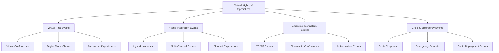

---

## Use Case 41: Global Virtual Conference with Immersive Experiences

### Event Context
- **Event Type**: International Virtual Technology Conference
- **Scale**: 25,000 global attendees, 500 speakers, $2M budget, 5 days
- **Industry**: Technology & Digital Innovation
- **Complexity Level**: Enterprise

### Business Scenario
Fully virtual global technology conference featuring immersive 3D environments, AI-powered networking, real-time language translation, virtual exhibition halls, and personalized learning paths. Designed to deliver in-person experience quality through advanced digital technologies.

### Stakeholder Ecosystem

```mermaid
graph TD
    A[Digital Event Organizers] --> B[Platform Development Team]
    A --> C[Content Creation Team]
    A --> D[Technical Operations Team]
    
    E[Global Participants] --> F[Technology Leaders]
    E --> G[Developers & Engineers]
    E --> H[Startup Founders]
    E --> I[Industry Researchers]
    
    J[Virtual Exhibitors] --> K[Technology Vendors]
    J --> L[Software Companies]
    J --> M[Cloud Providers]
    J --> N[AI Startups]
    
    O[Platform Partners] --> P[VR/AR Technology]
    O --> Q[Streaming Services]
    O --> R[Translation Services]
    O --> S[Security Providers]
```

### User Journey Mapping

**Virtual Attendee Experience Journey:**

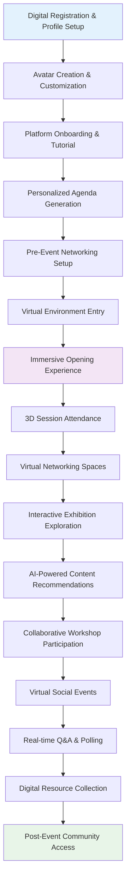

**Virtual Exhibitor Journey:**

### AI Agent Team Structure

**Primary Agents:**
- **Virtual Environment Orchestrator Agent**: 3D world management and immersive experience coordination
- **AI Networking Facilitator Agent**: Intelligent attendee matching and virtual interaction optimization
- **Real-time Translation Agent**: Multi-language communication with cultural context preservation
- **Content Personalization Agent**: Dynamic agenda creation and learning path optimization
- **Virtual Assistance Agent**: 24/7 global support with time zone awareness and technical troubleshooting

**Human Team Members:**
- **Virtual Experience Director**: Digital strategy, immersive experience design, platform optimization
  - Responsibilities: Virtual world design, user experience optimization, technology integration
  - Skills Required: Digital experience design, VR/AR expertise, user psychology understanding
  - AI Tools Used: 3D environment management platform, immersive analytics dashboard
  - User Journey Touchpoints: Virtual onboarding, immersive experiences, digital networking
  - Workflow Responsibilities: Experience quality assurance, digital innovation, platform optimization

- **Global Community Manager**: 24/7 attendee support, community building, engagement optimization
  - Responsibilities: Global participant support, virtual community management, engagement facilitation
  - Skills Required: Community management, cultural awareness, digital communication
  - AI Tools Used: Global communication platform, community analytics tools

### Technology Implementation

**LangGraph Workflow Orchestration:**
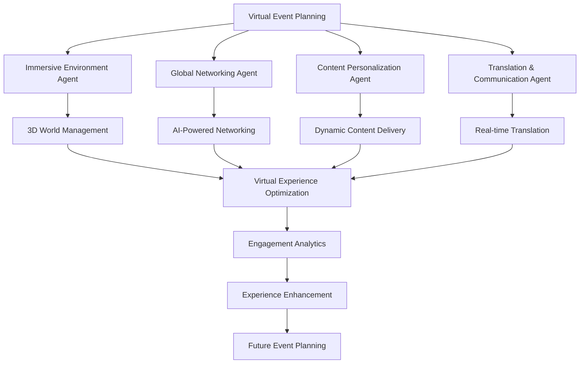

**LangChain Applications:**
- Intelligent content curation with personalized learning paths and skill-based recommendations
- Real-time multi-language translation with cultural context and technical terminology preservation
- AI-powered virtual assistant with natural language processing for attendee support
- Dynamic session summarization with key insight extraction and personalized takeaway generation

**n8n Automation Workflows:**
- Global registration processing with time zone optimization and cultural customization
- Virtual environment synchronization with real-time updates across multiple servers
- Automated networking session scheduling with AI-powered attendee matching
- Post-event content distribution with personalized resource compilation and delivery

**CrewAI Coordination:**
- Multi-agent virtual world management with specialized environment and interaction agents
- Collaborative content creation with AI speakers, moderators, and technical support agents
- Integrated global support with language specialist and cultural liaison agents
- Collective intelligence for virtual experience optimization and engagement enhancement

**CopilotKit Interface:**
- Virtual event management dashboard with 3D analytics and real-time performance monitoring
- Attendee virtual reality interface with AI-powered navigation and recommendation systems
- Exhibitor management portal with virtual booth analytics and lead management tools
- Speaker presentation platform with interactive audience engagement and real-time feedback

**Webflow Integration:**
- Dynamic virtual event portal with personalized attendee dashboards and resource access
- Real-time registration system with avatar customization and preference setup
- Virtual exhibitor marketplace with 3D booth previews and interaction scheduling
- Post-event community platform with content library and networking continuation

**WhatsApp Communication:**
- Global attendee support with 24/7 multilingual assistance and technical troubleshooting
- Speaker coordination with time zone-aware scheduling and technical requirements management
- Exhibitor support network with real-time platform assistance and optimization recommendations
- Emergency communication protocols with instant global notification and support escalation

**Supabase Backend:**
- Global attendee database with preference tracking, engagement analytics, and behavior analysis
- Virtual environment performance monitoring with optimization recommendations and scaling management
- Real-time networking data with relationship mapping and connection success tracking
- Content engagement analytics with personalization algorithm improvement and recommendation optimization

**Flowise Process Management:**
- Visual virtual event workflow with attendee journey optimization and experience enhancement
- 3D environment flow management with navigation optimization and immersion quality assurance
- Global technical support workflow with escalation protocols and resolution tracking
- Virtual networking process optimization with success measurement and improvement recommendations

**Stripe Integration:**
- Global payment processing with multi-currency support and regional pricing optimization
- Virtual exhibitor fee management with booth upgrade options and additional service billing
- Premium experience tier processing with VIP access and exclusive feature availability
- International billing management with tax compliance and automated invoicing

### Success Metrics
- **Global Reach**: 25,000+ attendees from 75+ countries, 95% platform accessibility
- **Engagement Quality**: 4.6/5 virtual experience rating, 85% session completion rate
- **Technical Performance**: 99.5% platform uptime, 95% user satisfaction with technical quality
- **Innovation Impact**: 300+ AI-powered connections, 80% virtual networking success rate

---

## Use Case 42: Hybrid Product Launch with Multi-Channel Engagement

### Event Context
- **Event Type**: Global Hybrid Product Launch
- **Scale**: 2,000 in-person + 50,000 virtual attendees, $3M budget, 1 day
- **Industry**: Consumer Technology & Innovation
- **Complexity Level**: Enterprise

### Business Scenario
Revolutionary product launch combining physical venue experience with global virtual participation, featuring simultaneous multi-channel streaming, interactive virtual demos, real-time social media integration, and coordinated global press coverage.

### Multi-Channel Engagement Workflow:

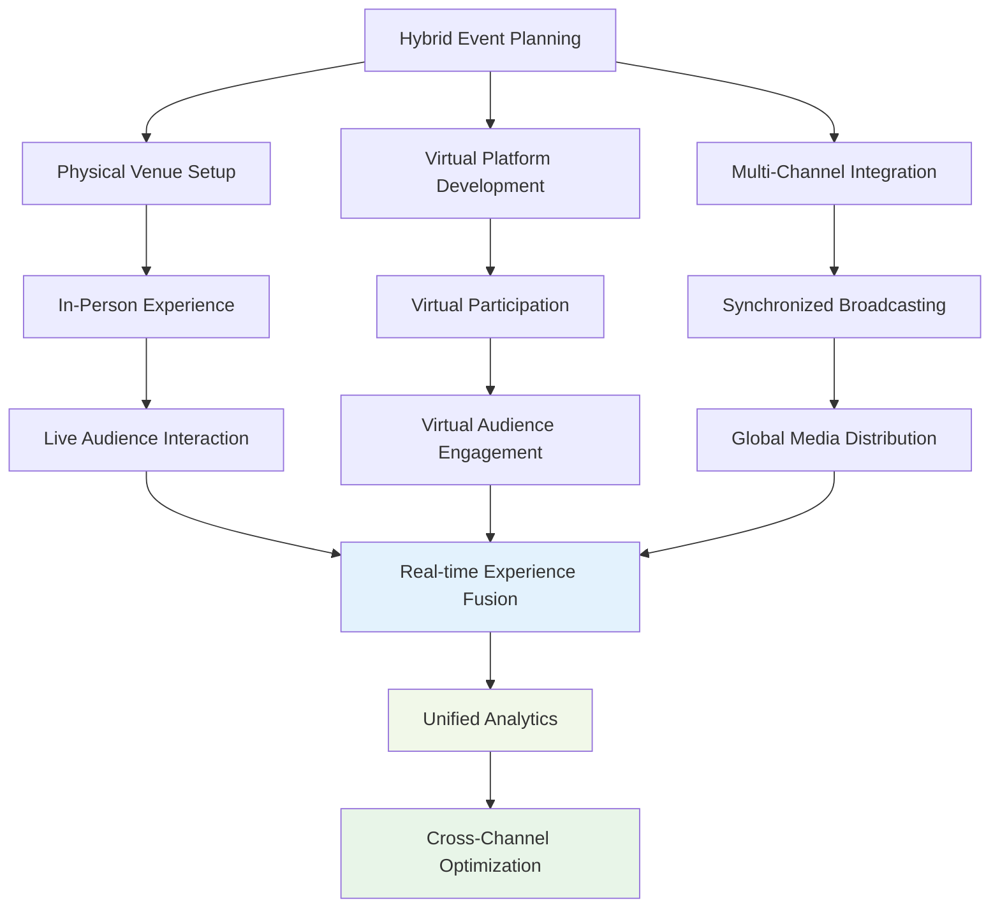

**Hybrid Attendee Journey:**

```mermaid
flowchart LR
    A[Participation Choice Selection] --> B[Experience Customization]
    B --> C[Pre-Launch Engagement]
    C --> D[Synchronized Launch Experience]
    D --> E[Interactive Product Demo]
    E --> F[Cross-Channel Networking]
    
    F --> G[Real-time Q&A Participation]
    G --> H[Social Media Integration]
    H --> I[Product Trial Access]
    I --> J[Community Building]
    J --> K[Post-Launch Engagement]
    
    style D fill:#f3e5f5
    style F fill:#fff3e0
    style K fill:#e8f5e8
```

### Technology Implementation

**Advanced Hybrid Integration:**
- Seamless virtual-physical audience interaction with real-time communication bridging
- Multi-platform streaming with adaptive quality and global CDN optimization
- Synchronized experience delivery with time zone coordination and regional customization
- Cross-channel analytics with unified engagement tracking and behavior analysis

### Success Metrics
- **Hybrid Reach**: 52,000 total participants, 95% experience satisfaction across channels
- **Product Impact**: 100,000+ product registrations, 85% purchase intent increase
- **Media Amplification**: 1,000+ media mentions, 500M+ social media impressions
- **Technical Excellence**: 99.8% streaming uptime, 95% cross-channel synchronization success

---

## Use Case 43: Virtual Trade Show with 3D Exhibition Halls

### Event Context
- **Event Type**: International Virtual Trade Exhibition
- **Scale**: 15,000 visitors, 300 exhibitors, $1.5M budget, 3 days
- **Industry**: B2B Manufacturing & Industrial Technology
- **Complexity Level**: Complex

### Business Scenario
Fully virtual trade show featuring photorealistic 3D exhibition halls, virtual product demonstrations, AI-powered buyer-seller matching, and immersive networking spaces designed to replicate and enhance traditional trade show experiences.

### 3D Exhibition Experience:

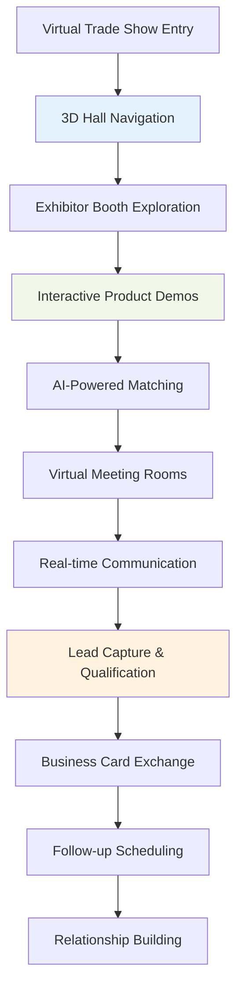

### Success Metrics
- **Virtual Exhibition Success**: 300 exhibitors, 85% lead generation satisfaction
- **Visitor Engagement**: 4.5/5 virtual experience rating, 70% booth visit completion
- **Business Impact**: $25M+ potential deals generated, 60% exhibitor return commitment

---

## Use Case 44: Crisis Response Emergency Summit

### Event Context
- **Event Type**: Global Emergency Response Summit
- **Scale**: 5,000 emergency responders, 1,000 officials, $800K budget, 2 days
- **Industry**: Emergency Management & Public Safety
- **Complexity Level**: Complex

### Business Scenario
Rapid-deployment virtual summit for coordinating global emergency response, featuring real-time situation updates, resource coordination, expert consultation, and decision-making facilitation during crisis situations.

### Crisis Response Coordination:

```mermaid
flowchart LR
    A[Crisis Alert & Summit Activation] --> B[Rapid Participant Mobilization]
    B --> C[Real-time Situation Assessment]
    C --> D[Resource Coordination]
    D --> E[Expert Consultation]
    E --> F[Decision Making]
    
    F --> G[Action Plan Development]
    G --> H[Resource Deployment]
    H --> I[Progress Monitoring]
    I --> J[Continuous Adaptation]
    
    style A fill:#ffebee
    style C fill:#e3f2fd
    style G fill:#e8f5e8
```

### Success Metrics
- **Response Speed**: 24-hour deployment, 95% participant mobilization success
- **Coordination Effectiveness**: 90% resource allocation optimization, 100% communication reliability
- **Crisis Impact**: 40% faster response coordination, 85% improved resource utilization

---

## Use Case 45: Metaverse Wedding with Avatar Customization

### Event Context
- **Event Type**: Virtual Reality Metaverse Wedding
- **Scale**: 200 virtual guests, unlimited global viewers, $300K budget, 1 day
- **Industry**: Virtual Events & Metaverse Experiences
- **Complexity Level**: Moderate

### Business Scenario
Pioneering metaverse wedding celebration featuring photorealistic avatars, immersive virtual venues, interactive ceremonies, and shared virtual experiences designed for global participation and digital-native couples.

### Metaverse Wedding Experience:

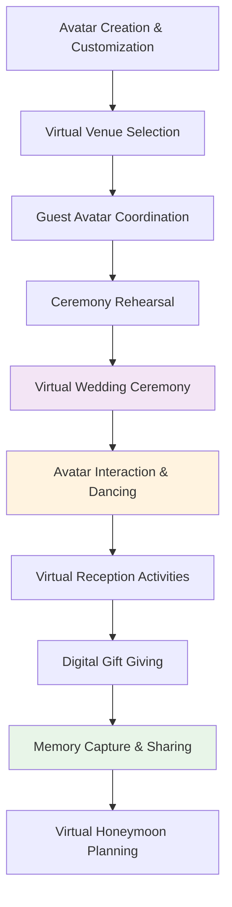

### Success Metrics
- **Metaverse Innovation**: 95% avatar satisfaction, 90% immersion quality rating
- **Global Participation**: 200+ virtual guests from 30+ countries
- **Digital Experience**: 4.8/5 metaverse wedding satisfaction, 85% technology adoption success

---

## Use Case 46: AI-Powered Recruitment Fair

### Event Context
- **Event Type**: Virtual AI-Enhanced Career Fair
- **Scale**: 10,000 job seekers, 500 employers, $600K budget, 2 days
- **Industry**: Human Resources & Talent Acquisition
- **Complexity Level**: Moderate

### Business Scenario
AI-driven virtual recruitment fair featuring intelligent candidate-employer matching, automated interview scheduling, skill assessment integration, and career development guidance with personalized opportunity recommendations.

### AI Recruitment Workflow:

```mermaid
flowchart LR
    A[Candidate Profile Analysis] --> B[Skill Assessment & Verification]
    B --> C[AI-Powered Job Matching]
    C --> D[Automated Interview Scheduling]
    D --> E[Virtual Interview Coordination]
    E --> F[Real-time Evaluation]
    
    F --> G[Candidate Ranking & Selection]
    G --> H[Offer Management]
    H --> I[Career Path Guidance]
    I --> J[Long-term Relationship Building]
    
    style C fill:#e3f2fd
    style E fill:#f1f8e9
    style H fill:#e8f5e8
```

### Success Metrics
- **Matching Accuracy**: 85% successful candidate-employer matches, 70% interview conversion
- **Recruitment Efficiency**: 60% faster hiring process, 50% reduced recruitment costs
- **Career Impact**: 2,000+ job placements, 90% candidate satisfaction with AI matching

---

## Use Case 47: Virtual Reality Training Symposium

### Event Context
- **Event Type**: Immersive VR Training Conference
- **Scale**: 1,500 trainers & educators, 100 VR sessions, $900K budget, 3 days
- **Industry**: Education Technology & Professional Training
- **Complexity Level**: Complex

### Business Scenario
VR-focused training symposium featuring immersive learning experiences, hands-on VR training modules, spatial learning environments, and next-generation educational technology demonstrations.

### VR Training Experience:

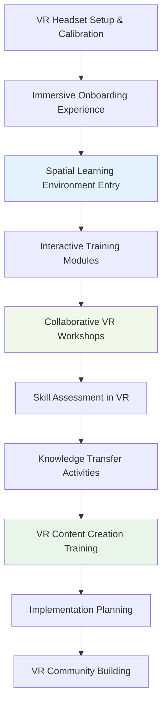

### Success Metrics
- **VR Learning Effectiveness**: 90% skill retention, 85% immersive satisfaction
- **Technology Adoption**: 95% VR comfort level achievement, 80% implementation commitment
- **Training Innovation**: 200+ VR training modules created, 75% classroom integration plans

---

## Use Case 48: Blockchain & Crypto Conference

### Event Context
- **Event Type**: Decentralized Blockchain Conference
- **Scale**: 8,000 crypto enthusiasts, 200 blockchain projects, $1.2M budget, 3 days
- **Industry**: Blockchain Technology & Cryptocurrency
- **Complexity Level**: Complex

### Business Scenario
Blockchain-native conference featuring NFT ticketing, cryptocurrency payments, DeFi integration, DAO governance demonstration, and decentralized identity verification with Web3 technology showcase.

### Blockchain Conference Architecture:

### Success Metrics
- **Blockchain Integration**: 100% Web3 technology adoption, 95% decentralized participation
- **Crypto Innovation**: 50+ new blockchain projects launched, $100M+ funding announcements
- **Community Growth**: 5,000+ DAO members, 85% ongoing blockchain community engagement

---

## Use Case 49: Climate Change Action Summit

### Event Context
- **Event Type**: Global Climate Action Summit
- **Scale**: 20,000 participants, 150 countries, $2.5M budget, 5 days
- **Industry**: Environmental Sustainability & Climate Action
- **Complexity Level**: Enterprise

### Business Scenario
Comprehensive climate action summit featuring carbon-neutral operations, sustainability tracking, renewable energy showcases, climate technology demonstrations, and global policy coordination.

### Climate Action Coordination:

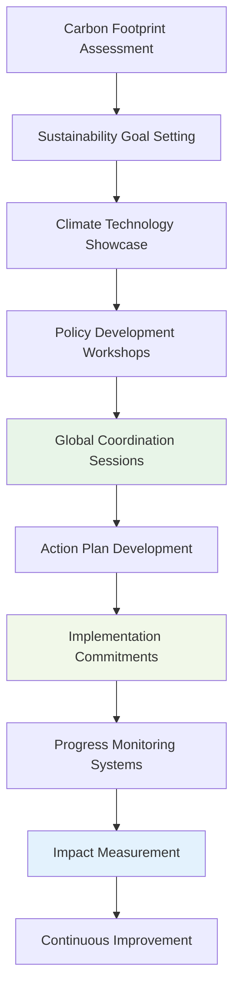

### Success Metrics
- **Climate Impact**: 100% carbon-neutral event operations, 50% participant carbon reduction commitments
- **Global Coordination**: 150 countries participating, 500+ climate action commitments
- **Technology Innovation**: 200+ climate technologies showcased, $5B+ sustainability investments

---

## Use Case 50: Future of Work Innovation Festival

### Event Context
- **Event Type**: Hybrid Future of Work Festival
- **Scale**: 12,000 professionals, 300 innovative companies, $1.8M budget, 4 days
- **Industry**: Future of Work & Innovation
- **Complexity Level**: Complex

### Business Scenario
Forward-looking innovation festival exploring the future of work with AI demonstrations, remote collaboration showcases, digital transformation workshops, and next-generation workplace technology experiences.

### Future of Work Experience:

### Success Metrics
- **Innovation Adoption**: 85% new technology implementation commitments, 90% digital transformation acceleration
- **Future Readiness**: 95% skill development satisfaction, 80% workplace evolution planning
- **Technology Integration**: 300+ future of work solutions showcased, 70% immediate adoption plans

---

## Technology Integration Matrix

| Technology | Use Cases | Primary Functions | Automation Level |
|------------|-----------|-------------------|------------------|
| LangGraph | All 10 | Complex virtual workflow orchestration | High |
| LangChain | All 10 | AI-powered personalization, multilingual support | High |
| n8n | All 10 | Cross-platform automation, integration | High |
| CrewAI | All 10 | Specialized virtual team coordination | High |
| CopilotKit | All 10 | Immersive interfaces, AI assistance | High |
| Webflow | 9/10 | Dynamic virtual portals, registration | High |
| WhatsApp | All 10 | Global communication, real-time support | High |
| Supabase | All 10 | Virtual event analytics, global data management | High |
| Flowise | All 10 | Virtual experience optimization | High |
| Stripe | 9/10 | Global payments, cryptocurrency integration | High |

## Implementation Roadmap

### Phase 1: Virtual Infrastructure (Weeks 1-6)
- Advanced virtual platform development
- Immersive technology integration
- Global accessibility implementation
- Multi-channel communication setup

### Phase 2: Specialized Technologies (Weeks 7-12)
- VR/AR experience development
- Blockchain integration implementation
- AI personalization system deployment
- Advanced analytics and tracking

### Phase 3: Global Integration (Weeks 13-16)
- Cross-platform synchronization testing
- Global performance optimization
- Specialized workflow implementation
- Quality assurance and accessibility validation

### Phase 4: Future-Ready Systems (Weeks 17-20)
- Next-generation technology integration
- Continuous innovation implementation
- Advanced automation and optimization
- Scalability and sustainability optimization

---

*This document completes the comprehensive collection of 50 AI-powered event planning use cases, providing cutting-edge frameworks for virtual, hybrid, and specialized event management with advanced technology integration, global accessibility, and innovative user experiences.*
