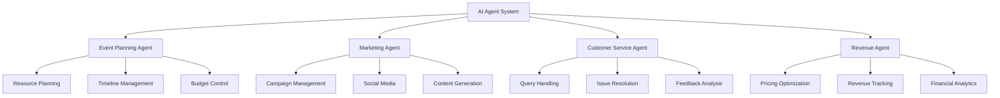
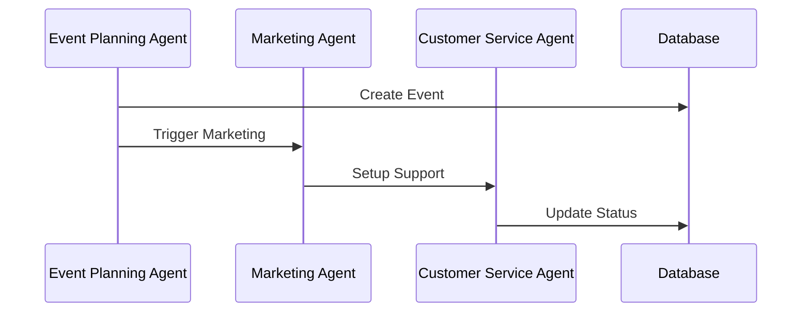
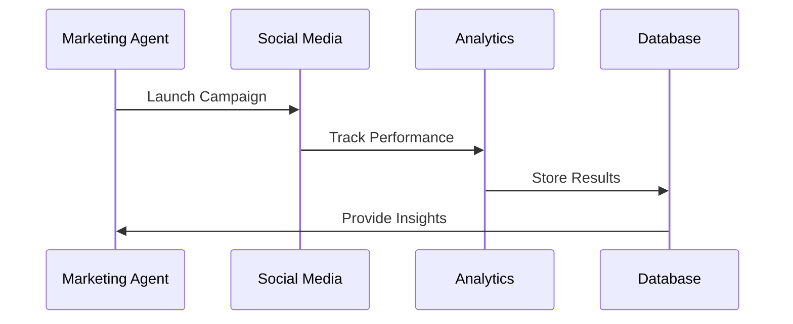

# AI Agents & Automation System

## Table of Contents
1. [AI Agent Architecture](#ai-agent-architecture)
2. [Agent Types & Responsibilities](#agent-types--responsibilities)
3. [Automation Workflows](#automation-workflows)
4. [Integration Points](#integration-points)
5. [Performance Metrics](#performance-metrics)

## AI Agent Architecture

## Agent Types & Responsibilities

### 1. Event Planning Agent
| Function | Description | Tools Used |
|----------|-------------|------------|
| Resource Allocation | Optimize resource distribution | LangChain, Custom Algorithms |
| Timeline Management | Create and manage event timelines | Project Management APIs |
| Budget Control | Monitor and optimize expenses | Financial APIs, Analytics |

### 2. Marketing Agent
| Function | Description | Tools Used |
|----------|-------------|------------|
| Campaign Management | Create and execute marketing campaigns | Social Media APIs |
| Content Generation | Generate marketing content | GPT Models, Content APIs |
| Analytics | Track campaign performance | Analytics APIs |

### 3. Customer Service Agent
| Function | Description | Tools Used |
|----------|-------------|------------|
| Query Handling | Process customer inquiries | NLP Models, FAQ Database |
| Issue Resolution | Resolve customer issues | Ticket System, Knowledge Base |
| Feedback Analysis | Analyze customer feedback | Sentiment Analysis, Analytics |

## Automation Workflows

### 1. Event Setup Workflow

### 2. Marketing Campaign Workflow

## Integration Points

### 1. External Systems
- WhatsApp API
- Social Media Platforms
- Payment Gateways
- Analytics Tools

### 2. Internal Systems
- Supabase Database
- n8n Workflows
- Custom APIs
- Monitoring Systems

## Performance Metrics

| Agent Type | Key Metrics | Target |
|------------|-------------|---------|
| Event Planning | Planning Time | < 2 hours |
| Marketing | Campaign ROI | > 300% |
| Customer Service | Response Time | < 5 minutes |
| Revenue | Revenue Growth | > 30% |

## Implementation Guidelines

### 1. Agent Development
- Use LangChain for agent framework
- Implement custom tools and functions
- Set up monitoring and logging
- Create fallback mechanisms

### 2. Workflow Automation
- Design modular workflows
- Implement error handling
- Set up monitoring
- Create documentation

### 3. Integration
- Use REST APIs
- Implement webhooks
- Set up authentication
- Monitor performance

## Security Considerations

1. **Data Protection**
   - Encrypt sensitive data
   - Implement access controls
   - Regular security audits

2. **API Security**
   - Use API keys
   - Implement rate limiting
   - Monitor usage

3. **System Security**
   - Regular updates
   - Vulnerability scanning
   - Backup systems

## Next Steps
1. Implement core agent functionality
2. Set up automation workflows
3. Integrate external systems
4. Deploy monitoring tools
