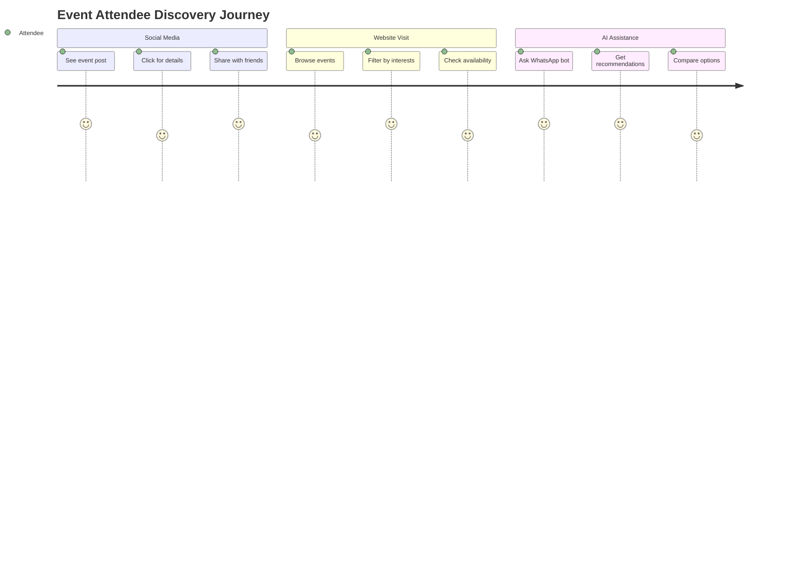
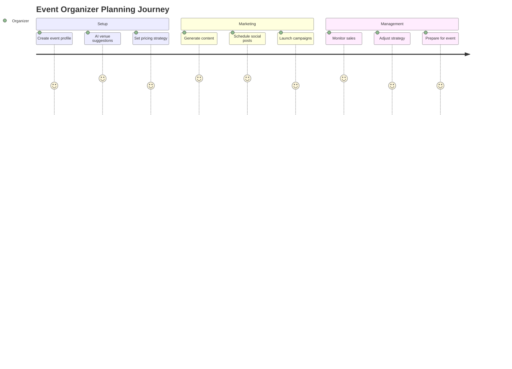
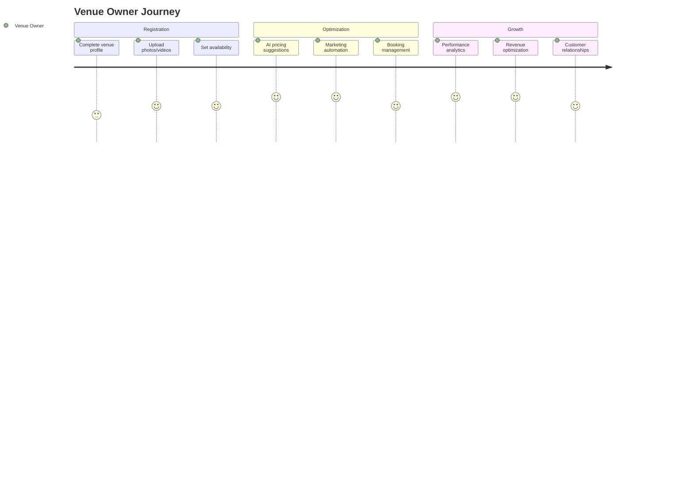
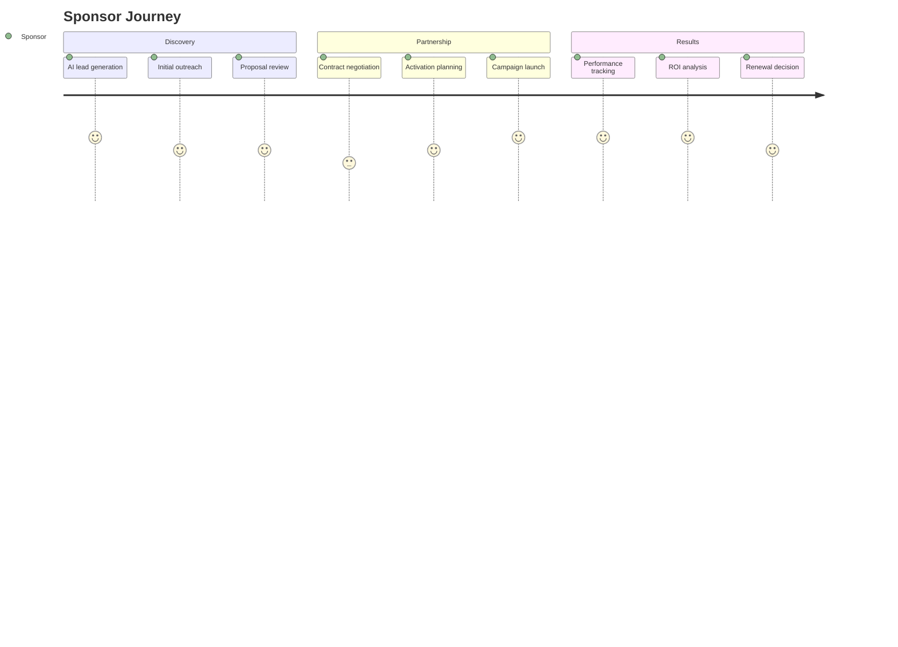
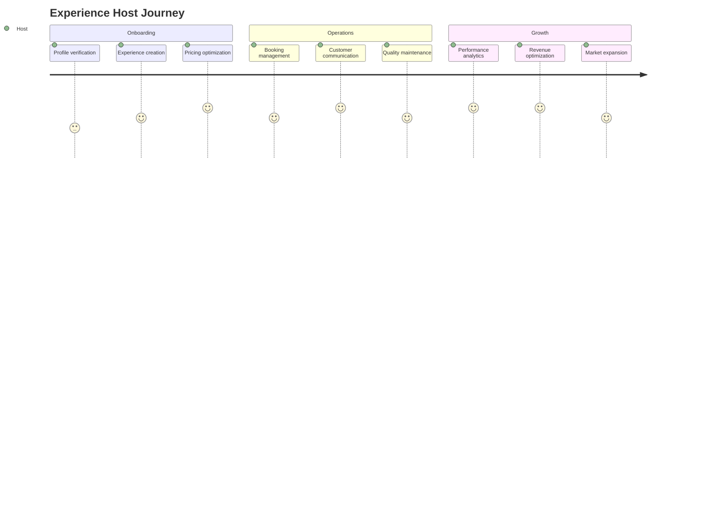

# Complete User Journey Maps

## 🎫 Event Attendee Journey

### Discovery Phase

### Booking & Experience Flow
1. **Event Discovery**
   - Social media feed (Postiz automated posts)
   - AI-powered recommendations based on preferences
   - WhatsApp bot suggestions via Flowise
   - Search with semantic matching (Pinecone)

2. **Information Gathering**
   - Event details with AI-generated descriptions
   - Real-time availability checking
   - Dynamic pricing display
   - Social proof (reviews, attendance)

3. **Booking Process**
   - Streamlined checkout (Stripe integration)
   - Group booking coordination
   - Payment flexibility (cards, cash, digital wallets)
   - Instant confirmation via WhatsApp

4. **Pre-Event Engagement**
   - Automated reminders (n8n workflows)
   - Event updates and changes
   - Networking opportunities
   - Personalized recommendations

5. **Event Experience**
   - Mobile check-in with QR codes
   - Real-time event information
   - Social sharing integration
   - Live support via WhatsApp

6. **Post-Event Follow-up**
   - Automated review requests
   - Photo/video sharing opportunities
   - Future event recommendations
   - Loyalty program benefits

## 🏢 Event Organizer Journey

### Event Planning Phase

### Complete Organizer Workflow
1. **Initial Setup**
   - Account creation with verification
   - Event template selection (AI-assisted)
   - Venue matching via AI recommendations
   - Pricing strategy with dynamic suggestions

2. **Content Creation**
   - AI-generated event descriptions
   - Automated social media content (Postiz)
   - Multi-language content management
   - SEO optimization suggestions

3. **Marketing & Promotion**
   - Cross-platform campaign management
   - Sponsor matching and outreach
   - Influencer collaboration tools
   - Performance tracking and optimization

4. **Sales Management**
   - Real-time booking analytics
   - Dynamic pricing adjustments
   - Customer communication automation
   - Revenue forecasting and planning

5. **Event Execution**
   - Check-in management systems
   - Real-time attendee insights
   - Issue resolution support
   - Live performance monitoring

6. **Post-Event Analysis**
   - Comprehensive analytics reports
   - Customer feedback analysis
   - ROI calculation and insights
   - Future event recommendations

## 🏨 Venue Owner Journey

### Onboarding & Setup

### Detailed Venue Management Flow
1. **Profile Creation**
   - Comprehensive venue registration
   - AI-powered photography recommendations
   - Capacity and facility documentation
   - Pricing strategy development

2. **Availability Management**
   - Dynamic calendar management
   - Automated booking confirmations
   - Conflict resolution systems
   - Maintenance scheduling integration

3. **Marketing Support**
   - AI-generated venue descriptions
   - Social media content automation
   - SEO optimization for local search
   - Partnership opportunity identification

4. **Booking Operations**
   - Real-time availability updates
   - Automated customer communication
   - Payment processing and management
   - Review and rating systems

5. **Performance Optimization**
   - Revenue analytics and insights
   - Booking pattern analysis
   - Competitive positioning data
   - Growth opportunity identification

## 💼 Sponsor Journey

### Lead Generation to Activation

### Complete Sponsorship Lifecycle
1. **Lead Identification**
   - AI-powered sponsor matching
   - Industry and audience alignment
   - Budget and goal compatibility
   - Automated outreach sequences

2. **Proposal & Negotiation**
   - Customized sponsorship packages
   - ROI projections and guarantees
   - Contract management systems
   - Approval workflow automation

3. **Activation & Management**
   - Brand integration across platforms
   - Content collaboration tools
   - Real-time campaign monitoring
   - Automated reporting systems

4. **Performance & Optimization**
   - Comprehensive analytics dashboards
   - Engagement and conversion tracking
   - ROI calculation and reporting
   - Renewal and upselling opportunities

## 🌟 Tourism Experience Host Journey

### Host Onboarding to Success

### Detailed Host Experience Flow
1. **Host Registration**
   - Identity and credential verification
   - Experience documentation and photography
   - Safety and quality standard compliance
   - Payment setup and tax compliance

2. **Experience Optimization**
   - AI-powered description enhancement
   - Dynamic pricing recommendations
   - Availability calendar management
   - Multi-language content creation

3. **Customer Interaction**
   - Automated booking confirmations
   - Pre-experience communication
   - Real-time support during experiences
   - Post-experience follow-up

4. **Business Development**
   - Performance analytics and insights
   - Revenue optimization recommendations
   - Marketing support and promotion
   - Network expansion opportunities