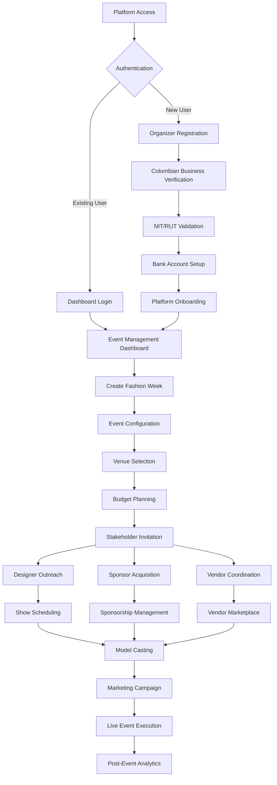
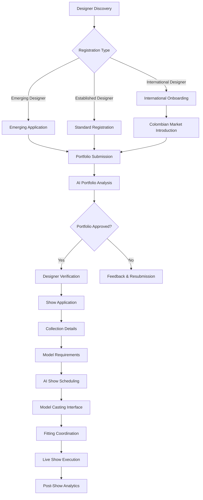
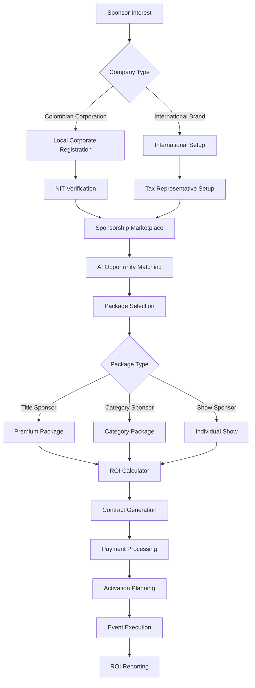
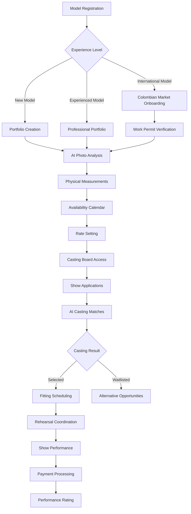

# 👥 Stakeholder User Journeys: Fashion Week Platform

## Overview

Comprehensive user journeys for all 7 stakeholder types in the Fashion Week AI platform, featuring Colombian market-specific flows and culturally-adapted onboarding processes.

## 🎯 Stakeholder Overview

### Primary Stakeholders
1. **Event Organizers** - Platform administrators and fashion week coordinators
2. **Fashion Designers** - Creators showcasing collections on runways
3. **Corporate Sponsors** - Brands investing in fashion week partnerships
4. **Vendors/Exhibitors** - Service providers and product vendors
5. **Models** - Runway and fashion show talent
6. **Media/Press** - Journalists, photographers, influencers
7. **Attendees/VIPs** - Fashion enthusiasts and industry professionals

### Colombian Market Context
- **Primary Language**: Spanish (with English fallback)
- **Payment Preferences**: PSE (45%), Nequi (30%), Efecty (15%), Cards (10%)
- **Communication**: WhatsApp business integration critical
- **Business Hours**: 8 AM - 6 PM COT (America/Bogota)

## 🏢 1. Event Organizer Journey

### Organizer User Flow



### Organizer Experience Details

**Phase 1: Registration & Setup**

1. **Colombian Business Registration**
   ```typescript
   const organizerSetup = {
     businessInfo: {
       companyName: "Colombia Moda Organización SAS",
       nit: "900123456-7",
       taxRegime: "Régimen Común",
       businessType: "SAS"
     },
     eventDetails: {
       name: "Colombia Moda 2025",
       dates: ["2025-07-27", "2025-08-01"],
       city: "Medellín",
       expectedAttendance: 60000,
       budget: 2500000000 // COP
     },
     bankingSetup: {
       primaryBank: "Bancolombia",
       accountType: "Cuenta Corriente",
       paymentMethods: ["PSE", "Nequi", "Stripe"]
     }
   };
   ```

2. **AI-Guided Event Planning**
   - Automated venue recommendations in Medellín/Bogotá
   - Budget optimization with Colombian cost structure
   - Timeline creation with local holiday considerations
   - Stakeholder database with Colombian fashion ecosystem

**Phase 2: Stakeholder Management**

3. **Designer Onboarding Dashboard**
   - Portfolio review interface with AI categorization
   - Show slot allocation with conflict prevention
   - Contract generation in Spanish with Colombian legal compliance
   - Payment terms setup with local banking integration

4. **Real-time Event Dashboard**
   - Live attendee tracking via QR codes
   - Revenue monitoring in COP with tax calculations
   - Emergency response via WhatsApp groups
   - Social media monitoring with Colombian hashtags

## 👗 2. Fashion Designer Journey

### Designer User Flow



### Designer Experience Details

**Colombian Designer Journey**

1. **Registration Process**
   ```spanish
   Registro de Diseñador - Colombia Moda 2025
   
   Información Personal:
   - Nombre completo
   - Cédula de ciudadanía
   - Ciudad de residencia
   - Experiencia en moda (años)
   
   Información de Marca:
   - Nombre de la marca
   - Estilo/Categoría (Casual, Formal, Sostenible, Alta Costura)
   - Precio promedio por prenda
   - Redes sociales (@instagram, @tiktok)
   ```

2. **Portfolio AI Analysis**
   - Style categorization (Casual, Formal, Avant-garde, Sustainable)
   - Colombian market fit assessment
   - Price point analysis for local purchasing power
   - International appeal scoring

3. **Show Configuration**
   ```typescript
   const designerShow = {
     collectionInfo: {
       name: "Tradición Colombiana Contemporánea",
       theme: "Heritage meets Innovation",
       pieces: 25,
       models: 12,
       duration: 30
     },
     venuePreferences: {
       capacity: "medium", // 200-500 attendees
       technicalNeeds: ["runway_standard", "LED_lighting", "professional_sound"],
       preferredSlots: ["afternoon", "evening"]
     },
     modelRequirements: {
       heightRange: [170, 180],
       experience: "intermediate",
       localPreferred: true,
       diversityRequested: true
     }
   };
   ```

**International Designer Journey**

4. **Colombian Market Integration**
   - Cultural briefing on Colombian fashion preferences
   - Local sizing conversion and market pricing guidance
   - Partner recommendations (production, logistics, marketing)
   - Language support for Spanish communication

## 🏢 3. Corporate Sponsor Journey

### Sponsor User Flow



### Sponsor Experience Details

**Colombian Corporate Sponsors**

1. **AI-Powered Opportunity Matching**
   ```typescript
   const sponsorMatching = {
     companyProfile: {
       industry: "belleza_cosmeticos",
       targetDemographic: "mujeres_25_45",
       budget: 500000000, // COP
       objectives: ["brand_awareness", "product_launch"]
     },
     recommendations: [
       {
         opportunity: "Sponsor Categoría: Belleza & Cosmética",
         investment: 300000000, // COP
         expectedROI: "15-20%",
         audienceReach: 25000,
         digitalImpressions: 2000000
       }
     ]
   };
   ```

2. **Sponsorship Packages**
   - **Title Sponsor** (1 available): $800M COP - Full event branding
   - **Category Sponsor** (5 available): $300M COP - Category exclusivity
   - **Show Sponsor** (20 available): $100M COP - Individual show branding

**International Brand Sponsors**

3. **Colombian Market Entry Support**
   - Market research and competitive analysis
   - Local partner recommendations
   - Cultural adaptation consulting
   - Colombian influencer network introduction

## 🛍️ 4. Vendor/Exhibitor Journey

### Vendor Categories (Colombian Market)

**Service Providers**
1. **Fashion Services**
   - Styling and wardrobe consultation
   - Hair and makeup artists (Colombian beauty standards)
   - Photography with Colombian cultural sensitivity
   - Fashion show production with local expertise

2. **Event Services**
   - Audio/visual equipment (Colombian power standards)
   - Transportation and logistics (Medellín traffic expertise)
   - Security services (Colombian safety protocols)
   - Catering (Colombian cuisine specialties)

**Product Vendors**
3. **Fashion Retail**
   - Colombian designer boutiques
   - Emerald jewelry (Colombian specialty)
   - Sustainable fashion (growing Colombian trend)
   - Textile suppliers (Colombian cotton, alpaca)

### Vendor Experience

```typescript
const vendorOnboarding = {
  registration: {
    vendorType: "service_provider", // or "product_vendor"
    specialties: ["makeup_artist", "hair_styling"],
    experience: "5_years",
    clientReferences: ["Designer A", "Colombia Moda 2024"]
  },
  portfolioSetup: {
    serviceOfferings: [
      {
        service: "Runway Makeup",
        priceRange: "150000-300000", // COP per model
        duration: "45_minutes",
        includedItems: ["base_makeup", "special_effects", "touch_ups"]
      }
    ],
    availability: {
      dates: ["2025-07-27", "2025-07-28", "2025-07-29"],
      timeSlots: ["morning", "afternoon", "evening"],
      capacity: "up_to_15_models_per_day"
    }
  }
};
```

## 👤 5. Model Journey

### Model User Flow



### Model Experience Details

**Colombian Model Journey**

1. **Registration & Portfolio Creation**
   ```spanish
   Registro de Modelo - Colombia Moda 2025
   
   Información Personal:
   - Nombre completo y cédula
   - Edad y ciudad de residencia
   - Agencia representante (si aplica)
   - Experiencia en pasarela (años)
   
   Especialidades:
   □ Moda comercial
   □ Alta costura
   □ Moda sostenible
   □ Plus size
   □ Moda masculina
   
   Medidas Corporales:
   - Altura: ___ cm
   - Medidas: ___-___-___ cm
   - Talla de calzado: ___ EUR
   ```

2. **AI-Powered Casting System**
   - Automatic matching with designer requirements
   - Style compatibility analysis based on portfolio
   - Experience level alignment
   - Schedule conflict prevention

3. **Payment & Legal**
   ```typescript
   const modelPayment = {
     rateStructure: {
       runwayShow: "800000-1500000", // COP per show
       fitting: "150000", // COP per hour
       rehearsal: "200000", // COP per session
       travel: "actual_costs" // if outside city
     },
     paymentMethods: ["bank_transfer", "nequi", "daviplata"],
     taxObligations: {
       withholdingTax: "11%", // Colombian retefuente
       platformFee: "5%",
       netPayment: "84%"
     }
   };
   ```

**International Model Journey**

4. **Colombian Work Authorization**
   - Visa requirement guidance (Tourism vs Work visa)
   - Work permit application support
   - Local agency partnership facilitation
   - Cultural orientation and basic Spanish phrases

## 📸 6. Media/Press Journey

### Media Experience Details

**Colombian Fashion Media**

1. **Accreditation Levels**
   ```typescript
   const mediaAccreditation = {
     vipPress: {
       requirements: ["major_publication", "50000+_reach"],
       access: ["all_shows", "backstage", "designer_interviews", "vip_lounge"],
       benefits: ["dedicated_wifi", "press_kit", "exclusive_content"]
     },
     standardPress: {
       requirements: ["recognized_outlet", "fashion_focus"],
       access: ["main_shows", "press_area", "scheduled_interviews"],
       benefits: ["press_kit", "standard_wifi", "networking_area"]
     },
     contentCreator: {
       requirements: ["10000+_followers", "fashion_content"],
       access: ["selected_shows", "content_creation_zones", "social_media_support"],
       benefits: ["branded_hashtags", "social_media_kit", "influencer_lounge"]
     }
   };
   ```

2. **Content Creation Tools**
   - Real-time press kit access in Spanish and English
   - High-resolution image downloads
   - Designer bio and collection information
   - Social media templates with Colombian brand guidelines

**International Media**

3. **Colombian Context Support**
   - Cultural briefing on Colombian fashion industry
   - Key local players and emerging designers introduction
   - Market trends and consumer behavior insights
   - Spanish-English interpretation services

## 🎟️ 7. Attendee/VIP Journey

### Attendee Experience Details

**Ticket Categories & Pricing (COP)**

```typescript
const ticketPricing = {
  generalAdmission: {
    price: 150000, // COP (~$37 USD)
    includes: ["runway_shows", "exhibitions", "basic_networking"],
    earlyBird: 120000, // 20% discount
    paymentMethods: ["PSE", "Nequi", "Efecty", "Credit_Card"]
  },
  
  vipPackage: {
    price: 400000, // COP (~$100 USD)
    includes: ["all_shows", "vip_lounge", "designer_meetups", "welcome_cocktail"],
    exclusiveContent: ["backstage_glimpses", "designer_interviews"],
    networking: ["business_matchmaking", "VIP_networking_area"]
  },
  
  allAccessPass: {
    price: 800000, // COP (~$200 USD)
    includes: ["full_access", "backstage", "after_parties", "exclusive_dinners"],
    limitedQuantity: 200,
    conciergeService: true
  }
};
```

**Colombian Fashion Professionals**

1. **Professional Networking Features**
   - Industry contact matching based on business goals
   - Business meeting scheduling during events
   - Colombian fashion ecosystem integration
   - Collaboration project opportunities board

2. **Mobile Experience (67.5% prefer mobile)**
   ```typescript
   const mobileFeatures = {
     coreNavigation: ["Schedule", "Network", "Messages", "Live_Stream"],
     quickActions: ["scan_qr", "whatsapp_contact", "instagram_share"],
     colombianPayments: ["nequi_quick_pay", "pse_integration"],
     realTimeUpdates: ["show_changes", "traffic_alerts", "emergency_broadcasts"]
   };
   ```

**International Visitors**

3. **Colombian Experience Integration**
   - Cultural immersion activities (coffee tours, emerald museums)
   - Local fashion brand discovery tours
   - Colombian designer shopping experiences with currency conversion
   - Tourism coordination with fashion itinerary

## 🔄 Cross-Stakeholder Interactions

### Key Integration Points

**Designer ↔ Model Interactions**
- AI-powered casting recommendations with compatibility scoring
- Direct messaging for fitting coordination in Spanish/English
- Performance feedback and rating system
- Long-term relationship building for future collaborations

**Sponsor ↔ Media Interactions**
- Branded content collaboration opportunities
- Exclusive interview access with sponsored designers
- Co-branded social media campaigns with Colombian influencers
- ROI measurement through media coverage analytics

**Organizer ↔ All Stakeholders**
- Centralized WhatsApp Business communication hub
- Real-time updates via push notifications and SMS
- Emergency response coordination with local authorities
- Post-event feedback collection with cultural sensitivity

### Colombian Cultural Considerations

**Business Relationship Building**
- Personal relationship emphasis before business transactions
- Family and personal life integration in professional context
- Formal but warm communication style
- Respect for hierarchy and experience

**Payment and Business Practices**
- Preference for cash and local payment methods
- Invoice requirements for tax compliance (DIAN)
- Bank reference verification for new business relationships
- Extended payment terms (30-60 days) common in Colombian business

This comprehensive stakeholder journey documentation ensures cultural relevance for the Colombian market while maintaining international standards and accessibility for all user types. 