# 🚀 I Love Medellín - LangChain LangGraph Full-Cycle Business AI Automation System
## Comprehensive Project Implementation Plan

---

## 📋 Executive Summary

### Project Vision
Transform I Love Medellín into Colombia's first AI-powered, fully automated marketplace that seamlessly integrates tourism, real estate, events, and restaurant services through an intelligent multi-agent system that handles the complete business cycle from lead generation to post-sale analytics.

### Key Objectives
- **Build a self-sustaining AI ecosystem** that operates 24/7 with minimal human intervention
- **Automate 95% of all business processes** from customer acquisition to revenue collection
- **Create intelligent agents** that learn, adapt, and optimize performance continuously
- **Integrate all existing systems** (Webflow, Supabase, WhatsApp, Stripe, n8n) into a unified platform
- **Generate $500K monthly GMV** within 6 months through automated operations

### Success Metrics
- **Technical**: 99.9% uptime, <500ms response time, 95% automation rate
- **Business**: 50,000 MAU, 15% conversion rate, $150 AOV
- **Financial**: $500K monthly GMV, 250% ROI in 18 months
- **Operational**: 80% cost reduction, 24/7 autonomous operation

### Current System State
- **Database**: Supabase with 50+ tables designed and partially implemented
- **Frontend**: Webflow CMS configured with basic collections
- **Automation**: n8n workflows created for basic operations
- **Payments**: Stripe Connect integration planned
- **Communication**: WhatsApp Business API ready for integration
- **AI/Search**: Pinecone vector database configured
- **MCP Servers**: Active for Supabase, n8n, and Pinecone

---

## 🏗️ System Architecture Overview

### Full-Cycle Business Automation Architecture


---

## 📅 Phase 1: Foundation & Infrastructure (Weeks 1-3)

### Overview
**Purpose**: Establish the core infrastructure and foundational AI agents that will power the entire platform. This phase focuses on creating a robust, scalable foundation that can handle full business automation.

**Key Goals**:
- Set up complete development environment with all necessary tools
- Implement core LangGraph architecture with supervisory hierarchy
- Create base agent templates and communication protocols
- Integrate all existing services into unified system
- Establish monitoring and error handling frameworks

### Week 1: Development Environment & Core Setup

#### Day 1-2: Environment Configuration
**Goal**: Create a production-ready development environment

**Tasks**:
1. **Repository Setup**
   - Initialize main repository with proper structure
   - Configure Git flow for Claude-human collaboration
   - Set up branch protection and review processes
   - Create comprehensive README and documentation structure

2. **LangGraph Installation**
   - Install LangGraph Core, Swarm, and Supervisor
   - Configure development dependencies
   - Set up Python virtual environment
   - Install required community nodes from GitHub

3. **MCP Server Configuration**
   - Verify Supabase MCP connection
   - Test n8n MCP functionality
   - Configure Pinecone MCP for vector operations
   - Document all MCP commands and usage patterns

**Success Criteria**:
- All team members can access and contribute to repository
- LangGraph examples run successfully
- MCP servers respond to all commands
- Development environment reproducible from documentation

#### Day 3-4: Core Infrastructure Integration
**Goal**: Connect all existing services into unified system

**Integration Architecture**:


**Implementation Steps**:
1. **Supabase Integration**
   - Create database connection pooling
   - Implement real-time subscriptions
   - Set up Row Level Security policies
   - Create audit logging tables

2. **WhatsApp Integration**
   - Configure WATI/Twilio credentials
   - Create message template manager
   - Implement webhook handlers
   - Set up conversation state management

3. **Stripe Integration**
   - Initialize Stripe Connect
   - Create payment intent handlers
   - Implement commission splitting logic
   - Set up webhook processing

**Success Criteria**:
- All services connected and authenticated
- Test transactions complete successfully
- Real-time data sync operational
- Error handling catches all edge cases

#### Day 5-7: Base Agent Architecture
**Goal**: Create foundational agent structure for all business operations

**Master Supervisor Architecture**:


**Implementation**:
1. **Base Agent Class**
   ```python
   # Core structure (conceptual - no actual code)
   BaseAgent:
     - State management
     - Memory interface
     - Tool registry
     - Communication protocol
     - Error handling
     - Performance tracking
   ```

2. **Supervisor Hierarchy**
   - Master Supervisor: Overall orchestration
   - Vertical Supervisors: Business line management
   - Support Supervisors: Cross-cutting concerns
   - Agent Registry: Dynamic agent discovery

**Success Criteria**:
- Base architecture supports all planned features
- Agents can communicate bidirectionally
- State persists across sessions
- Performance metrics collected automatically

### Week 2: Business Process Automation

#### Day 1-3: Lead Generation & Customer Acquisition
**Goal**: Automate the entire customer acquisition funnel

**Lead Generation System Architecture**:


**Implementation Components**:
1. **Multi-Channel Lead Capture**
   - Webflow form integration
   - Social media webhook handlers
   - Chat widget implementation
   - QR code campaign system

2. **Lead Enrichment Pipeline**
   - Clay.com API integration
   - Social profile matching
   - Company data enrichment
   - Behavioral scoring

3. **Automated Nurture Campaigns**
   - Segment-based routing
   - Personalized content delivery
   - Multi-touch attribution
   - A/B testing framework

**Success Criteria**:
- Leads captured from all channels automatically
- 100% of leads enriched within 5 minutes
- Nurture campaigns trigger without manual intervention
- Conversion tracking accurate across all touchpoints

#### Day 4-5: Sales & Booking Automation
**Goal**: Create seamless booking experience across all verticals

**Unified Booking System**:


**Key Features**:
1. **Intelligent Booking Agent**
   - Natural language understanding
   - Multi-vertical capability
   - Dynamic availability checking
   - Real-time pricing optimization

2. **Payment Automation**
   - Stripe Connect integration
   - Commission calculation
   - Multi-party payments
   - Automated invoicing

3. **Communication Orchestration**
   - WhatsApp confirmations
   - Email backups
   - SMS failover
   - In-app notifications

**Success Criteria**:
- End-to-end booking without human intervention
- Payment processing success rate >98%
- Confirmation delivery within 30 seconds
- Partner notifications 100% reliable

#### Day 6-7: Operational Automation
**Goal**: Automate all backend operations and reporting

**Operational Automation Flow**:


**Implementation**:
1. **n8n Workflow Integration**
   - Schedule daily sync workflows
   - Create error handling workflows
   - Implement retry mechanisms
   - Set up monitoring alerts

2. **Financial Automation**
   - Automated commission splits
   - Weekly partner payouts
   - Monthly statements
   - Tax document generation

3. **Reporting Dashboard**
   - Real-time KPI tracking
   - Automated report generation
   - Anomaly detection
   - Predictive analytics

**Success Criteria**:
- Zero manual operational tasks
- Financial accuracy 100%
- Reports generated automatically
- Predictive models improve weekly

### Week 3: Testing & Optimization

#### Day 1-3: Integration Testing
**Goal**: Ensure all components work seamlessly together

**Testing Framework**:


**Testing Components**:
1. **Automated Test Suite**
   - Agent communication tests
   - Database transaction tests
   - Payment flow validation
   - Multi-language support

2. **Load Testing**
   - Simulate 1,000 concurrent users
   - Test agent scaling
   - Database performance
   - API rate limits

3. **Security Validation**
   - SQL injection prevention
   - XSS protection
   - Authentication flows
   - Data encryption

**Success Criteria**:
- All tests pass with >95% coverage
- System handles 1,000 concurrent users
- Zero security vulnerabilities
- Recovery from failures within 60 seconds

#### Day 4-5: Performance Optimization
**Goal**: Optimize system for speed and efficiency

**Optimization Areas**:
1. **Database Optimization**
   - Query optimization
   - Index creation
   - Connection pooling
   - Caching strategy

2. **Agent Performance**
   - Response time reduction
   - Memory optimization
   - Parallel processing
   - Resource allocation

3. **API Optimization**
   - Request batching
   - Response caching
   - CDN configuration
   - Compression

**Success Criteria**:
- Average response time <500ms
- Database queries <100ms
- Agent decision time <2 seconds
- 50% reduction in API calls

#### Day 6-7: Documentation & Training
**Goal**: Prepare comprehensive documentation for all systems

**Documentation Structure**:
1. **Technical Documentation**
   - Architecture diagrams
   - API documentation
   - Agent specifications
   - Integration guides

2. **Operational Guides**
   - Daily operations manual
   - Troubleshooting guide
   - Emergency procedures
   - Monitoring setup

3. **Business Documentation**
   - Partner onboarding
   - Feature descriptions
   - ROI calculations
   - Growth strategies

**Success Criteria**:
- Complete documentation coverage
- All procedures documented
- Emergency contacts listed
- Knowledge transfer complete

---

## 📅 Phase 2: Vertical Implementation (Weeks 4-7)

### Overview
**Purpose**: Implement specialized agents for each business vertical with deep integration into the Colombian market. Each vertical will have autonomous operation capabilities while maintaining system-wide coordination.

**Key Goals**:
- Deploy production-ready agents for all four verticals
- Integrate with local Colombian services and payment methods
- Create Spanish-first experiences with English support
- Establish partner networks in each vertical
- Achieve 90% automation in vertical operations

### Week 4: Tourism & Experiences Vertical

#### Day 1-3: Tourism Agent Ecosystem
**Goal**: Create comprehensive tourism automation system

**Tourism Agent Architecture**:


**Implementation Details**:

1. **Experience Discovery Agent**
   - Natural language search in Spanish/English
   - Semantic matching using Pinecone
   - Personalization based on preferences
   - Real-time availability checking
   - Price comparison across providers

2. **Itinerary Planning Agent**
   - Multi-day trip planning
   - Budget optimization
   - Travel time calculations
   - Restaurant recommendations
   - Activity sequencing

3. **Colombian Market Integration**
   - Comuna 13 graffiti tours
   - Coffee farm experiences
   - Pablo Escobar history tours
   - Guatapé day trips
   - Paragliding in San Felix

**Success Criteria**:
- 100+ tour operators integrated
- Booking success rate >95%
- Spanish language accuracy >98%
- Average booking time <5 minutes
- Customer satisfaction >4.5/5

#### Day 4-5: Dynamic Pricing & Yield Management
**Goal**: Implement intelligent pricing for maximum revenue

**Pricing Engine Architecture**:


**Key Features**:
- Real-time price adjustments
- Competitor price monitoring
- Seasonal demand forecasting
- Event-based pricing
- Weather impact modeling

**Success Criteria**:
- 20% revenue increase through optimization
- Price updates within 5 minutes
- Competitive positioning maintained
- Occupancy rate >80%

#### Day 6-7: Partner Onboarding & Training
**Goal**: Rapidly onboard tourism partners

**Partner Automation System**:
1. **Self-Service Onboarding**
   - Digital contract signing
   - Automated credential verification
   - Experience listing creation
   - Photo upload and optimization
   - Pricing configuration

2. **Training Automation**
   - Interactive tutorials
   - WhatsApp training bot
   - Performance dashboards
   - Best practices sharing

**Success Criteria**:
- 50 partners onboarded
- Onboarding time <30 minutes
- Zero manual intervention
- Partner satisfaction >90%

### Week 5: Real Estate Vertical

#### Day 1-3: Property Management Ecosystem
**Goal**: Automate entire property rental and sales cycle

**Real Estate Agent Architecture**:


**Colombian Real Estate Features**:
1. **Estrato System Integration**
   - Automatic estrato classification
   - Utility cost estimation
   - Neighborhood safety ratings

2. **Local Document Processing**
   - Cédula verification
   - Certificado de tradición
   - Paz y salvo automation

3. **Colombian Payment Methods**
   - Bancolombia integration
   - PSE payments
   - Efecty for cash deposits

**Success Criteria**:
- 500+ properties listed
- Application processing <24 hours
- Document verification automated
- Tenant satisfaction >4.3/5

#### Day 4-5: Virtual Viewing Technology
**Goal**: Enable remote property viewing

**Virtual Tour System**:
- 360° property tours
- AR furniture placement
- Neighborhood street view
- Live video tours with agents
- VR headset support

**Success Criteria**:
- 80% properties with virtual tours
- Tour completion rate >70%
- Booking conversion >30%
- Technical issues <5%

#### Day 6-7: Legal Compliance Automation
**Goal**: Ensure full Colombian legal compliance

**Compliance Features**:
- Automated contract generation
- Digital signature integration
- Tax calculation (predial, valorización)
- Deposit protection system
- Eviction process management

**Success Criteria**:
- 100% legal compliance
- Contract generation <5 minutes
- Zero legal disputes
- Automated tax filing

### Week 6: Events & Restaurant Verticals

#### Day 1-3: Event Management Platform
**Goal**: Full event lifecycle automation

**Event Platform Architecture**:


**Key Features**:
1. **Sponsor Matching AI**
   - Brand alignment analysis
   - ROI projections
   - Activation recommendations
   - Contract automation

2. **Attendee Engagement**
   - Personalized schedules
   - Networking suggestions
   - Live polling
   - Gamification

**Success Criteria**:
- 50 events monthly
- 85% capacity average
- Sponsor satisfaction >4.5/5
- Zero event failures

#### Day 4-5: Restaurant Automation
**Goal**: Complete restaurant operation digitization

**Restaurant System Architecture**:


**Colombian Restaurant Features**:
- Menu corriente automation
- Propina (tip) handling
- Dataphone integration
- Rappi/Didi sync

**Success Criteria**:
- 200 restaurants onboarded
- Table turnover +20%
- Order accuracy >98%
- Customer wait time -30%

#### Day 6-7: Cross-Vertical Integration
**Goal**: Create seamless experiences across verticals

**Integration Features**:
- Tourism + Restaurant packages
- Event + Accommodation bundles
- Real Estate + Local services
- Loyalty points across verticals

**Success Criteria**:
- 30% cross-vertical bookings
- Unified customer experience
- Single payment flow
- Integrated loyalty program

### Week 7: Advanced AI Features

#### Day 1-3: Machine Learning Implementation
**Goal**: Deploy predictive and optimization models

**ML Architecture**:


**Key Models**:
1. **Demand Forecasting**
   - Seasonal patterns
   - Event impact
   - Weather correlation
   - Economic indicators

2. **Dynamic Pricing**
   - Competitor analysis
   - Elasticity modeling
   - Yield optimization
   - Bundle pricing

3. **Customer Intelligence**
   - Lifetime value prediction
   - Churn risk scoring
   - Next best action
   - Personalization engine

**Success Criteria**:
- Forecast accuracy >85%
- Revenue lift >20%
- Churn reduction >30%
- Personalization CTR >25%

#### Day 4-5: Voice & Conversational AI
**Goal**: Natural voice interactions in Spanish/English

**Voice System Architecture**:
- Wake word detection
- Intent recognition
- Contextual understanding
- Multi-turn conversations
- Emotion detection

**Use Cases**:
- "Hola Medellín, busca tours para mañana"
- "Book a table for 4 at a steakhouse"
- "Show me apartments under 2 million pesos"
- "What events are happening this weekend?"

**Success Criteria**:
- Voice recognition accuracy >90%
- Intent matching >85%
- Completion rate >70%
- User satisfaction >4.0/5

#### Day 6-7: Autonomous Operations
**Goal**: Achieve full system autonomy

**Autonomous Features**:
1. **Self-Healing Systems**
   - Automatic error recovery
   - Performance optimization
   - Resource allocation
   - Capacity planning

2. **Continuous Improvement**
   - A/B test automation
   - Feature flag management
   - Performance monitoring
   - Automated rollbacks

**Success Criteria**:
- 99.9% uptime achieved
- Zero manual interventions
- Automatic optimization
- Self-documenting system

---

## 📅 Phase 3: Scale & Optimization (Weeks 8-10)

### Overview
**Purpose**: Scale the platform to handle massive growth while maintaining performance and reliability. This phase focuses on optimization, automation of growth mechanisms, and preparation for regional expansion.

**Key Goals**:
- Scale to 10,000+ concurrent users
- Achieve sub-second response times
- Implement advanced growth automation
- Prepare for multi-city expansion
- Optimize for profitability

### Week 8: Performance & Scale Engineering

#### Day 1-3: Infrastructure Scaling
**Goal**: Build infrastructure for 100x growth

**Scaling Architecture**:


**Implementation**:
1. **Database Optimization**
   - Implement read replicas
   - Configure connection pooling
   - Set up query caching
   - Optimize indexes

2. **Agent Scaling**
   - Horizontal scaling rules
   - Resource allocation
   - Priority queuing
   - Graceful degradation

3. **Caching Strategy**
   - Redis for session data
   - CDN for static assets
   - API response caching
   - Database query caching

**Success Criteria**:
- Handle 10,000 concurrent users
- Response time <200ms globally
- 99.99% availability
- Linear scaling capability

#### Day 4-5: Growth Automation
**Goal**: Automate all growth mechanisms

**Growth Engine Architecture**:


**Key Implementations**:
1. **SEO Automation**
   - Programmatic page generation
   - Schema markup automation
   - Link building AI
   - Content optimization

2. **Social Media AI**
   - Multi-platform posting
   - Engagement automation
   - Trend detection
   - Influencer identification

3. **Referral Virality**
   - Incentive A/B testing
   - Social proof generation
   - Gamification elements
   - Network effect amplification

**Success Criteria**:
- 50% month-over-month growth
- CAC reduction 40%
- Viral coefficient >1.2
- Zero manual marketing tasks

#### Day 6-7: Financial Optimization
**Goal**: Maximize profitability through automation

**Financial Automation System**:
1. **Revenue Optimization**
   - Dynamic commission rates
   - Upsell automation
   - Bundle optimization
   - Pricing elasticity testing

2. **Cost Reduction**
   - Automated vendor negotiation
   - Resource optimization
   - Operational efficiency
   - Waste elimination

3. **Cash Flow Management**
   - Automated collections
   - Payment term optimization
   - Working capital management
   - Investment automation

**Success Criteria**:
- Gross margin >40%
- Operating margin >20%
- Cash conversion <30 days
- Zero financial manual tasks

### Week 9: Advanced Features & Innovation

#### Day 1-3: Next-Generation AI Features
**Goal**: Implement cutting-edge AI capabilities

**Advanced AI Architecture**:


**Innovative Features**:
1. **Predictive Concierge**
   - Anticipates user needs
   - Proactive recommendations
   - Contextual awareness
   - Emotional intelligence

2. **AR/VR Integration**
   - Virtual property tours
   - AR restaurant menus
   - VR event previews
   - Mixed reality navigation

3. **Blockchain Integration**
   - Smart contracts for bookings
   - Cryptocurrency payments
   - Decentralized reviews
   - NFT loyalty tokens

**Success Criteria**:
- User delight score >9/10
- Feature adoption >60%
- Innovation pipeline active
- First-mover advantage secured

#### Day 4-5: Ecosystem Development
**Goal**: Create platform ecosystem effects

**Ecosystem Architecture**:
1. **Developer Platform**
   - Public APIs
   - Webhook system
   - Plugin marketplace
   - Revenue sharing

2. **Partner Integrations**
   - Hotel chains
   - Airlines
   - Credit cards
   - Loyalty programs

3. **Data Monetization**
   - Anonymized insights
   - Market reports
   - Trend analysis
   - Predictive data

**Success Criteria**:
- 50+ API integrations
- 100+ developers
- Ecosystem revenue 10%
- Network effects visible

#### Day 6-7: Regional Expansion Prep
**Goal**: Prepare for multi-city launch

**Expansion Framework**:
1. **Localization System**
   - Multi-dialect support
   - Cultural adaptation
   - Local partnership framework
   - Regional customization

2. **Scalable Operations**
   - Remote team management
   - Distributed systems
   - Local compliance
   - Multi-currency support

**Target Cities**:
- Bogotá (Q2)
- Cartagena (Q2)
- Cali (Q3)
- Santa Marta (Q3)

**Success Criteria**:
- Expansion playbook complete
- Systems multi-city ready
- Local partnerships identified
- Regulatory compliance mapped

### Week 10: Launch Preparation

#### Day 1-3: Final Testing & Validation
**Goal**: Ensure production readiness

**Comprehensive Testing**:


**Testing Checklist**:
- 10,000 user load test ✓
- 24-hour stress test ✓
- Security penetration test ✓
- Disaster recovery test ✓
- Multi-language validation ✓
- Payment flow testing ✓
- Partner API testing ✓

**Success Criteria**:
- Zero critical bugs
- Performance targets met
- Security vulnerabilities fixed
- User satisfaction >4.5/5

#### Day 4-5: Launch Marketing Campaign
**Goal**: Create massive launch awareness

**Launch Campaign Architecture**:
1. **PR Automation**
   - Press release generation
   - Media outreach
   - Influencer activation
   - Story placement

2. **Digital Campaign**
   - Social media blitz
   - Google Ads campaign
   - Content marketing
   - Email sequences

3. **Local Activation**
   - Street teams
   - Partner events
   - QR code campaign
   - Guerrilla marketing

**Success Criteria**:
- 1M impressions week 1
- 50K app downloads
- 10K active users
- Media coverage secured

#### Day 6-7: Go-Live & Monitoring
**Goal**: Successful platform launch

**Launch Sequence**:
1. **Soft Launch (Day 6 AM)**
   - 10% traffic migration
   - Early adopter access
   - Real-time monitoring
   - Quick fixes

2. **Progressive Rollout (Day 6 PM)**
   - 25% → 50% → 75% → 100%
   - Performance monitoring
   - Error tracking
   - User feedback

3. **Full Launch (Day 7)**
   - Marketing activation
   - Partner notification
   - Media announcement
   - Celebration! 🎉

**Success Criteria**:
- 99.9% uptime maintained
- <500ms response time
- Zero critical issues
- Positive user feedback

---

## 📅 Phase 4: Growth & Expansion (Weeks 11-16)

### Overview
**Purpose**: Accelerate growth through viral mechanisms, optimize unit economics, and prepare for Series A funding. This phase transforms the platform from a successful launch to a market-dominating force.

**Key Goals**:
- Achieve $500K monthly GMV
- Reach 50,000 MAU
- Expand to 3 additional cities
- Secure strategic partnerships
- Prepare for $5M Series A

### Week 11-12: Viral Growth Mechanisms

#### Viral Growth Engine
**Goal**: Achieve exponential user growth

**Viral Loop Architecture**:


**Implementation**:
1. **Referral Program 2.0**
   - Dynamic rewards based on LTV
   - Milestone bonuses
   - Leaderboards
   - Social recognition

2. **Social Features**
   - Trip planning with friends
   - Shared wishlists
   - Group chat integration
   - Social recommendations

3. **Gamification Layer**
   - City explorer badges
   - Streak rewards
   - Challenge system
   - Virtual currency

**Success Criteria**:
- Viral coefficient >1.5
- 40% users from referrals
- 60% monthly retention
- 3x user engagement

### Week 13-14: Strategic Partnerships

#### Partnership Ecosystem
**Goal**: Create strategic alliances for growth

**Partnership Architecture**:

```mermaid
graph LR
    subgraph "Travel Partners"
        TP1[Airlines]
        TP2[Hotels]
        TP3[Car Rentals]
        TP4[Travel Insurance]
    end
    
    subgraph "Financial Partners"
        FP1[Banks]
        FP2[Credit Cards]
        FP3[Digital Wallets]
        FP4[BNPL Providers]
    end
    
    subgraph "Tech Partners"
        TeP1[Google]
        TeP2[Meta]
        TeP3[Apple]
        TeP4[Samsung]
    end
    
    subgraph "Local Partners"
        LP1[Governments]
        LP2[Tourism Boards]
        LP3[Chambers]
        LP4[Universities]
    end
    
    TP1 & TP2 & TP3 & TP4 --> Core[I Love Medellín Platform]
    FP1 & FP2 & FP3 & FP4 --> Core
    TeP1 & TeP2 & TeP3 & TeP4 --> Core
    LP1 & LP2 & LP3 & LP4 --> Core
```


**Key Partnerships**:
1. **Avianca/LATAM Integration**
   - Flight booking API
   - Loyalty point transfer
   - Package deals
   - Priority access

2. **Bancolombia Alliance**
   - Integrated payments
   - Credit facilities
   - Co-branded cards
   - Financial products

3. **Google Cloud Partnership**
   - Technical support
   - Cloud credits
   - AI/ML resources
   - Global scaling

**Success Criteria**:
- 20 strategic partnerships
- 30% revenue from partners
- Enhanced user value
- Market barriers created

### Week 15-16: Series A Preparation

#### Investment Readiness
**Goal**: Prepare for $5M Series A round

**Series A Preparation**:


**Investor Package**:
1. **Compelling Metrics**
   - 10x growth trajectory
   - Unit economics mastery
   - Market dominance path
   - Global expansion plan

2. **Technology Differentiation**
   - AI agent superiority
   - Platform extensibility
   - Data advantages
   - Automation degree

3. **Team & Vision**
   - Experienced leadership
   - Technical excellence
   - Market knowledge
   - Execution track record

**Success Criteria**:
- Investment deck complete
- Due diligence ready
- Multiple term sheets
- Favorable valuation

---

## 🎯 Success Metrics & KPIs

### Technical Excellence Metrics

| Metric | Month 3 Target | Month 6 Target | Month 12 Target |
|--------|----------------|----------------|-----------------|
| System Uptime | 99.5% | 99.9% | 99.99% |
| Response Time | <1s | <500ms | <200ms |
| Automation Rate | 80% | 95% | 99% |
| Agent Success Rate | 85% | 95% | 98% |
| API Reliability | 99% | 99.9% | 99.99% |
| Security Score | A- | A | A+ |

### Business Growth Metrics

| Metric | Month 3 Target | Month 6 Target | Month 12 Target |
|--------|----------------|----------------|-----------------|
| Monthly Active Users | 5,000 | 50,000 | 200,000 |
| Gross Merchandise Value | $50K | $500K | $2M |
| Conversion Rate | 8% | 15% | 25% |
| Average Order Value | $80 | $150 | $250 |
| Customer Acquisition Cost | $40 | $25 | $15 |
| Lifetime Value | $200 | $500 | $1,000 |

### Operational Excellence Metrics

| Metric | Month 3 Target | Month 6 Target | Month 12 Target |
|--------|----------------|----------------|-----------------|
| Partner Count | 100 | 500 | 2,000 |
| Partner Satisfaction | 4.0/5 | 4.5/5 | 4.8/5 |
| Booking Success Rate | 90% | 95% | 98% |
| Support Response Time | <1 hour | <15 min | <5 min |
| Issue Resolution Rate | 85% | 95% | 99% |
| NPS Score | 40 | 60 | 75 |

### Financial Performance Metrics

| Metric | Month 3 Target | Month 6 Target | Month 12 Target |
|--------|----------------|----------------|-----------------|
| Monthly Revenue | $7.5K | $75K | $300K |
| Gross Margin | 30% | 40% | 50% |
| Operating Margin | -50% | 10% | 30% |
| Burn Rate | $30K | $20K | -$50K profit |
| Runway | 12 months | 18 months | Profitable |
| Valuation | $2M | $10M | $30M |

---

## 🚀 Implementation Tools & Resources

### GitHub Repository Structure
```
i-love-medellin/
├── agents/
│   ├── supervisors/
│   │   ├── master_supervisor.py
│   │   ├── tourism_supervisor.py
│   │   ├── realestate_supervisor.py
│   │   ├── events_supervisor.py
│   │   └── restaurant_supervisor.py
│   ├── workers/
│   │   ├── booking_agents/
│   │   ├── payment_agents/
│   │   ├── communication_agents/
│   │   └── analytics_agents/
│   └── tools/
│       ├── webflow_tools.py
│       ├── supabase_tools.py
│       ├── stripe_tools.py
│       └── whatsapp_tools.py
├── integrations/
│   ├── mcp_servers/
│   ├── n8n_workflows/
│   └── api_connectors/
├── ml_models/
│   ├── pricing/
│   ├── recommendations/
│   └── predictions/
├── tests/
├── docs/
└── deployment/
```

### n8n Community Nodes
- Supabase Extended Operations
- WhatsApp Business Enhanced
- Stripe Connect Marketplace
- LangChain Integration
- Pinecone Vector Operations
- Colombian Payment Gateways

### Technology Stack Details

**Webflow Usage**:
- Dynamic CMS for all content
- Multi-language pages
- SEO optimization
- Conversion-optimized forms
- Member areas for partners

**Supabase Architecture**:
- 50+ optimized tables
- Real-time subscriptions
- Row-level security
- Edge functions
- Vector embeddings

**WhatsApp Integration**:
- Business API for scale
- Template management
- Media handling
- Quick replies
- Conversation analytics

**Stripe Implementation**:
- Connect for marketplace
- Multi-party payments
- Subscription handling
- Tax automation
- Financial reporting

**n8n Automation**:
- 100+ workflow templates
- Error handling patterns
- Monitoring dashboards
- Backup workflows
- Performance optimization

---

## 🎉 Conclusion

This comprehensive plan provides a complete roadmap for building the I Love Medellín AI-powered marketplace. By following this systematic approach, we will create a platform that:

1. **Revolutionizes Colombian Tourism** through intelligent automation
2. **Generates Sustainable Revenue** with multiple income streams
3. **Scales Effortlessly** to millions of users
4. **Operates Autonomously** with minimal human intervention
5. **Dominates the Market** through superior technology and execution

The combination of LangChain LangGraph's proven architecture, deep local market understanding, and relentless focus on automation will create an unstoppable platform that serves all stakeholders while generating exceptional returns.

**Next Steps**:
1. Begin Week 1 implementation immediately
2. Set up daily progress tracking
3. Establish weekly milestone reviews
4. Maintain constant communication between Claude and human team
5. Celebrate small wins while building toward the ultimate vision

Let's build the future of AI-powered commerce together! 🚀🇨🇴


I've created two comprehensive documents for the I Love Medellín LangChain LangGraph implementation:

## 📄 Document 1: Project Implementation Plan

The main project plan includes:

1. **Executive Summary** - Vision, objectives, success metrics, and current system state
2. **System Architecture** - Full-cycle business automation architecture with detailed mermaid diagrams
3. **Phase 1: Foundation & Infrastructure (Weeks 1-3)**
   - Development environment setup
   - Core infrastructure integration
   - Base agent architecture
   - Business process automation
   - Testing and optimization

4. **Phase 2: Vertical Implementation (Weeks 4-7)**
   - Tourism & experiences vertical
   - Real estate vertical  
   - Events & restaurant verticals
   - Advanced AI features

5. **Phase 3: Scale & Optimization (Weeks 8-10)**
   - Performance and scale engineering
   - Growth automation
   - Advanced features and innovation
   - Launch preparation

6. **Phase 4: Growth & Expansion (Weeks 11-16)**
   - Viral growth mechanisms
   - Strategic partnerships
   - Series A preparation

Each phase includes:
- **Detailed mermaid diagrams** showing system architecture
- **Purpose and goals** for each section
- **Success criteria** with measurable outcomes
- **Integration details** for all existing tools
- **Implementation steps** without code (as requested)

## 📄 Document 2: Comprehensive Implementation Checklist

The checklist is organized into:

1. **Pre-Implementation Phase**
   - Legal & business setup
   - Technical infrastructure
   - Service accounts
   - Team collaboration

2. **Phase-by-Phase Checklists**
   - Detailed daily tasks for each week
   - Integration checkpoints
   - Testing requirements
   - Documentation needs

3. **Ongoing Operations**
   - Daily, weekly, monthly, quarterly tasks
   - Success validation criteria
   - Final launch criteria
   - Post-launch success metrics

## 🎯 Key Highlights:

1. **Current State Integration**: The plan fully incorporates your existing Webflow, Supabase, WhatsApp, Stripe, and n8n setup

2. **MCP Server Utilization**: Heavy emphasis on using MCP servers for all operations

3. **GitHub Repository Structure**: Clear organization for collaboration between you and Claude

4. **n8n Community Nodes**: Specific workflows and automation patterns

5. **Full Business Cycle**: Complete automation from lead generation to revenue collection

6. **Colombian Market Focus**: Local payment methods, Spanish-first approach, cultural considerations

7. **Measurable Success**: Clear KPIs and metrics for each phase

The plan provides a comprehensive roadmap to achieve:
- **$500K monthly GMV within 6 months**
- **95% automation rate**
- **50,000 MAU**
- **250% ROI within 18 months**

Both documents work together to provide a complete implementation guide that can be executed step-by-step by your team of Claude and yourself.