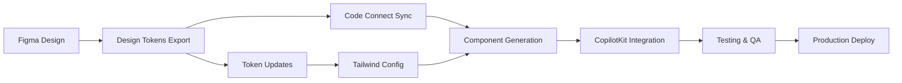

# CopilotKit Travel Planner - Figma to React Enhancement Plan

## 🎯 Executive Summary

This comprehensive plan outlines the enhancement of the CopilotKit travel planner using Figma Code Connect and modern React best practices. The goal is to create a Mindtrip.ai-inspired interface with seamless design-to-code workflow for the I Love Medellín platform.

---

## 📋 Table of Contents

1. [Project Setup & Prerequisites](#project-setup)
2. [Figma Design System Architecture](#figma-design-system)
3. [Component Library Structure](#component-library)
4. [Figma Code Connect Implementation](#code-connect)
5. [CopilotKit Integration Strategy](#copilotkit-integration)
6. [Development Workflow](#development-workflow)
7. [Implementation Timeline](#timeline)
8. [Quality Assurance](#quality-assurance)

---

## 🚀 Project Setup & Prerequisites {#project-setup}

### Required Tools & Accounts

```yaml
Design Tools:
  - Figma Professional (with Dev Mode)
  - Figma Code Connect plugin
  - Figma Tokens plugin (for design tokens)

Development Environment:
  - Node.js 18+
  - React 18+ with TypeScript
  - Next.js 14+ (App Router)
  - Tailwind CSS 3.4+
  - CopilotKit SDK

Version Control:
  - Git with conventional commits
  - GitHub/GitLab with CI/CD
  - Figma version history sync
```

### Initial Project Structure

```bash
travel-planner/
├── .figma/
│   ├── code-connect/          # Figma Code Connect configs
│   └── tokens/                # Design tokens
├── src/
│   ├── components/
│   │   ├── atoms/            # Basic UI elements
│   │   ├── molecules/        # Composite components
│   │   ├── organisms/        # Complex sections
│   │   └── templates/        # Page layouts
│   ├── copilot/
│   │   ├── actions/          # CopilotKit actions
│   │   ├── hooks/            # Custom hooks
│   │   └── providers/        # Context providers
│   ├── styles/
│   │   ├── tokens/           # Design tokens
│   │   └── globals.css       # Global styles
│   └── lib/
│       ├── figma/            # Figma utilities
│       └── utils/            # Helper functions
```

---

## 🎨 Figma Design System Architecture {#figma-design-system}

### 1. File Organization

```
Figma Project: I Love Medellín Travel Planner
├── 📁 Design System
│   ├── 🎨 Foundations
│   │   ├── Colors
│   │   ├── Typography
│   │   ├── Spacing
│   │   ├── Shadows
│   │   └── Border Radius
│   ├── 🧩 Components
│   │   ├── Atoms
│   │   ├── Molecules
│   │   ├── Organisms
│   │   └── Templates
│   └── 📐 Tokens
├── 📁 Web Design
│   ├── Desktop (1440x1024)
│   ├── Tablet (768x1024)
│   └── Components States
├── 📁 Mobile Design
│   ├── iOS (375x812)
│   ├── Android (360x800)
│   └── Components States
└── 📁 Prototypes
    ├── User Flows
    └── Interactions
```

### 2. Design Tokens Structure

```json
{
  "global": {
    "color": {
      "primary": {
        "50": { "value": "#E8F5E9" },
        "500": { "value": "#4CAF50" },
        "900": { "value": "#1B5E20" }
      },
      "semantic": {
        "success": { "value": "{color.green.500}" },
        "warning": { "value": "{color.amber.500}" },
        "error": { "value": "{color.red.500}" }
      }
    },
    "spacing": {
      "xs": { "value": "4px" },
      "sm": { "value": "8px" },
      "md": { "value": "16px" },
      "lg": { "value": "24px" },
      "xl": { "value": "32px" }
    },
    "typography": {
      "fontFamily": {
        "sans": { "value": "Inter, system-ui, sans-serif" },
        "mono": { "value": "JetBrains Mono, monospace" }
      },
      "fontSize": {
        "xs": { "value": "12px" },
        "sm": { "value": "14px" },
        "base": { "value": "16px" },
        "lg": { "value": "18px" },
        "xl": { "value": "24px" },
        "2xl": { "value": "32px" }
      }
    },
    "borderRadius": {
      "sm": { "value": "4px" },
      "md": { "value": "8px" },
      "lg": { "value": "16px" },
      "full": { "value": "9999px" }
    }
  }
}
```

### 3. Component Naming Convention

```
Pattern: [Category]/[Component]/[Variant]/[State]

Examples:
- Chat/Bubble/Incoming/Default
- Chat/Bubble/Outgoing/Loading
- Itinerary/Card/Activity/Hover
- Itinerary/Card/Hotel/Selected
- Button/Primary/Large/Disabled
- Input/Text/Default/Error
```

---

## 🧱 Component Library Structure {#component-library}

### Atomic Design Hierarchy

#### 1. Atoms (Basic Building Blocks)

```typescript
// components/atoms/Button/Button.tsx
interface ButtonProps {
  variant: 'primary' | 'secondary' | 'ghost';
  size: 'sm' | 'md' | 'lg';
  loading?: boolean;
  icon?: React.ReactNode;
  children: React.ReactNode;
}

// components/atoms/Avatar/Avatar.tsx
interface AvatarProps {
  src?: string;
  alt: string;
  size: 'sm' | 'md' | 'lg';
  status?: 'online' | 'offline' | 'typing';
}

// components/atoms/Badge/Badge.tsx
interface BadgeProps {
  variant: 'confirmed' | 'draft' | 'suggested';
  children: React.ReactNode;
}
```

#### 2. Molecules (Composite Components)

```typescript
// components/molecules/ChatBubble/ChatBubble.tsx
interface ChatBubbleProps {
  message: string;
  sender: 'user' | 'ai';
  timestamp: Date;
  isTyping?: boolean;
  actions?: ChatAction[];
}

// components/molecules/ItineraryCard/ItineraryCard.tsx
interface ItineraryCardProps {
  type: 'day' | 'activity' | 'hotel' | 'restaurant';
  title: string;
  subtitle?: string;
  image?: string;
  time?: string;
  status?: 'confirmed' | 'draft';
  onEdit?: () => void;
  onReplace?: () => void;
  onDelete?: () => void;
}

// components/molecules/SearchBar/SearchBar.tsx
interface SearchBarProps {
  placeholder: string;
  suggestions?: string[];
  onSearch: (query: string) => void;
  copilotEnabled?: boolean;
}
```

#### 3. Organisms (Complex Sections)

```typescript
// components/organisms/ChatInterface/ChatInterface.tsx
interface ChatInterfaceProps {
  messages: Message[];
  onSendMessage: (message: string) => void;
  isAiTyping: boolean;
  suggestions?: Suggestion[];
}

// components/organisms/ItineraryBuilder/ItineraryBuilder.tsx
interface ItineraryBuilderProps {
  days: ItineraryDay[];
  onReorderDays: (order: number[]) => void;
  onEditCard: (dayId: string, cardId: string) => void;
  onReplaceCard: (dayId: string, cardId: string) => void;
}

// components/organisms/TripHeader/TripHeader.tsx
interface TripHeaderProps {
  tripName: string;
  destination: string;
  dates: { start: Date; end: Date };
  onSave: () => void;
  onShare: () => void;
}
```

#### 4. Templates (Page Layouts)

```typescript
// components/templates/TravelPlannerLayout/TravelPlannerLayout.tsx
interface TravelPlannerLayoutProps {
  chatPanel: React.ReactNode;
  itineraryPanel: React.ReactNode;
  mobileView?: 'chat' | 'itinerary';
}
```

---

## 🔗 Figma Code Connect Implementation {#code-connect}

### 1. Setup Code Connect

```bash
# Install dependencies
npm install --save-dev @figma/code-connect
npm install @copilotkit/react-core @copilotkit/react-ui

# Initialize Code Connect
npx figma connect init
```

### 2. Component Mapping Examples

#### Chat Bubble Component

```typescript
// components/molecules/ChatBubble/ChatBubble.figma.tsx
import figma from '@figma/code-connect/react';
import { ChatBubble } from './ChatBubble';

figma.connect(ChatBubble, 'https://figma.com/file/YOUR_FILE/Chat-Bubble', {
  props: {
    message: figma.string('Message'),
    sender: figma.enum('Sender', {
      User: 'user',
      AI: 'ai'
    }),
    isTyping: figma.boolean('Is Typing'),
    timestamp: figma.string('Timestamp')
  },
  example: ({ message, sender, isTyping, timestamp }) => (
    <ChatBubble
      message={message}
      sender={sender}
      isTyping={isTyping}
      timestamp={new Date(timestamp)}
    />
  )
});
```

#### Itinerary Card Component

```typescript
// components/molecules/ItineraryCard/ItineraryCard.figma.tsx
import figma from '@figma/code-connect/react';
import { ItineraryCard } from './ItineraryCard';

figma.connect(ItineraryCard, 'https://figma.com/file/YOUR_FILE/Itinerary-Card', {
  props: {
    type: figma.enum('Card Type', {
      Day: 'day',
      Activity: 'activity',
      Hotel: 'hotel',
      Restaurant: 'restaurant'
    }),
    title: figma.string('Title'),
    subtitle: figma.string('Subtitle'),
    image: figma.string('Image URL'),
    time: figma.string('Time'),
    status: figma.enum('Status', {
      Confirmed: 'confirmed',
      Draft: 'draft'
    })
  },
  example: ({ type, title, subtitle, image, time, status }) => (
    <ItineraryCard
      type={type}
      title={title}
      subtitle={subtitle}
      image={image}
      time={time}
      status={status}
      onEdit={() => console.log('Edit')}
      onReplace={() => console.log('Replace')}
      onDelete={() => console.log('Delete')}
    />
  )
});
```

### 3. Design Token Integration

```typescript
// lib/figma/tokens.ts
import { tokens } from '../../.figma/tokens/tokens.json';

export const theme = {
  colors: {
    primary: tokens.global.color.primary,
    semantic: tokens.global.color.semantic
  },
  spacing: tokens.global.spacing,
  typography: tokens.global.typography,
  borderRadius: tokens.global.borderRadius
};

// tailwind.config.js
import { theme } from './lib/figma/tokens';

export default {
  content: ['./src/**/*.{js,ts,jsx,tsx}'],
  theme: {
    extend: {
      colors: theme.colors,
      spacing: theme.spacing,
      fontFamily: theme.typography.fontFamily,
      fontSize: theme.typography.fontSize,
      borderRadius: theme.borderRadius
    }
  }
};
```

---

## 🤖 CopilotKit Integration Strategy {#copilotkit-integration}

### 1. CopilotKit Provider Setup

```typescript
// app/providers.tsx
'use client';

import { CopilotKit } from '@copilotkit/react-core';
import { CopilotPopup } from '@copilotkit/react-ui';
import '@copilotkit/react-ui/styles.css';

export function Providers({ children }: { children: React.ReactNode }) {
  return (
    <CopilotKit runtimeUrl="/api/copilotkit">
      {children}
      <CopilotPopup
        defaultOpen={false}
        clickOutsideToClose={false}
        labels={{
          title: "Travel Planning Assistant",
          initial: "Hi! I can help you plan your perfect trip to Medellín. What kind of experience are you looking for?"
        }}
      />
    </CopilotKit>
  );
}
```

### 2. Custom Copilot Actions

```typescript
// copilot/actions/itinerary.actions.ts
import { useCopilotAction } from '@copilotkit/react-core';

export function useItineraryActions() {
  useCopilotAction({
    name: "replaceItineraryDay",
    description: "Replace activities for a specific day",
    parameters: [
      {
        name: "dayNumber",
        type: "number",
        description: "Day number to replace"
      },
      {
        name: "preferences",
        type: "string",
        description: "New preferences for the day"
      }
    ],
    handler: async ({ dayNumber, preferences }) => {
      // Implementation
      await replaceDay(dayNumber, preferences);
    }
  });

  useCopilotAction({
    name: "translateTrip",
    description: "Translate the entire itinerary",
    parameters: [
      {
        name: "targetLanguage",
        type: "string",
        description: "Target language (es, en, fr, etc.)"
      }
    ],
    handler: async ({ targetLanguage }) => {
      await translateItinerary(targetLanguage);
    }
  });

  useCopilotAction({
    name: "addActivity",
    description: "Add a new activity to a specific day",
    parameters: [
      {
        name: "dayNumber",
        type: "number"
      },
      {
        name: "activityType",
        type: "string"
      },
      {
        name: "preferences",
        type: "string"
      }
    ],
    handler: async ({ dayNumber, activityType, preferences }) => {
      await addActivityToDay(dayNumber, activityType, preferences);
    }
  });
}
```

### 3. Copilot-Enhanced Components

```typescript
// components/organisms/ChatInterface/CopilotChatInterface.tsx
import { useCopilotChat } from '@copilotkit/react-core';
import { ChatInterface } from './ChatInterface';

export function CopilotChatInterface() {
  const {
    messages,
    sendMessage,
    isLoading
  } = useCopilotChat();

  const suggestions = [
    "Plan a 5-day cultural trip",
    "Find the best restaurants in El Poblado",
    "Add hiking activities to my itinerary",
    "Translate my trip to Spanish"
  ];

  return (
    <ChatInterface
      messages={messages}
      onSendMessage={sendMessage}
      isAiTyping={isLoading}
      suggestions={suggestions}
    />
  );
}
```

---

## 🔄 Development Workflow {#development-workflow}

### 1. Design-to-Code Pipeline



### 2. Git Workflow

```bash
# Feature branch naming
feature/chat-interface-enhancement
feature/itinerary-drag-drop
fix/copilot-action-error
chore/update-figma-tokens

# Commit message format
feat: add drag-and-drop to itinerary cards
fix: resolve CopilotKit action timeout
style: update chat bubble animations
docs: add Figma Code Connect guide
```

### 3. CI/CD Pipeline

```yaml
# .github/workflows/figma-sync.yml
name: Figma Design Sync

on:
  schedule:
    - cron: '0 */6 * * *' # Every 6 hours
  workflow_dispatch:

jobs:
  sync-tokens:
    runs-on: ubuntu-latest
    steps:
      - uses: actions/checkout@v3
      - name: Sync Figma Tokens
        run: npm run figma:sync-tokens
      - name: Generate Types
        run: npm run figma:generate-types
      - name: Create PR if changes
        uses: peter-evans/create-pull-request@v5
        with:
          title: 'chore: update Figma design tokens'
          commit-message: 'chore: sync latest design tokens from Figma'
```

---

## 📅 Implementation Timeline {#timeline}

### Phase 1: Foundation (Week 1-2)
- [ ] Set up Figma file structure
- [ ] Create design system foundations
- [ ] Configure Code Connect
- [ ] Initialize React project with CopilotKit

### Phase 2: Core Components (Week 3-4)
- [ ] Design and code atoms
- [ ] Build chat interface molecules
- [ ] Create itinerary card variants
- [ ] Implement drag-and-drop

### Phase 3: CopilotKit Integration (Week 5-6)
- [ ] Set up Copilot provider
- [ ] Implement custom actions
- [ ] Connect chat to itinerary
- [ ] Add real-time updates

### Phase 4: Mobile Optimization (Week 7)
- [ ] Design mobile layouts
- [ ] Implement responsive components
- [ ] Test touch interactions
- [ ] Optimize performance

### Phase 5: Polish & Launch (Week 8)
- [ ] Accessibility audit
- [ ] Performance optimization
- [ ] User testing
- [ ] Production deployment

---

## ✅ Quality Assurance {#quality-assurance}

### Testing Strategy

```typescript
// Component Testing Example
// components/molecules/ChatBubble/ChatBubble.test.tsx
import { render, screen } from '@testing-library/react';
import { ChatBubble } from './ChatBubble';

describe('ChatBubble', () => {
  it('renders user message correctly', () => {
    render(
      <ChatBubble
        message="Plan a trip to Comuna 13"
        sender="user"
        timestamp={new Date()}
      />
    );
    
    expect(screen.getByText('Plan a trip to Comuna 13')).toBeInTheDocument();
    expect(screen.getByRole('article')).toHaveClass('justify-end');
  });

  it('shows typing indicator for AI', () => {
    render(
      <ChatBubble
        message=""
        sender="ai"
        isTyping={true}
        timestamp={new Date()}
      />
    );
    
    expect(screen.getByTestId('typing-indicator')).toBeInTheDocument();
  });
});
```

### Accessibility Checklist
- [ ] WCAG 2.1 AA compliance
- [ ] Keyboard navigation
- [ ] Screen reader support
- [ ] Color contrast ratios
- [ ] Focus indicators
- [ ] ARIA labels

### Performance Targets
- [ ] Lighthouse score > 90
- [ ] First Contentful Paint < 1.5s
- [ ] Time to Interactive < 3.5s
- [ ] Bundle size < 250KB

---

## 🚀 Launch Readiness

### Pre-Launch Checklist
- [ ] All Figma components mapped
- [ ] CopilotKit actions tested
- [ ] Mobile responsiveness verified
- [ ] Cross-browser compatibility
- [ ] Performance benchmarks met
- [ ] Security audit passed
- [ ] Documentation complete
- [ ] Team training done

### Success Metrics
- Component reusability: >80%
- Design-code parity: 100%
- User task completion: >90%
- AI action success rate: >95%
- Page load time: <2s
- Error rate: <0.1%

---

This comprehensive plan provides a complete roadmap for enhancing the CopilotKit travel planner with professional Figma integration and modern React development practices. The combination of Figma Code Connect, atomic design, and CopilotKit's AI capabilities will create a powerful, maintainable travel planning application.