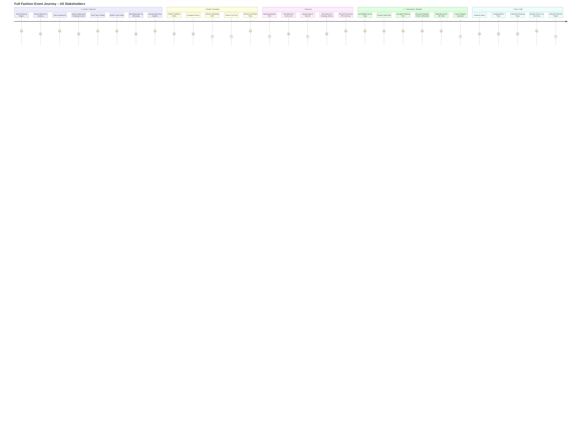

Here is a **comprehensive Mermaid journey diagram** illustrating the full event lifecycle for all key stakeholders:

---

---

## 🧠 How It All Connects

- **Forms** feed structured data into `form_*` tables → create/assign `events`, `users`, `tickets`
    
- **Webflow** CMS syncs visible data: events, tasks, team, tickets
    
- **Supabase** is the backend for all operations, users, automations
    
- **AI** automations trigger from form inserts or payment updates
    
- **WhatsApp** messages are dispatched from n8n based on `ticket_sales` and `tasks`
    

Would you like a **flowchart version** that complements this journey (e.g. swimlane)? Or a downloadable `.mmd` file version?