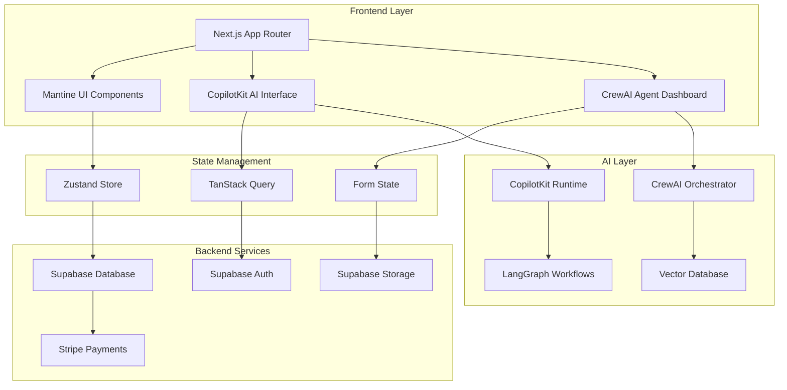
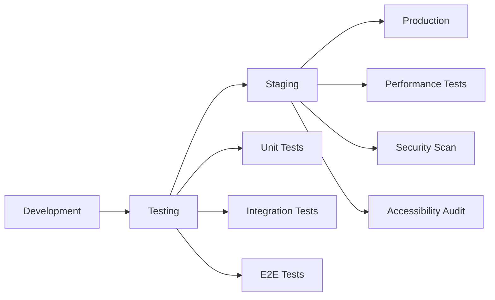

# AI-Powered Event Management Platform - Implementation Plan

## Progress Tracker

| Phase | Component | Status | Progress | Priority | Estimated Hours |
|-------|-----------|--------|----------|----------|----------------|
| **Phase 1: Foundation** | Project Setup | Not Started | 0% | Critical | 16h |
| **Phase 1: Foundation** | Design System | Not Started | 0% | Critical | 24h |
| **Phase 1: Foundation** | Core Layout | Not Started | 0% | Critical | 20h |
| **Phase 2: Core Features** | Event Management | Not Started | 0% | High | 40h |
| **Phase 2: Core Features** | User Management | Not Started | 0% | High | 32h |
| **Phase 2: Core Features** | Ticketing System | Not Started | 0% | High | 36h |
| **Phase 3: AI Integration** | CopilotKit Setup | Not Started | 0% | High | 28h |
| **Phase 3: AI Integration** | CrewAI Agents | Not Started | 0% | High | 32h |
| **Phase 3: AI Integration** | Sponsor Matching | Not Started | 0% | Medium | 24h |
| **Phase 4: Advanced** | Analytics Dashboard | Not Started | 0% | Medium | 28h |
| **Phase 4: Advanced** | Communication System | Not Started | 0% | Medium | 24h |
| **Phase 4: Advanced** | Payment Integration | Not Started | 0% | High | 20h |
| **Phase 5: Polish** | Performance Optimization | Not Started | 0% | Medium | 16h |
| **Phase 5: Polish** | Testing & QA | Not Started | 0% | Critical | 24h |
| **Phase 5: Polish** | Deployment | Not Started | 0% | Critical | 12h |

**Total Estimated Hours: 376h (9-10 weeks with 2 developers)**

---

## Table of Contents

1. [Executive Summary](#1-executive-summary)
2. [Technology Stack](#2-technology-stack)
3. [Architecture Overview](#3-architecture-overview)
4. [Phase 1: Foundation Setup](#4-phase-1-foundation-setup)
5. [Phase 2: Core Features](#5-phase-2-core-features)
6. [Phase 3: AI Integration](#6-phase-3-ai-integration)
7. [Phase 4: Advanced Features](#7-phase-4-advanced-features)
8. [Phase 5: Polish & Deployment](#8-phase-5-polish--deployment)
9. [Testing Strategy](#9-testing-strategy)
10. [Performance Requirements](#10-performance-requirements)
11. [Security Implementation](#11-security-implementation)
12. [Deployment Strategy](#12-deployment-strategy)

---

## 1. Executive Summary

### 1.1 Project Overview

The AI-Powered Event Management Platform is a comprehensive solution targeting the $34.7 billion global event management market. Built with Next.js 15, Mantine v8, CopilotKit, and CrewAI, it transforms traditional event planning through intelligent automation and multi-stakeholder coordination.

### 1.2 Key Success Metrics

- **Performance**: 95+ Lighthouse score, <2s load times
- **Business Impact**: 80% reduction in planning time, 300% revenue increase
- **Scale**: Support 100,000+ concurrent users during major events
- **AI Efficiency**: 90% automation rate for routine tasks
- **User Experience**: 95%+ user adoption rate

### 1.3 Reference Design Analysis

Based on analysis of https://elegant-heartstrings.lovable.app/, the implementation will feature:
- Clean, modern typography with premium sans-serif fonts
- Sophisticated color gradients (pink-to-gold fashion theme)
- Mobile-first responsive design
- Smooth animations and micro-interactions
- Conversion-optimized CTAs and user flows

---

## 2. Technology Stack

### 2.1 Frontend Stack

```json
{
  "framework": "Next.js 15.3.3",
  "ui_library": "@mantine/core 8.1.2",
  "styling": "CSS Modules + Mantine Theme",
  "state_management": "Zustand + TanStack Query",
  "ai_integration": "@copilotkit/react-core ^1.0",
  "multi_agent": "crewai-js ^1.0",
  "forms": "react-hook-form + zod",
  "animations": "framer-motion ^11.0",
  "testing": "Jest + Playwright + Testing Library"
}
```

### 2.2 Backend Integration

```json
{
  "database": "Supabase PostgreSQL",
  "realtime": "Supabase Realtime",
  "auth": "Supabase Auth",
  "storage": "Supabase Storage",
  "payments": "Stripe",
  "communication": "WhatsApp Business API",
  "ai_orchestration": "LangGraph + CrewAI",
  "vector_db": "Pinecone"
}
```

### 2.3 Deployment & Infrastructure

```yaml
hosting: Vercel (Edge Functions)
cdn: Cloudflare
monitoring: Sentry + Vercel Analytics
performance: Web Vitals + Lighthouse CI
ci_cd: GitHub Actions
```

---

## 3. Architecture Overview

### 3.1 System Architecture



### 3.2 Component Architecture

```
src/
├── app/                    # Next.js App Router
├── components/
│   ├── ui/                # Reusable UI components
│   ├── forms/             # Form components
│   ├── sections/          # Page sections
│   ├── dashboards/        # Role-based dashboards
│   └── ai/                # AI-powered components
├── lib/
│   ├── supabase/          # Database client
│   ├── stripe/            # Payment integration
│   ├── ai/                # AI utilities
│   └── utils/             # Helper functions
├── hooks/                 # Custom React hooks
├── stores/                # Zustand stores
├── types/                 # TypeScript definitions
└── styles/                # Global styles and themes
```

---

## 4. Phase 1: Foundation Setup

### 4.1 Project Scaffolding & Configuration

- [ ] **1.1 Initialize Next.js 15 Project with App Router**
  - Create new Next.js project with TypeScript
  - Configure App Router structure
  - Setup path aliases (@/ for src)
  - Configure next.config.mjs for optimization
  - _Requirements: 9.1, 9.2_

**Commands:**
```bash
npx create-next-app@latest ai-event-platform --typescript --tailwind --eslint --app --src-dir
cd ai-event-platform
npm install @mantine/core @mantine/hooks @mantine/form @mantine/notifications
```

**Success Criteria:**
- Development server runs without errors
- TypeScript compilation successful
- App Router structure functional

- [ ] **1.2 Setup Development Environment**
  - Configure ESLint with custom rules
  - Setup Prettier for code formatting
  - Configure Husky for pre-commit hooks
  - Setup environment variables structure
  - _Requirements: 9.1_

**Commands:**
```bash
npm install -D eslint-config-next prettier husky lint-staged
npx husky install
echo "npm run lint && npm run type-check" > .husky/pre-commit
```

**Success Criteria:**
- All linting rules pass
- Code formatting consistent
- Pre-commit hooks working

### 4.2 Design System Implementation

- [ ] **1.3 Mantine Theme Configuration**
  - Create fashion-themed color palette
  - Configure typography scale with premium fonts
  - Setup responsive breakpoints
  - Create component style overrides
  - _Requirements: 12.1, 16.1_

**Implementation:**
```typescript
// src/lib/theme.ts
import { createTheme } from '@mantine/core';

export const theme = createTheme({
  colors: {
    fashionPink: [
      '#fce4ec', '#f8bbd0', '#f48fb1', '#f06292', '#ec407a',
      '#e91e63', '#d81b60', '#c2185b', '#ad1457', '#880e4f'
    ],
    fashionGold: [
      '#fffdf7', '#fffbeb', '#fef3c7', '#fde68a', '#fcd34d',
      '#ffd700', '#f59e0b', '#d97706', '#b45309', '#92400e'
    ]
  },
  primaryColor: 'fashionPink',
  fontFamily: 'Inter, -apple-system, BlinkMacSystemFont, sans-serif',
  headings: { fontFamily: 'Inter Display, Inter, sans-serif' }
});
```

**Success Criteria:**
- Theme applied consistently across components
- Colors match fashion brand guidelines
- Typography scales properly on all devices

- [ ] **1.4 Premium Typography Setup**
  - Integrate premium sans-serif fonts (Inter Display, Helvetica Neue)
  - Configure font loading optimization
  - Setup font fallback chains
  - Implement FOUT prevention
  - _Requirements: 12.1_

**Commands:**
```bash
# Download and optimize fonts
mkdir -p public/fonts
# Add font files and configure in next.config.mjs
```

**Success Criteria:**
- Fonts load without layout shift
- Fallback fonts properly configured
- Typography hierarchy established

### 4.3 Core Layout Components

- [ ] **1.5 App Shell Layout**
  - Create main layout component
  - Implement responsive navigation header
  - Build footer with newsletter signup
  - Setup sidebar for dashboards
  - _Requirements: 1.1, 16.1_

**Implementation:**
```typescript
// src/components/layout/AppShell.tsx
export function AppShell({ children }: { children: React.ReactNode }) {
  return (
    <MantineProvider theme={theme}>
      <AppShellComponent
        header={{ height: 70 }}
        navbar={{ width: 280, breakpoint: 'md' }}
        padding="md"
      >
        <Header />
        <Navbar />
        <main>{children}</main>
        <Footer />
      </AppShellComponent>
    </MantineProvider>
  );
}
```

**Success Criteria:**
- Layout responsive across all breakpoints
- Navigation state persists correctly
- Mobile menu animations smooth

- [ ] **1.6 Authentication Layout**
  - Create login/register pages
  - Implement Supabase Auth integration
  - Setup protected route wrapper
  - Create user profile management
  - _Requirements: 15.1, 15.2_

**Commands:**
```bash
npm install @supabase/supabase-js
```

**Success Criteria:**
- Authentication flow functional
- Protected routes working
- User session management active

---

## 5. Phase 2: Core Features

### 5.1 Event Management System

- [ ] **2.1 Event Creation Interface**
  - Build multi-step event creation wizard
  - Implement form validation with Zod schemas
  - Add image upload functionality
  - Create event preview and publish flow
  - _Requirements: 1.1, 1.2_

**Implementation:**
```typescript
// src/components/events/EventCreationWizard.tsx
const eventSchema = z.object({
  name: z.string().min(3).max(100),
  description: z.string().min(10).max(1000),
  startDate: z.date(),
  endDate: z.date(),
  venue: z.string(),
  capacity: z.number().min(1)
});

export function EventCreationWizard() {
  const form = useForm({
    resolver: zodResolver(eventSchema)
  });
  
  // Multi-step form implementation
}
```

**Success Criteria:**
- Event creation completes in under 5 minutes
- Form validation prevents invalid submissions
- Image uploads process successfully

- [ ] **2.2 Event Dashboard**
  - Create real-time event metrics display
  - Build interactive analytics charts
  - Implement quick action buttons
  - Add event status management
  - _Requirements: 1.1, 5.1_

**Commands:**
```bash
npm install @mantine/charts recharts
```

**Success Criteria:**
- Real-time updates display within 2 seconds
- Charts render correctly with live data
- Dashboard responsive on mobile

- [ ] **2.3 Event Listing & Search**
  - Build event discovery interface
  - Implement advanced filtering and sorting
  - Add search with autocomplete
  - Create bookmark and favorites system
  - _Requirements: 1.1, 3.1_

**Success Criteria:**
- Search returns results in under 500ms
- Filters work correctly
- Pagination handles large datasets

### 5.2 User Management System

- [ ] **2.4 Role-Based Access Control**
  - Implement user roles (organizer, sponsor, vendor, attendee)
  - Create role-based dashboard routing
  - Setup permission-based component rendering
  - Build user profile management
  - _Requirements: 6.1, 15.1_

**Implementation:**
```typescript
// src/lib/auth/roles.ts
export enum UserRole {
  ADMIN = 'admin',
  ORGANIZER = 'organizer',
  SPONSOR = 'sponsor',
  VENDOR = 'vendor',
  ATTENDEE = 'attendee'
}

export function useUserRole() {
  const { user } = useAuth();
  return user?.role as UserRole;
}
```

**Success Criteria:**
- Role-based routing functional
- Permissions enforced correctly
- User profiles editable

- [ ] **2.5 Multi-Stakeholder Dashboards**
  - Create organizer dashboard with event management
  - Build sponsor dashboard with ROI tracking
  - Implement vendor marketplace interface
  - Design attendee dashboard with bookings
  - _Requirements: 6.1, 6.2_

**Success Criteria:**
- Each role has appropriate dashboard
- Data displays correctly for user context
- Actions work within role permissions

### 5.3 Ticketing System

- [ ] **2.6 Dynamic Ticketing Interface**
  - Build ticket type creation and management
  - Implement dynamic pricing algorithms
  - Create ticket purchase flow
  - Add inventory management
  - _Requirements: 3.1, 3.2, 10.1_

**Implementation:**
```typescript
// src/lib/pricing/dynamic.ts
export class DynamicPricingEngine {
  calculatePrice(basePrice: number, demand: number, timeToEvent: number) {
    const demandMultiplier = 1 + (demand / 100) * 0.5;
    const timeMultiplier = timeToEvent < 7 ? 1.2 : 1.0;
    return basePrice * demandMultiplier * timeMultiplier;
  }
}
```

**Success Criteria:**
- Pricing updates in real-time
- Purchase flow completes successfully
- Inventory tracking accurate

- [ ] **2.7 Payment Integration**
  - Integrate Stripe payment processing
  - Implement multi-currency support
  - Add commission calculation
  - Create refund and dispute handling
  - _Requirements: 3.1, 7.1, 10.1_

**Commands:**
```bash
npm install stripe @stripe/stripe-js
```

**Success Criteria:**
- Payments process successfully
- Colombian payment methods supported
- Commission calculations accurate

---

## 6. Phase 3: AI Integration

### 6.1 CopilotKit Setup

- [ ] **3.1 CopilotKit Runtime Configuration**
  - Setup CopilotKit provider and context
  - Configure AI model connections
  - Implement context-aware chat interface
  - Add natural language processing
  - _Requirements: 8.1, 16.1_

**Commands:**
```bash
npm install @copilotkit/react-core @copilotkit/react-ui
```

**Implementation:**
```typescript
// src/components/ai/CopilotProvider.tsx
export function CopilotProvider({ children }: { children: React.ReactNode }) {
  return (
    <CopilotKitProvider
      runtimeUrl="/api/copilotkit"
      agent="event-planning-assistant"
    >
      {children}
    </CopilotKitProvider>
  );
}
```

**Success Criteria:**
- AI responses generated within 2 seconds
- Context awareness accuracy above 90%
- Multi-language support functional

- [ ] **3.2 Intelligent Form Assistance**
  - Add AI-powered form completion
  - Implement smart suggestions
  - Create content generation features
  - Build recommendation engine
  - _Requirements: 8.1, 8.2_

**Success Criteria:**
- Form completion reduces input time by 60%
- Suggestions relevant and accurate
- Content generation maintains quality

### 6.2 CrewAI Multi-Agent System

- [ ] **3.3 Agent Orchestration Setup**
  - Configure CrewAI agent framework
  - Create specialized agent roles
  - Implement agent communication protocols
  - Build agent performance monitoring
  - _Requirements: 11.1, 17.1_

**Commands:**
```bash
npm install crewai-js
```

**Implementation:**
```typescript
// src/lib/ai/agents/EventPlanningCrew.ts
export class EventPlanningCrew {
  private plannerAgent: Agent;
  private logisticsAgent: Agent;
  private marketingAgent: Agent;
  
  async planEvent(requirements: EventRequirements) {
    const crew = new Crew([
      this.plannerAgent,
      this.logisticsAgent,
      this.marketingAgent
    ]);
    
    return await crew.kickoff(requirements);
  }
}
```

**Success Criteria:**
- Agent coordination completes tasks successfully
- Performance monitoring accurate
- Error recovery automatic

- [ ] **3.4 LangGraph Workflow Implementation**
  - Setup LangGraph workflow engine
  - Create sponsor matching workflows
  - Implement human-in-the-loop mechanisms
  - Add workflow debugging capabilities
  - _Requirements: 11.1, 11.2_

**Success Criteria:**
- Workflows execute reliably
- Human intervention points functional
- Debugging provides useful insights

### 6.3 AI-Powered Features

- [ ] **3.5 Sponsor Matching System**
  - Build AI sponsor identification engine
  - Implement matching algorithms
  - Create automated proposal generation
  - Add ROI prediction models
  - _Requirements: 2.1, 2.2, 11.1_

**Implementation:**
```typescript
// src/lib/ai/sponsor-matching.ts
export class SponsorMatchingEngine {
  async findMatches(event: Event): Promise<SponsorMatch[]> {
    const eventEmbedding = await this.createEventEmbedding(event);
    const sponsors = await this.getActiveSponsors();
    
    return sponsors
      .map(sponsor => ({
        sponsor,
        score: this.calculateMatchScore(eventEmbedding, sponsor)
      }))
      .filter(match => match.score > 0.7)
      .sort((a, b) => b.score - a.score);
  }
}
```

**Success Criteria:**
- Matching accuracy above 85%
- Proposals generated automatically
- ROI predictions within 10% accuracy

- [ ] **3.6 Content Generation System**
  - Implement AI content creation
  - Add social media post generation
  - Create marketing copy automation
  - Build SEO optimization features
  - _Requirements: 8.1, 13.1_

**Success Criteria:**
- Content generation reduces creation time by 70%
- Generated content maintains brand consistency
- SEO optimization improves search rankings

---

## 7. Phase 4: Advanced Features

### 7.1 Analytics Dashboard

- [ ] **4.1 Real-Time Analytics Engine**
  - Build comprehensive analytics dashboard
  - Implement real-time data visualization
  - Create predictive analytics features
  - Add automated insight generation
  - _Requirements: 5.1, 5.2_

**Commands:**
```bash
npm install @mantine/charts recharts d3
```

**Success Criteria:**
- Dashboards update within 10 seconds
- Predictive analytics 85% accurate
- Insights actionable and relevant

- [ ] **4.2 Business Intelligence Features**
  - Create cross-event performance comparison
  - Implement revenue forecasting
  - Build attendee behavior analysis
  - Add vendor performance metrics
  - _Requirements: 5.1, 10.1_

**Success Criteria:**
- Forecasting accuracy within 15%
- Comparisons provide actionable insights
- Performance metrics drive decisions

### 7.2 Communication System

- [ ] **4.3 Multi-Channel Communication**
  - Integrate WhatsApp Business API
  - Implement email automation
  - Create SMS notification system
  - Build in-app messaging
  - _Requirements: 4.1, 4.2_

**Commands:**
```bash
npm install whatsapp-web.js nodemailer
```

**Success Criteria:**
- Messages delivered within 5 minutes
- Multi-channel orchestration functional
- Personalization improves engagement

- [ ] **4.4 Automated Communication Workflows**
  - Create event reminder sequences
  - Implement emergency notification system
  - Build sponsor activation coordination
  - Add attendee journey automation
  - _Requirements: 4.1, 6.1_

**Success Criteria:**
- Automation reduces manual work by 80%
- Emergency notifications instant
- Journey completion rates improve

### 7.3 Advanced Integrations

- [ ] **4.5 Colombian Market Localization**
  - Implement Spanish/English language switching
  - Add Colombian payment methods (PSE, Nequi)
  - Create DIAN tax compliance features
  - Build local vendor prioritization
  - _Requirements: 7.1, 7.2_

**Success Criteria:**
- Language switching seamless
- Local payments process correctly
- Tax compliance automated

- [ ] **4.6 Fashion Industry Specialization**
  - Create fashion-specific templates
  - Build model casting management
  - Implement runway show coordination
  - Add sustainability tracking
  - _Requirements: 12.1, 12.2_

**Success Criteria:**
- Templates reduce setup time by 60%
- Casting management streamlined
- Sustainability metrics accurate

---

## 8. Phase 5: Polish & Deployment

### 8.1 Performance Optimization

- [ ] **5.1 Core Web Vitals Optimization**
  - Optimize Largest Contentful Paint (LCP < 2.5s)
  - Minimize First Input Delay (FID < 100ms)
  - Reduce Cumulative Layout Shift (CLS < 0.1)
  - Improve Time to Interactive (TTI < 3.5s)
  - _Requirements: 9.1, 9.2_

**Commands:**
```bash
npm install @next/bundle-analyzer
npm run analyze
```

**Success Criteria:**
- Lighthouse score 95+
- Core Web Vitals pass
- Mobile performance optimized

- [ ] **5.2 Code Splitting & Lazy Loading**
  - Implement route-based code splitting
  - Add component-level lazy loading
  - Optimize bundle sizes
  - Configure caching strategies
  - _Requirements: 9.1_

**Success Criteria:**
- Bundle size reduced by 40%
- Initial load time under 2 seconds
- Caching improves repeat visits

### 8.2 Security Implementation

- [ ] **5.3 Security Hardening**
  - Implement Content Security Policy
  - Add XSS protection
  - Configure CSRF protection
  - Setup rate limiting
  - _Requirements: 15.1, 15.2_

**Success Criteria:**
- Security scan passes
- No critical vulnerabilities
- Rate limiting prevents abuse

- [ ] **5.4 Data Protection & Compliance**
  - Implement GDPR compliance features
  - Add data encryption
  - Create audit logging
  - Setup privacy controls
  - _Requirements: 15.1, 15.3_

**Success Criteria:**
- GDPR compliance verified
- Data encryption active
- Audit trails complete

### 8.3 Testing & Quality Assurance

- [ ] **5.5 Comprehensive Testing Suite**
  - Write unit tests for all components
  - Create integration tests for workflows
  - Implement E2E tests with Playwright
  - Add accessibility testing
  - _Requirements: All_

**Commands:**
```bash
npm install -D jest @testing-library/react playwright
npx playwright install
```

**Success Criteria:**
- Test coverage above 80%
- All critical paths tested
- Accessibility compliance verified

- [ ] **5.6 Performance Testing**
  - Load test with 100,000+ concurrent users
  - Stress test payment processing
  - Test AI response times under load
  - Validate database performance
  - _Requirements: 9.1, 9.2_

**Success Criteria:**
- System handles target load
- Response times remain under 2s
- No memory leaks detected

### 8.4 Deployment & Monitoring

- [ ] **5.7 Production Deployment**
  - Configure Vercel deployment
  - Setup environment variables
  - Configure CDN and caching
  - Implement monitoring and alerting
  - _Requirements: 9.1_

**Commands:**
```bash
vercel --prod
```

**Success Criteria:**
- Deployment successful
- Monitoring active
- Alerts configured

- [ ] **5.8 Post-Deployment Validation**
  - Run smoke tests
  - Validate all integrations
  - Test user flows end-to-end
  - Monitor performance metrics
  - _Requirements: All_

**Success Criteria:**
- All systems operational
- Performance meets targets
- User flows functional

---

## 9. Testing Strategy

### 9.1 Testing Pyramid

```
E2E Tests (10%)
├── Critical user journeys
├── Payment flows
├── AI interactions
└── Cross-browser compatibility

Integration Tests (30%)
├── API integrations
├── Database operations
├── Authentication flows
└── AI agent workflows

Unit Tests (60%)
├── Component logic
├── Utility functions
├── Business logic
└── Form validation
```

### 9.2 Testing Implementation

**Unit Testing:**
```typescript
// src/components/events/EventCard.test.tsx
describe('EventCard', () => {
  it('displays event information correctly', () => {
    render(<EventCard event={mockEvent} />);
    expect(screen.getByText(mockEvent.name)).toBeInTheDocument();
  });
});
```

**Integration Testing:**
```typescript
// src/lib/api/events.test.ts
describe('Event API', () => {
  it('creates event successfully', async () => {
    const event = await createEvent(mockEventData);
    expect(event.id).toBeDefined();
  });
});
```

**E2E Testing:**
```typescript
// tests/e2e/event-creation.spec.ts
test('user can create and publish event', async ({ page }) => {
  await page.goto('/events/create');
  await page.fill('[data-testid="event-name"]', 'Test Event');
  await page.click('[data-testid="publish-button"]');
  await expect(page.locator('.success-message')).toBeVisible();
});
```

---

## 10. Performance Requirements

### 10.1 Performance Targets

| Metric | Target | Critical Path |
|--------|--------|---------------|
| LCP | < 2.5s | Homepage, Event pages |
| FID | < 100ms | All interactive elements |
| CLS | < 0.1 | All pages |
| TTI | < 3.5s | Dashboard pages |
| Bundle Size | < 500KB | Initial load |
| API Response | < 500ms | Search, filters |
| AI Response | < 2s | CopilotKit interactions |

### 10.2 Optimization Strategies

**Image Optimization:**
```typescript
// next.config.mjs
const nextConfig = {
  images: {
    domains: ['supabase.co'],
    formats: ['image/webp', 'image/avif'],
    deviceSizes: [640, 750, 828, 1080, 1200, 1920, 2048, 3840],
  }
};
```

**Code Splitting:**
```typescript
// Dynamic imports for heavy components
const EventAnalytics = dynamic(() => import('./EventAnalytics'), {
  loading: () => <Skeleton height={400} />,
  ssr: false
});
```

---

## 11. Security Implementation

### 11.1 Security Checklist

- [ ] **Authentication & Authorization**
  - Multi-factor authentication
  - JWT token management
  - Role-based access control
  - Session management

- [ ] **Data Protection**
  - End-to-end encryption
  - Data classification
  - Privacy controls
  - Audit logging

- [ ] **Network Security**
  - HTTPS enforcement
  - Content Security Policy
  - Rate limiting
  - DDoS protection

- [ ] **Input Validation**
  - XSS prevention
  - SQL injection protection
  - CSRF protection
  - Input sanitization

### 11.2 Security Implementation

**Content Security Policy:**
```typescript
// next.config.mjs
const securityHeaders = [
  {
    key: 'Content-Security-Policy',
    value: "default-src 'self'; script-src 'self' 'unsafe-eval'; style-src 'self' 'unsafe-inline';"
  }
];
```

**Rate Limiting:**
```typescript
// src/lib/rate-limit.ts
export const rateLimiter = rateLimit({
  windowMs: 15 * 60 * 1000, // 15 minutes
  max: 100, // limit each IP to 100 requests per windowMs
  message: 'Too many requests from this IP'
});
```

---

## 12. Deployment Strategy

### 12.1 Deployment Pipeline



### 12.2 Environment Configuration

**Development:**
```bash
NEXT_PUBLIC_SUPABASE_URL=http://localhost:54321
NEXT_PUBLIC_SUPABASE_ANON_KEY=dev_key
STRIPE_SECRET_KEY=sk_test_...
```

**Production:**
```bash
NEXT_PUBLIC_SUPABASE_URL=https://project.supabase.co
NEXT_PUBLIC_SUPABASE_ANON_KEY=prod_key
STRIPE_SECRET_KEY=sk_live_...
```

### 12.3 Monitoring & Alerting

**Performance Monitoring:**
- Vercel Analytics for Core Web Vitals
- Sentry for error tracking
- Custom metrics for business KPIs

**Alerting Rules:**
- Error rate > 1%
- Response time > 2s
- Availability < 99.9%
- AI response time > 5s

---

## Conclusion

This implementation plan provides a comprehensive roadmap for building the AI-Powered Event Management Platform. The phased approach ensures systematic development while maintaining quality and performance standards.

**Key Success Factors:**
1. **Incremental Development**: Each phase builds upon the previous
2. **Quality Gates**: Testing and validation at every step
3. **Performance Focus**: Optimization throughout development
4. **User-Centric Design**: Based on elegant-heartstrings analysis
5. **AI-First Approach**: Intelligence integrated from the start

**Next Steps:**
1. Review and approve this implementation plan
2. Setup development environment
3. Begin Phase 1: Foundation Setup
4. Execute tasks systematically with regular reviews

The estimated timeline of 9-10 weeks with 2 developers provides a realistic path to delivering a world-class event management platform that transforms the industry through AI-powered automation and intelligent user experiences.