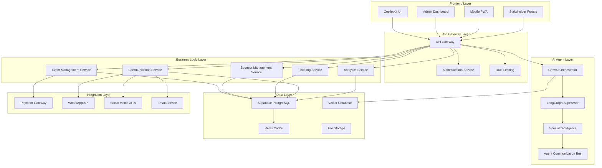
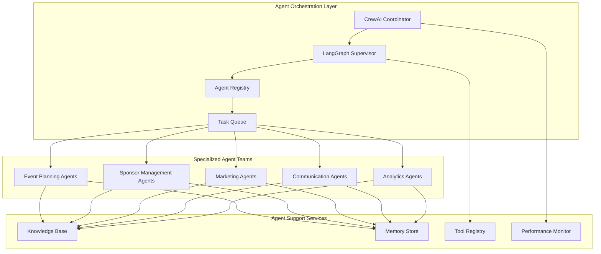
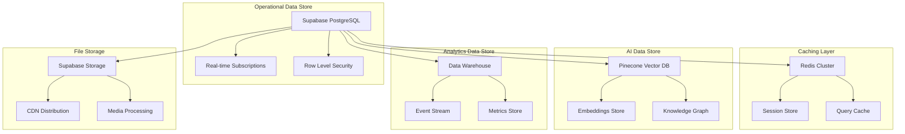
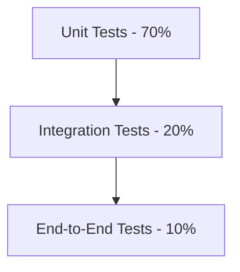

# Design Document

## Table of Contents

1. [Overview](#1-overview)
   - 1.1 [System Purpose](#11-system-purpose)
   - 1.2 [Design Principles](#12-design-principles)
   - 1.3 [Success Metrics](#13-success-metrics)

2. [Architecture](#2-architecture)
   - 2.1 [System Architecture Overview](#21-system-architecture-overview)
   - 2.2 [Multi-Agent AI Architecture](#22-multi-agent-ai-architecture)
   - 2.3 [Data Architecture](#23-data-architecture)
   - 2.4 [Security Architecture](#24-security-architecture)

3. [Components and Interfaces](#3-components-and-interfaces)
   - 3.1 [Frontend Components](#31-frontend-components)
   - 3.2 [Backend Services](#32-backend-services)
   - 3.3 [AI Agent Systems](#33-ai-agent-systems)
   - 3.4 [Integration Layer](#34-integration-layer)

4. [Data Models](#4-data-models)
   - 4.1 [Core Event Management Models](#41-core-event-management-models)
   - 4.2 [Stakeholder Management Models](#42-stakeholder-management-models)
   - 4.3 [AI and Analytics Models](#43-ai-and-analytics-models)
   - 4.4 [Financial and Commerce Models](#44-financial-and-commerce-models)

5. [Error Handling](#5-error-handling)
   - 5.1 [Error Classification](#51-error-classification)
   - 5.2 [Recovery Strategies](#52-recovery-strategies)
   - 5.3 [Monitoring and Alerting](#53-monitoring-and-alerting)

6. [Testing Strategy](#6-testing-strategy)
   - 6.1 [Testing Approach](#61-testing-approach)
   - 6.2 [AI Agent Testing](#62-ai-agent-testing)
   - 6.3 [Performance Testing](#63-performance-testing)
   - 6.4 [Security Testing](#64-security-testing)

---

## 1. Overview

### 1.1 System Purpose

The AI-Powered Event Management Platform is a comprehensive solution that transforms traditional event planning through intelligent automation, multi-stakeholder coordination, and advanced revenue optimization. The system targets the global event management market projected to reach $34.7 billion by 2029, with specific focus on fashion weeks, corporate events, and cultural exhibitions.

**Core Value Proposition:**
- Reduce manual event planning work by 80%
- Increase event revenue by 300% through intelligent optimization
- Achieve 150-300% ROI within 18-24 months
- Support 60,000+ concurrent users during major events

### 1.2 Design Principles

**1.2.1 AI-First Architecture**
- Every component designed with AI integration as a primary consideration
- Human-in-the-loop mechanisms for critical decisions
- Continuous learning and optimization capabilities

**1.2.2 Multi-Stakeholder Collaboration**
- Role-based interfaces and permissions
- Real-time collaboration tools
- Intelligent workflow orchestration

**1.2.3 Scalability and Performance**
- Cloud-native microservices architecture
- Auto-scaling capabilities
- Sub-2-second response times under load

**1.2.4 Security and Compliance**
- Enterprise-grade security by design
- GDPR, SOC 2, and regional compliance
- End-to-end encryption for sensitive data

### 1.3 Success Metrics

**1.3.1 Performance Metrics**
- System uptime: >99.9%
- Response time: <2 seconds (95th percentile)
- Concurrent user support: 100,000+
- AI agent response time: <2 seconds

**1.3.2 Business Metrics**
- Event planning time reduction: 80%
- Revenue increase: 300%
- Sponsor satisfaction: 85%+
- User adoption rate: 95%+

---

## 2. Architecture

### 2.1 System Architecture Overview

The platform follows a cloud-native, microservices architecture with AI-first design principles:



**2.1.1 Architecture Layers**

**Frontend Layer:**
- CopilotKit-powered intelligent user interfaces
- Role-based dashboards for different stakeholders
- Progressive Web App for mobile access
- Real-time collaboration interfaces

**API Gateway Layer:**
- Centralized API management and routing
- Authentication and authorization
- Rate limiting and security controls
- Request/response transformation

**AI Agent Layer:**
- CrewAI-based multi-agent orchestration
- LangGraph supervisor for complex workflows
- Specialized agents for different domains
- Inter-agent communication and coordination

**Business Logic Layer:**
- Domain-specific microservices
- Event lifecycle management
- Stakeholder coordination
- Revenue optimization

**Data Layer:**
- Supabase PostgreSQL for transactional data
- Redis for caching and session management
- Vector database for AI embeddings
- Distributed file storage for media

**Integration Layer:**
- Third-party service integrations
- Payment processing
- Communication channels
- External API connections

### 2.2 Multi-Agent AI Architecture

The platform leverages both CrewAI and LangGraph for sophisticated multi-agent coordination:



**2.2.1 Agent Coordination Patterns**

**CrewAI Role-Based Collaboration:**
- Specialized agents with distinct personalities and expertise
- Collaborative workflow coordination with context sharing
- Hierarchical task delegation and management
- Inter-agent communication and knowledge transfer

**LangGraph Workflow Orchestration:**
- Graph-based workflow definition and execution
- State management and checkpointing
- Human-in-the-loop intervention points
- Time-travel debugging capabilities

### 2.3 Data Architecture

The data architecture supports real-time operations, analytics, and AI processing:



### 2.4 Security Architecture

Enterprise-grade security implemented across all layers:

```mermaid
graph TB
    subgraph "Identity & Access Management"
        A[Multi-Factor Authentication]
        B[Role-Based Access Control]
        C[JWT Token Management]
        D[Session Management]
    end
    
    subgraph "Data Protection"
        E[End-to-End Encryption]
        F[Data Classification]
        G[Privacy Controls]
        H[Audit Logging]
    end
    
    subgraph "Network Security"
        I[API Gateway Security]
        J[Rate Limiting]
        K[DDoS Protection]
        L[SSL/TLS Termination]
    end
    
    subgraph "Compliance & Monitoring"
        M[GDPR Compliance]
        N[SOC 2 Controls]
        O[Security Monitoring]
        P[Incident Response]
    end
    
    A --> B
    B --> C
    C --> D
    E --> F
    F --> G
    G --> H
    I --> J
    J --> K
    K --> L
    M --> N
    N --> O
    O --> P
```



---

## 3. Components and Interfaces

### 3.1 Frontend Components

**3.1.1 CopilotKit AI-Powered Interface**

**Purpose:** Provide intelligent, context-aware user interfaces with natural language interaction capabilities.

**Key Features:**
- Context-aware AI chat interface
- Intelligent form completion
- Real-time suggestions and recommendations
- Natural language query processing
- Proactive assistance based on user behavior

**Component Architecture:**
```typescript
interface CopilotKitConfig {
  agents: AgentConfig[];
  context: ContextProvider;
  ui: UIConfiguration;
  integrations: IntegrationConfig[];
}

class EventPlanningCopilot extends CopilotKit {
  private eventContext: EventContext;
  private userPreferences: UserPreferences;
  
  async processUserIntent(query: string): Promise<ActionPlan> {
    const intent = await this.classifyIntent(query);
    const context = await this.gatherContext();
    return this.generateActionPlan(intent, context);
  }
  
  async executeAction(action: Action): Promise<ActionResult> {
    const agent = this.selectAgent(action.type);
    return agent.execute(action, this.eventContext);
  }
}
```

**3.1.2 Role-Based Dashboards**

**Event Organizer Dashboard:**
- Event creation and management interface
- Real-time analytics and performance metrics
- Team coordination and task management
- Budget tracking and financial reporting

**Sponsor Dashboard:**
- Campaign performance analytics
- ROI tracking and reporting
- Brand exposure metrics
- Renewal and upselling opportunities

**Vendor Dashboard:**
- Booking management and coordination
- Performance metrics and feedback
- Payment tracking and invoicing
- Communication with event organizers

### 3.2 Backend Services

**3.2.1 Event Management Service**

**Purpose:** Core service managing the complete event lifecycle from creation to completion.

**Key Features:**
- Event creation and configuration
- Timeline and milestone management
- Resource allocation and optimization
- Stakeholder coordination
- Performance tracking and analytics

**Service Architecture:**
```typescript
class EventManagementService {
  private eventRepository: EventRepository;
  private aiOrchestrator: AIOrchestrator;
  private notificationService: NotificationService;
  
  async createEvent(eventData: EventCreationRequest): Promise<Event> {
    // Validate event data
    const validatedData = await this.validateEventData(eventData);
    
    // Create event record
    const event = await this.eventRepository.create(validatedData);
    
    // Initialize AI agents for event
    await this.aiOrchestrator.initializeEventAgents(event.id);
    
    // Generate initial timeline and tasks
    const timeline = await this.generateEventTimeline(event);
    
    // Notify stakeholders
    await this.notificationService.notifyEventCreation(event);
    
    return event;
  }
  
  async generateEventTimeline(event: Event): Promise<Timeline> {
    const agent = await this.aiOrchestrator.getAgent('timeline-planner');
    return agent.generateTimeline(event);
  }
}
```

**3.2.2 Sponsor Management Service**

**Purpose:** Intelligent sponsor identification, matching, and relationship management.

**Key Features:**
- AI-powered sponsor prospect identification
- Automated proposal generation
- ROI tracking and optimization
- Relationship management and renewal

**Service Architecture:**
```typescript
class SponsorManagementService {
  private sponsorRepository: SponsorRepository;
  private aiMatchingEngine: AIMatchingEngine;
  private proposalGenerator: ProposalGenerator;
  
  async findSponsorMatches(eventId: string): Promise<SponsorMatch[]> {
    const event = await this.eventRepository.findById(eventId);
    const eventVector = await this.aiMatchingEngine.createEventEmbedding(event);
    
    const potentialSponsors = await this.sponsorRepository.findActive();
    const matches = [];
    
    for (const sponsor of potentialSponsors) {
      const sponsorVector = await this.aiMatchingEngine.createSponsorEmbedding(sponsor);
      const similarity = this.calculateSimilarity(eventVector, sponsorVector);
      const budgetFit = this.calculateBudgetFit(sponsor, event);
      
      const matchScore = this.calculateMatchScore(similarity, budgetFit);
      
      if (matchScore > 0.7) {
        matches.push({
          sponsor,
          score: matchScore,
          reasoning: this.generateMatchReasoning(similarity, budgetFit)
        });
      }
    }
    
    return matches.sort((a, b) => b.score - a.score);
  }
}
```

### 3.3 AI Agent Systems

**3.3.1 CrewAI Agent Teams**

**Event Planning Crew:**
```python
from crewai import Agent, Task, Crew

class EventPlanningCrew:
    def __init__(self):
        self.planner_agent = Agent(
            role='Event Planner',
            goal='Create comprehensive event plans with optimal resource allocation',
            backstory='Expert event planner with 10+ years of experience in fashion and corporate events',
            tools=[timeline_tool, budget_tool, venue_tool],
            verbose=True
        )
        
        self.logistics_agent = Agent(
            role='Logistics Coordinator',
            goal='Manage all logistical aspects of event execution',
            backstory='Experienced logistics coordinator specializing in complex multi-venue events',
            tools=[vendor_tool, transportation_tool, equipment_tool],
            verbose=True
        )
        
        self.marketing_agent = Agent(
            role='Marketing Specialist',
            goal='Develop and execute comprehensive marketing strategies',
            backstory='Digital marketing expert with expertise in fashion and luxury events',
            tools=[social_media_tool, content_tool, analytics_tool],
            verbose=True
        )
    
    def plan_event(self, event_requirements):
        planning_task = Task(
            description=f"Create comprehensive event plan for: {event_requirements}",
            agent=self.planner_agent
        )
        
        logistics_task = Task(
            description="Develop logistics plan based on event requirements",
            agent=self.logistics_agent
        )
        
        marketing_task = Task(
            description="Create marketing strategy and campaign plan",
            agent=self.marketing_agent
        )
        
        crew = Crew(
            agents=[self.planner_agent, self.logistics_agent, self.marketing_agent],
            tasks=[planning_task, logistics_task, marketing_task],
            verbose=True
        )
        
        return crew.kickoff()
```

**3.3.2 LangGraph Workflow Orchestration**

**Sponsor Matching Workflow:**
```python
from langgraph.graph import StateGraph, END
from typing import TypedDict, List

class SponsorMatchingState(TypedDict):
    event_id: str
    event_data: dict
    potential_sponsors: List[dict]
    matched_sponsors: List[dict]
    proposals_generated: List[dict]
    human_approval_required: bool

def analyze_event(state: SponsorMatchingState):
    # Analyze event characteristics for sponsor matching
    event_analysis = event_analyzer.analyze(state["event_data"])
    state["event_analysis"] = event_analysis
    return state

def find_potential_sponsors(state: SponsorMatchingState):
    # Use AI to find potential sponsors
    sponsors = sponsor_finder.find_matches(state["event_analysis"])
    state["potential_sponsors"] = sponsors
    return state

def score_sponsor_matches(state: SponsorMatchingState):
    # Score and rank sponsor matches
    scored_matches = []
    for sponsor in state["potential_sponsors"]:
        score = match_scorer.calculate_score(state["event_analysis"], sponsor)
        scored_matches.append({"sponsor": sponsor, "score": score})
    
    state["matched_sponsors"] = sorted(scored_matches, key=lambda x: x["score"], reverse=True)
    return state

def generate_proposals(state: SponsorMatchingState):
    # Generate personalized proposals for top matches
    proposals = []
    for match in state["matched_sponsors"][:5]:  # Top 5 matches
        proposal = proposal_generator.generate(state["event_data"], match["sponsor"])
        proposals.append(proposal)
    
    state["proposals_generated"] = proposals
    return state

def check_human_approval(state: SponsorMatchingState):
    # Determine if human approval is needed
    high_value_sponsors = [m for m in state["matched_sponsors"] if m["score"] > 0.9]
    state["human_approval_required"] = len(high_value_sponsors) > 0
    return state

# Build the workflow graph
workflow = StateGraph(SponsorMatchingState)

workflow.add_node("analyze_event", analyze_event)
workflow.add_node("find_sponsors", find_potential_sponsors)
workflow.add_node("score_matches", score_sponsor_matches)
workflow.add_node("generate_proposals", generate_proposals)
workflow.add_node("check_approval", check_human_approval)

workflow.add_edge("analyze_event", "find_sponsors")
workflow.add_edge("find_sponsors", "score_matches")
workflow.add_edge("score_matches", "generate_proposals")
workflow.add_edge("generate_proposals", "check_approval")

workflow.add_conditional_edges(
    "check_approval",
    lambda x: "human_review" if x["human_approval_required"] else "auto_send",
    {
        "human_review": "human_review_node",
        "auto_send": END
    }
)

workflow.set_entry_point("analyze_event")
```

### 3.4 Integration Layer

**3.4.1 Payment Integration (Stripe)**

**Purpose:** Handle all payment processing, including tickets, vendor payments, and commission distribution.

**Key Features:**
- Multi-party payment processing
- Dynamic pricing support
- Automated commission calculation
- Refund and dispute management

**Integration Architecture:**
```typescript
class PaymentService {
  private stripe: Stripe;
  private commissionCalculator: CommissionCalculator;
  
  async processTicketPurchase(purchaseData: TicketPurchaseData): Promise<PaymentResult> {
    // Calculate dynamic pricing
    const pricing = await this.calculateDynamicPricing(purchaseData);
    
    // Create payment intent
    const paymentIntent = await this.stripe.paymentIntents.create({
      amount: pricing.totalAmount,
      currency: purchaseData.currency,
      metadata: {
        event_id: purchaseData.eventId,
        ticket_type: purchaseData.ticketType,
        pricing_algorithm: 'ai_optimized'
      }
    });
    
    // Process commission distribution
    await this.processCommissions(purchaseData, pricing);
    
    return {
      paymentIntent,
      pricing,
      commissionBreakdown: await this.getCommissionBreakdown(purchaseData)
    };
  }
  
  async processVendorPayment(vendorPayment: VendorPaymentData): Promise<PaymentResult> {
    // Validate milestone completion
    const milestoneCompleted = await this.validateMilestone(vendorPayment.milestoneId);
    
    if (!milestoneCompleted) {
      throw new Error('Milestone not completed');
    }
    
    // Process payment to vendor
    const transfer = await this.stripe.transfers.create({
      amount: vendorPayment.amount,
      currency: vendorPayment.currency,
      destination: vendorPayment.vendorStripeAccount
    });
    
    return { transfer, status: 'completed' };
  }
}
```

**3.4.2 Communication Integration (WhatsApp)**

**Purpose:** Provide multi-channel communication automation with intelligent routing and personalization.

**Key Features:**
- Automated message sequences
- Rich media support
- Intelligent routing and escalation
- Multi-language support

**Integration Architecture:**
```typescript
class CommunicationService {
  private whatsappClient: WhatsAppClient;
  private emailService: EmailService;
  private aiPersonalizer: AIPersonalizer;
  
  async sendPersonalizedMessage(messageData: MessageData): Promise<MessageResult> {
    // Personalize message content using AI
    const personalizedContent = await this.aiPersonalizer.personalize(
      messageData.template,
      messageData.recipient,
      messageData.context
    );
    
    // Determine optimal channel
    const optimalChannel = await this.determineOptimalChannel(
      messageData.recipient,
      messageData.urgency,
      messageData.contentType
    );
    
    // Send via optimal channel
    let result: MessageResult;
    
    switch (optimalChannel) {
      case 'whatsapp':
        result = await this.sendWhatsAppMessage(personalizedContent);
        break;
      case 'email':
        result = await this.sendEmailMessage(personalizedContent);
        break;
      case 'sms':
        result = await this.sendSMSMessage(personalizedContent);
        break;
    }
    
    // Track delivery and engagement
    await this.trackMessagePerformance(result);
    
    return result;
  }
}
```

---

## 4. Data Models

### 4.1 Core Event Management Models

**4.1.1 Event Model**

```typescript
interface Event {
  id: string;
  name: string;
  slug: string;
  description: string;
  eventType: 'fashion' | 'corporate' | 'cultural' | 'wedding' | 'music';
  startDate: Date;
  endDate: Date;
  venueId: string;
  organizerId: string;
  maxCapacity: number;
  currentRegistrations: number;
  ticketSalesStart: Date;
  ticketSalesEnd: Date;
  status: 'draft' | 'active' | 'sold_out' | 'completed' | 'cancelled';
  featuredImageUrl?: string;
  gallery: MediaItem[];
  pricingTiers: PricingTier[];
  commissionRate: number;
  estimatedRevenue: number;
  actualRevenue: number;
  aiGeneratedContent: AIGeneratedContent;
  metadata: EventMetadata;
  createdAt: Date;
  updatedAt: Date;
}

interface PricingTier {
  id: string;
  name: string;
  description: string;
  basePrice: number;
  dynamicPricing: DynamicPricingConfig;
  benefits: string[];
  restrictions: string[];
  quantity: number;
  sold: number;
}

interface AIGeneratedContent {
  description: string;
  marketingCopy: string;
  socialMediaPosts: SocialMediaPost[];
  seoKeywords: string[];
  targetAudience: AudienceSegment[];
}
```

**4.1.2 Timeline and Task Models**

```typescript
interface EventTimeline {
  id: string;
  eventId: string;
  milestones: Milestone[];
  tasks: Task[];
  dependencies: Dependency[];
  aiOptimized: boolean;
  lastUpdated: Date;
}

interface Task {
  id: string;
  eventId: string;
  title: string;
  description: string;
  category: 'setup' | 'marketing' | 'coordination' | 'technical' | 'cleanup';
  priority: 'low' | 'medium' | 'high' | 'urgent';
  status: 'pending' | 'in_progress' | 'completed' | 'blocked' | 'cancelled';
  assignedTo: string;
  createdBy: string;
  dueDate: Date;
  estimatedHours: number;
  actualHours: number;
  dependencies: string[];
  aiGenerated: boolean;
  completionNotes?: string;
  createdAt: Date;
  updatedAt: Date;
}
```

### 4.2 Stakeholder Management Models

**4.2.1 User and Role Models**

```typescript
interface User {
  id: string;
  fullName: string;
  email: string;
  phone?: string;
  role: UserRole;
  companyName?: string;
  avatarUrl?: string;
  bio?: string;
  location: Location;
  preferences: UserPreferences;
  verificationStatus: 'pending' | 'verified' | 'rejected';
  dashboardConfig: DashboardConfig;
  lastActiveAt: Date;
  createdAt: Date;
  updatedAt: Date;
}

type UserRole = 'admin' | 'organizer' | 'sponsor' | 'vendor' | 'team' | 'attendee';

interface UserPreferences {
  language: 'en' | 'es';
  timezone: string;
  notifications: NotificationPreferences;
  interests: string[];
  communicationChannels: CommunicationChannel[];
}

interface Location {
  city: string;
  country: string;
  coordinates?: {
    lat: number;
    lng: number;
  };
}
```

**4.2.2 Sponsor Models**

```typescript
interface Sponsor {
  id: string;
  userId: string;
  companyName: string;
  industry: string;
  budgetRange: 'startup' | 'small' | 'medium' | 'large' | 'enterprise';
  logoUrl?: string;
  website?: string;
  socialLinks: SocialLinks;
  preferredEventTypes: string[];
  geographicPreferences: string[];
  brandGuidelines: BrandGuidelines;
  campaignObjectives: string[];
  totalSpent: number;
  activeCampaigns: number;
  roiMetrics: ROIMetrics;
  rating: number;
  status: 'active' | 'paused' | 'suspended';
  aiProfile: SponsorAIProfile;
  createdAt: Date;
  updatedAt: Date;
}

interface SponsorshipCampaign {
  id: string;
  sponsorId: string;
  eventId: string;
  campaignName: string;
  sponsorshipTier: 'title' | 'presenting' | 'gold' | 'silver' | 'bronze';
  budgetAllocated: number;
  expectedImpressions: number;
  expectedLeads: number;
  actualImpressions: number;
  actualLeads: number;
  creativeAssets: MediaItem[];
  placementLocations: string[];
  performanceMetrics: PerformanceMetrics;
  roiScore: number;
  status: 'pending' | 'approved' | 'active' | 'completed' | 'cancelled';
  campaignStart: Date;
  campaignEnd: Date;
  aiOptimizations: AIOptimization[];
  createdAt: Date;
  updatedAt: Date;
}
```

### 4.3 AI and Analytics Models

**4.3.1 AI Agent Models**

```typescript
interface AIAgent {
  id: string;
  name: string;
  type: 'crewai' | 'langgraph' | 'custom';
  role: string;
  expertise: string[];
  personality: AgentPersonality;
  tools: AgentTool[];
  performance: AgentPerformance;
  configuration: AgentConfiguration;
  status: 'active' | 'inactive' | 'training';
  createdAt: Date;
  updatedAt: Date;
}

interface AgentPerformance {
  tasksCompleted: number;
  averageResponseTime: number;
  successRate: number;
  userSatisfactionScore: number;
  learningProgress: number;
  lastPerformanceReview: Date;
}

interface AIRecommendation {
  id: string;
  userId: string;
  recommendationType: 'event_match' | 'sponsor_match' | 'pricing_optimization' | 'content_suggestion';
  context: Record<string, any>;
  recommendations: RecommendationItem[];
  confidenceScore: number;
  modelVersion: string;
  feedbackRating?: number;
  feedbackNotes?: string;
  accepted: boolean;
  createdAt: Date;
  expiresAt: Date;
}
```

**4.3.2 Analytics Models**

```typescript
interface EventAnalytics {
  id: string;
  eventId: string;
  metricDate: Date;
  pageViews: number;
  uniqueVisitors: number;
  conversionRate: number;
  ticketSalesCount: number;
  ticketSalesRevenue: number;
  sponsorImpressions: number;
  socialMediaMentions: number;
  socialMediaEngagement: number;
  emailOpenRate: number;
  emailClickRate: number;
  whatsappResponseRate: number;
  attendeeSatisfaction: number;
  sponsorSatisfaction: number;
  aiInsights: AIInsight[];
  calculatedAt: Date;
  createdAt: Date;
}

interface AIInsight {
  type: 'trend' | 'anomaly' | 'opportunity' | 'risk';
  title: string;
  description: string;
  confidence: number;
  impact: 'low' | 'medium' | 'high';
  actionable: boolean;
  recommendations: string[];
  createdAt: Date;
}
```

### 4.4 Financial and Commerce Models

**4.4.1 Ticketing Models**

```typescript
interface TicketType {
  id: string;
  eventId: string;
  name: string;
  description: string;
  price: number;
  currency: string;
  quantityTotal: number;
  quantitySold: number;
  quantityReserved: number;
  saleStartDate: Date;
  saleEndDate: Date;
  benefits: TicketBenefit[];
  restrictions: TicketRestriction[];
  transferPolicy: 'transferable' | 'non_transferable' | 'restricted';
  refundPolicy: 'full' | 'partial' | 'non_refundable';
  dynamicPricing: DynamicPricingConfig;
  status: 'active' | 'paused' | 'sold_out' | 'disabled';
  createdAt: Date;
  updatedAt: Date;
}

interface TicketSale {
  id: string;
  ticketTypeId: string;
  buyerId: string;
  quantity: number;
  unitPrice: number;
  totalAmount: number;
  platformFee: number;
  paymentMethod: string;
  paymentStatus: 'pending' | 'completed' | 'failed' | 'refunded';
  stripePaymentIntentId: string;
  confirmationCode: string;
  attendeeInfo: AttendeeInfo[];
  specialRequests?: string;
  sourceChannel: 'web' | 'mobile' | 'whatsapp' | 'partner';
  referralCode?: string;
  purchaseTimestamp: Date;
  checkinTimestamp?: Date;
  refundAmount?: number;
  refundReason?: string;
  aiOptimizations: PurchaseOptimization[];
  createdAt: Date;
  updatedAt: Date;
}
```

**4.4.2 Financial Models**

```typescript
interface RevenueStream {
  id: string;
  eventId: string;
  source: 'tickets' | 'sponsorship' | 'vendor_commission' | 'merchandise' | 'other';
  amount: number;
  currency: string;
  commission: number;
  netAmount: number;
  status: 'pending' | 'confirmed' | 'paid';
  paymentDate?: Date;
  description: string;
  metadata: Record<string, any>;
  createdAt: Date;
  updatedAt: Date;
}

interface CommissionStructure {
  id: string;
  eventType: string;
  tier: 'basic' | 'premium' | 'enterprise';
  ticketCommission: number;
  sponsorshipCommission: number;
  vendorCommission: number;
  minimumFee: number;
  maximumFee?: number;
  effectiveDate: Date;
  expiryDate?: Date;
  createdAt: Date;
  updatedAt: Date;
}
```

---

## 5. Error Handling

### 5.1 Error Classification

**5.1.1 Error Categories**

**System Errors:**
- Database connection failures
- External API timeouts
- Infrastructure outages
- Memory/resource exhaustion

**Business Logic Errors:**
- Invalid event configurations
- Booking conflicts
- Payment processing failures
- Capacity exceeded

**AI Agent Errors:**
- Model inference failures
- Context window exceeded
- Agent coordination conflicts
- Knowledge base inconsistencies

**User Input Errors:**
- Validation failures
- Authentication errors
- Permission denied
- Malformed requests

### 5.2 Recovery Strategies

**5.2.1 Automatic Recovery**

```typescript
class ErrorRecoveryService {
  private retryStrategies: Map<ErrorType, RetryStrategy>;
  private fallbackServices: Map<ServiceType, FallbackService>;
  
  async handleError(error: SystemError, context: ErrorContext): Promise<RecoveryResult> {
    // Classify error
    const errorType = this.classifyError(error);
    
    // Attempt automatic recovery
    const recoveryStrategy = this.retryStrategies.get(errorType);
    
    if (recoveryStrategy) {
      const recoveryResult = await this.executeRecovery(recoveryStrategy, context);
      
      if (recoveryResult.success) {
        await this.logRecovery(error, recoveryResult);
        return recoveryResult;
      }
    }
    
    // Fallback to alternative service
    const fallbackService = this.fallbackServices.get(context.serviceType);
    
    if (fallbackService) {
      const fallbackResult = await this.executeFallback(fallbackService, context);
      await this.logFallback(error, fallbackResult);
      return fallbackResult;
    }
    
    // Escalate to human intervention
    await this.escalateError(error, context);
    
    return { success: false, requiresHumanIntervention: true };
  }
}
```

**5.2.2 AI Agent Error Recovery**

```python
class AgentErrorRecovery:
    def __init__(self):
        self.recovery_strategies = {
            'context_overflow': self.handle_context_overflow,
            'model_timeout': self.handle_model_timeout,
            'coordination_conflict': self.handle_coordination_conflict,
            'knowledge_inconsistency': self.handle_knowledge_inconsistency
        }
    
    async def recover_agent_error(self, agent_id: str, error: AgentError, context: dict):
        error_type = self.classify_agent_error(error)
        
        if error_type in self.recovery_strategies:
            recovery_func = self.recovery_strategies[error_type]
            return await recovery_func(agent_id, error, context)
        
        # Fallback to human intervention
        return await self.escalate_to_human(agent_id, error, context)
    
    async def handle_context_overflow(self, agent_id: str, error: AgentError, context: dict):
        # Compress context using summarization
        compressed_context = await self.compress_context(context)
        
        # Retry with compressed context
        agent = self.get_agent(agent_id)
        return await agent.retry_with_context(compressed_context)
    
    async def handle_coordination_conflict(self, agent_id: str, error: AgentError, context: dict):
        # Resolve conflict using supervisor agent
        supervisor = self.get_supervisor_agent()
        resolution = await supervisor.resolve_conflict(error.conflict_details)
        
        # Apply resolution and retry
        await self.apply_conflict_resolution(resolution)
        agent = self.get_agent(agent_id)
        return await agent.retry_operation()
```

### 5.3 Monitoring and Alerting

**5.3.1 Real-time Monitoring**

```typescript
class MonitoringService {
  private metrics: MetricsCollector;
  private alertManager: AlertManager;
  private dashboards: DashboardManager;
  
  async monitorSystemHealth(): Promise<void> {
    const healthChecks = await Promise.all([
      this.checkDatabaseHealth(),
      this.checkAPIHealth(),
      this.checkAIAgentHealth(),
      this.checkExternalIntegrations()
    ]);
    
    const systemHealth = this.calculateOverallHealth(healthChecks);
    
    // Update real-time dashboards
    await this.dashboards.updateHealthStatus(systemHealth);
    
    // Check alert thresholds
    await this.checkAlertThresholds(systemHealth);
    
    // Log metrics
    await this.metrics.record('system_health', systemHealth);
  }
  
  async checkAlertThresholds(health: SystemHealth): Promise<void> {
    const alerts = [];
    
    if (health.responseTime > 2000) {
      alerts.push({
        type: 'performance',
        severity: 'warning',
        message: 'Response time exceeding 2 seconds',
        value: health.responseTime
      });
    }
    
    if (health.errorRate > 0.01) {
      alerts.push({
        type: 'reliability',
        severity: 'critical',
        message: 'Error rate exceeding 1%',
        value: health.errorRate
      });
    }
    
    if (health.aiAgentFailureRate > 0.05) {
      alerts.push({
        type: 'ai_performance',
        severity: 'warning',
        message: 'AI agent failure rate exceeding 5%',
        value: health.aiAgentFailureRate
      });
    }
    
    for (const alert of alerts) {
      await this.alertManager.sendAlert(alert);
    }
  }
}
```

---

## 6. Testing Strategy

### 6.1 Testing Approach

**6.1.1 Testing Pyramid**



**Unit Tests (70%):**
- Individual component testing
- Business logic validation
- AI agent behavior testing
- Data model validation

**Integration Tests (20%):**
- Service-to-service communication
- Database integration
- External API integration
- AI agent coordination

**End-to-End Tests (10%):**
- Complete user workflows
- Cross-platform functionality
- Performance under load
- Security validation

### 6.2 AI Agent Testing

**6.2.1 Agent Behavior Testing**

```python
import pytest
from unittest.mock import Mock, patch
from crewai_agents import EventPlanningAgent

class TestEventPlanningAgent:
    def setup_method(self):
        self.agent = EventPlanningAgent()
        self.mock_event_data = {
            'name': 'Fashion Week 2025',
            'type': 'fashion',
            'capacity': 1000,
            'budget': 500000,
            'duration_days': 3
        }
    
    @pytest.mark.asyncio
    async def test_timeline_generation(self):
        # Test timeline generation for fashion event
        timeline = await self.agent.generate_timeline(self.mock_event_data)
        
        assert timeline is not None
        assert len(timeline.milestones) > 0
        assert timeline.total_duration_weeks > 0
        
        # Verify fashion-specific milestones
        milestone_names = [m.name for m in timeline.milestones]
        assert 'Designer Recruitment' in milestone_names
        assert 'Model Casting' in milestone_names
        assert 'Runway Setup' in milestone_names
    
    @pytest.mark.asyncio
    async def test_budget_optimization(self):
        # Test budget allocation optimization
        budget_plan = await self.agent.optimize_budget(self.mock_event_data)
        
        assert budget_plan.total_budget == self.mock_event_data['budget']
        assert budget_plan.venue_allocation > 0
        assert budget_plan.marketing_allocation > 0
        assert budget_plan.production_allocation > 0
        
        # Verify budget doesn't exceed total
        total_allocated = sum([
            budget_plan.venue_allocation,
            budget_plan.marketing_allocation,
            budget_plan.production_allocation,
            budget_plan.contingency_allocation
        ])
        assert total_allocated <= budget_plan.total_budget
    
    @pytest.mark.asyncio
    async def test_agent_collaboration(self):
        # Test collaboration with other agents
        marketing_agent = Mock()
        logistics_agent = Mock()
        
        collaboration_result = await self.agent.collaborate_with_agents(
            [marketing_agent, logistics_agent],
            self.mock_event_data
        )
        
        assert collaboration_result.success
        assert len(collaboration_result.shared_context) > 0
        assert marketing_agent.receive_context.called
        assert logistics_agent.receive_context.called
```

**6.2.2 Agent Performance Testing**

```python
class TestAgentPerformance:
    @pytest.mark.asyncio
    async def test_response_time_under_load(self):
        agent = EventPlanningAgent()
        
        # Simulate concurrent requests
        tasks = []
        for i in range(100):
            task = agent.generate_timeline(self.mock_event_data)
            tasks.append(task)
        
        start_time = time.time()
        results = await asyncio.gather(*tasks)
        end_time = time.time()
        
        # Verify all requests completed successfully
        assert len(results) == 100
        assert all(r is not None for r in results)
        
        # Verify average response time under 2 seconds
        average_response_time = (end_time - start_time) / 100
        assert average_response_time < 2.0
    
    @pytest.mark.asyncio
    async def test_memory_usage(self):
        agent = EventPlanningAgent()
        
        # Monitor memory usage during operation
        initial_memory = psutil.Process().memory_info().rss
        
        # Perform memory-intensive operations
        for i in range(50):
            await agent.generate_comprehensive_plan(self.mock_event_data)
        
        final_memory = psutil.Process().memory_info().rss
        memory_increase = final_memory - initial_memory
        
        # Verify memory usage stays within acceptable limits (100MB)
        assert memory_increase < 100 * 1024 * 1024
```

### 6.3 Performance Testing

**6.3.1 Load Testing**

```typescript
import { check, sleep } from 'k6';
import http from 'k6/http';

export let options = {
  stages: [
    { duration: '2m', target: 100 }, // Ramp up to 100 users
    { duration: '5m', target: 100 }, // Stay at 100 users
    { duration: '2m', target: 200 }, // Ramp up to 200 users
    { duration: '5m', target: 200 }, // Stay at 200 users
    { duration: '2m', target: 0 },   // Ramp down to 0 users
  ],
  thresholds: {
    http_req_duration: ['p(95)<2000'], // 95% of requests under 2s
    http_req_failed: ['rate<0.01'],    // Error rate under 1%
  },
};

export default function () {
  // Test event creation
  let eventData = {
    name: `Test Event ${Math.random()}`,
    type: 'corporate',
    capacity: 500,
    startDate: '2025-06-01',
    endDate: '2025-06-03'
  };
  
  let createResponse = http.post(
    'https://api.eventplatform.com/events',
    JSON.stringify(eventData),
    {
      headers: {
        'Content-Type': 'application/json',
        'Authorization': 'Bearer ' + __ENV.API_TOKEN
      }
    }
  );
  
  check(createResponse, {
    'event creation status is 201': (r) => r.status === 201,
    'event creation response time < 2s': (r) => r.timings.duration < 2000,
  });
  
  if (createResponse.status === 201) {
    let eventId = JSON.parse(createResponse.body).id;
    
    // Test AI agent timeline generation
    let timelineResponse = http.post(
      `https://api.eventplatform.com/events/${eventId}/timeline/generate`,
      null,
      {
        headers: {
          'Authorization': 'Bearer ' + __ENV.API_TOKEN
        }
      }
    );
    
    check(timelineResponse, {
      'timeline generation status is 200': (r) => r.status === 200,
      'timeline generation response time < 5s': (r) => r.timings.duration < 5000,
    });
  }
  
  sleep(1);
}
```

### 6.4 Security Testing

**6.4.1 Authentication and Authorization Testing**

```typescript
describe('Security Tests', () => {
  describe('Authentication', () => {
    it('should reject requests without valid JWT token', async () => {
      const response = await request(app)
        .get('/api/events')
        .expect(401);
      
      expect(response.body.error).toBe('Authentication required');
    });
    
    it('should reject expired JWT tokens', async () => {
      const expiredToken = jwt.sign(
        { userId: 'test-user' },
        process.env.JWT_SECRET,
        { expiresIn: '-1h' }
      );
      
      const response = await request(app)
        .get('/api/events')
        .set('Authorization', `Bearer ${expiredToken}`)
        .expect(401);
      
      expect(response.body.error).toBe('Token expired');
    });
  });
  
  describe('Authorization', () => {
    it('should enforce role-based access control', async () => {
      const attendeeToken = await generateToken({ role: 'attendee' });
      
      const response = await request(app)
        .post('/api/events')
        .set('Authorization', `Bearer ${attendeeToken}`)
        .send(mockEventData)
        .expect(403);
      
      expect(response.body.error).toBe('Insufficient permissions');
    });
    
    it('should allow organizers to create events', async () => {
      const organizerToken = await generateToken({ role: 'organizer' });
      
      const response = await request(app)
        .post('/api/events')
        .set('Authorization', `Bearer ${organizerToken}`)
        .send(mockEventData)
        .expect(201);
      
      expect(response.body.id).toBeDefined();
    });
  });
  
  describe('Data Protection', () => {
    it('should encrypt sensitive data at rest', async () => {
      const user = await User.create({
        email: 'test@example.com',
        phone: '+1234567890',
        paymentInfo: 'sensitive-payment-data'
      });
      
      // Verify data is encrypted in database
      const rawUser = await db.query('SELECT * FROM users WHERE id = ?', [user.id]);
      expect(rawUser.phone).not.toBe('+1234567890');
      expect(rawUser.paymentInfo).not.toBe('sensitive-payment-data');
      
      // Verify data is decrypted when accessed through model
      const decryptedUser = await User.findById(user.id);
      expect(decryptedUser.phone).toBe('+1234567890');
      expect(decryptedUser.paymentInfo).toBe('sensitive-payment-data');
    });
  });
});
```

This comprehensive design document provides the architectural foundation for implementing the AI-powered event management platform with all the specified requirements, including CopilotKit integration for intelligent user interfaces and CrewAI for multi-agent coordination systems.