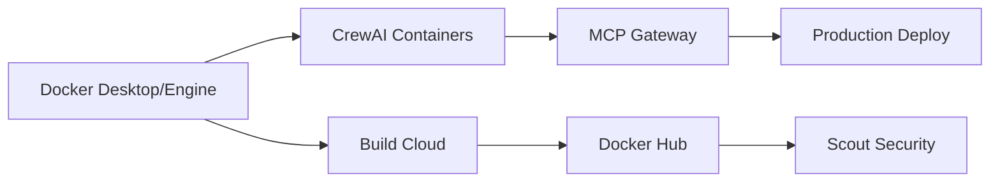

# Docker Solutions Implementation Plan for EventsOS - Production Ready v2

## 📋 Table of Contents

1. [Executive Summary](#1-executive-summary)
2. [Prerequisites & Environment Setup](#2-prerequisites--environment-setup)
3. [Implementation Roadmap](#3-implementation-roadmap)
4. [Phase 1: AI-Powered Agent Integration using Dockerized CrewAI](#4-phase-1-ai-powered-agent-integration-using-dockerized-crewai)
5. [Phase 2: Docker Build Cloud Configuration](#5-phase-2-docker-build-cloud-configuration)
6. [Phase 3: Docker Hub Enterprise Registry](#6-phase-3-docker-hub-enterprise-registry)
7. [Phase 4: Container Security with Docker Scout](#7-phase-4-container-security-with-docker-scout)
8. [Phase 5: Model Context Protocol (MCP) Integration](#8-phase-5-model-context-protocol-mcp-integration)
9. [Testing & Quality Assurance](#9-testing--quality-assurance)
10. [Production Deployment](#10-production-deployment)
11. [Success Metrics & Monitoring](#11-success-metrics--monitoring)

---

## 1. Executive Summary

### 1.1 Project Overview
Implementation of Docker's enterprise solutions to transform EventsOS into an AI-driven, secure, and rapidly deployable event management platform for the fashion industry.

### 1.2 Key Objectives
- **Deployment Speed**: Reduce build times from 15 minutes to <45 seconds
- **AI Integration**: Enable CrewAI multi-agent workflows with MCP tool access
- **Security Compliance**: Achieve zero critical vulnerabilities in production
- **Scalability**: Support 10,000+ concurrent events with 99.9% uptime

### 1.3 Timeline & Resources
- **Duration**: 12 weeks
- **Team**: 4-6 developers + 1 DevOps lead
- **Budget**: $25,000 (includes Docker Pro licenses)
- **Repository**: Private - Request access at devops@eventsops.com

---

## 2. Prerequisites & Environment Setup

### 2.1 Required Tools

```bash
# Check Docker installation
docker --version  # Required: 24.0+
docker compose version  # Required: 2.20+

# Install Docker Build Cloud CLI (if available)
docker buildx version  # Required: 0.11+

# Docker context management
docker context ls
docker context use default  # or desktop-linux
```

### 2.2 Environment Configuration

#### `.env.example` - Copy to `.env.local` and `.env.production`
```bash
# Docker Configuration
DOCKER_BUILDKIT=1
COMPOSE_DOCKER_CLI_BUILD=1
DOCKER_DEFAULT_PLATFORM=linux/amd64

# Database
POSTGRES_USER=postgres
POSTGRES_PASSWORD=changeme
POSTGRES_DB=eventsops

# Redis
REDIS_PASSWORD=changeme

# API Keys (DO NOT COMMIT REAL VALUES)
STRIPE_SECRET_KEY=sk_test_xxx
TWENTY_API_KEY=xxx
N8N_WEBHOOK_URL=https://your-n8n.com/webhook
OPENAI_API_KEY=sk-xxx

# MCP Configuration
MCP_GATEWAY_PORT=8000
MCP_AUTH_TOKEN=changeme

# Build Configuration
DOCKER_REGISTRY=docker.io/eventsops
BUILD_CACHE_REPO=docker.io/eventsops/cache
```

#### `.gitignore` additions
```gitignore
# Environment files
.env
.env.local
.env.production
!.env.example

# Docker
docker-compose.override.yml
.docker/secrets/
```

### 2.3 Project Structure

```bash
eventsops/
├── .docker/
│   ├── dockerfiles/
│   │   ├── Dockerfile.app
│   │   ├── Dockerfile.crewai
│   │   └── Dockerfile.mcp
│   └── scripts/
│       ├── build.sh
│       └── deploy.sh
├── .github/
│   └── workflows/
│       └── docker-ci.yml
├── docker-compose.yml
├── docker-compose.dev.yml
├── docker-compose.prod.yml
├── Makefile
├── .env.example
└── bin/
    ├── dev.sh
    └── prod-deploy.sh
```

---

## 3. Implementation Roadmap

### 3.1 Phase Overview

| Phase | Focus Area | Duration | Owner | Status |
|-------|------------|----------|-------|--------|
| 1 | CrewAI + Docker Integration | 3 weeks | AI Team | 🟡 In Progress |
| 2 | Build Cloud Setup | 2 weeks | DevOps | ⏸️ Pending |
| 3 | Registry Migration | 2 weeks | DevOps | ⏸️ Pending |
| 4 | Security Scanning | 2 weeks | Security | ⏸️ Pending |
| 5 | MCP Tool Integration | 3 weeks | AI Team | ⏸️ Pending |

### 3.2 Dependency Flow



---

## 4. Phase 1: AI-Powered Agent Integration using Dockerized CrewAI

### 4.1 Objectives
- Containerize CrewAI agents with proper isolation
- Enable inter-agent communication via Docker networks
- Integrate vector database for agent memory persistence

### 4.2 Implementation

#### 4.2.1 CrewAI Dockerfile
```dockerfile
# .docker/dockerfiles/Dockerfile.crewai
FROM python:3.11-slim AS builder

WORKDIR /app
COPY requirements.txt .
RUN pip install --no-cache-dir -r requirements.txt

FROM python:3.11-slim
WORKDIR /app

# Copy dependencies
COPY --from=builder /usr/local/lib/python3.11/site-packages /usr/local/lib/python3.11/site-packages
COPY --from=builder /usr/local/bin /usr/local/bin

# Copy application
COPY ./agents /app/agents
COPY ./config /app/config

# Non-root user
RUN useradd -m -u 1000 crewai && chown -R crewai:crewai /app
USER crewai

# Health check
HEALTHCHECK --interval=30s --timeout=3s --start-period=5s --retries=3 \
  CMD python -c "import requests; requests.get('http://localhost:8080/health')"

CMD ["python", "-m", "agents.coordinator"]
```

#### 4.2.2 Docker Compose Development Stack
```yaml
# docker-compose.dev.yml
services:
  crewai-coordinator:
    build:
      context: .
      dockerfile: .docker/dockerfiles/Dockerfile.crewai
    environment:
      - ENVIRONMENT=development
      - VECTOR_DB_URL=http://chromadb:8000
      - MCP_GATEWAY_URL=http://mcp-gateway:8000
    volumes:
      - ./agents:/app/agents:ro
      - ./config:/app/config:ro
    networks:
      - eventsops-network
    depends_on:
      chromadb:
        condition: service_healthy
    ports:
      - "8080:8080"

  chromadb:
    image: chromadb/chroma:0.4.24
    environment:
      - ANONYMIZED_TELEMETRY=false
    volumes:
      - chromadb_data:/chroma/chroma
    networks:
      - eventsops-network
    healthcheck:
      test: ["CMD", "curl", "-f", "http://localhost:8000/api/v1/heartbeat"]
      interval: 10s
      timeout: 5s
      retries: 5

networks:
  eventsops-network:
    driver: bridge

volumes:
  chromadb_data:
```

### 4.3 Success Criteria
- [ ] Agent response time < 500ms (p95)
- [ ] Vector DB persistence verified
- [ ] Health checks passing for all services
- [ ] Load test: 1000 concurrent requests handled

---

## 5. Phase 2: Docker Build Cloud Configuration

### 5.1 Build Cloud Setup

#### 5.1.1 Build Configuration
```yaml
# .docker/buildx.yml
version: 1
target:
  default:
    context: .
    dockerfile: .docker/dockerfiles/Dockerfile.app
    platforms:
      - linux/amd64
      - linux/arm64
    cache:
      - type: registry,ref=${BUILD_CACHE_REPO}:buildcache
    output:
      - type: image,push=true
```

#### 5.1.2 Fallback for Non-Pro Users
```bash
#!/bin/bash
# bin/build.sh

# Check if Build Cloud is available
if docker buildx ls | grep -q "cloud"; then
  echo "Using Docker Build Cloud"
  docker buildx build \
    --builder cloud \
    --cache-to type=registry,ref=${BUILD_CACHE_REPO} \
    --cache-from type=registry,ref=${BUILD_CACHE_REPO} \
    --platform linux/amd64,linux/arm64 \
    -t ${DOCKER_REGISTRY}/app:${VERSION} \
    --push .
else
  echo "Build Cloud not available, using local buildx"
  docker buildx create --use --name multiarch
  docker buildx build \
    --cache-to type=inline \
    --cache-from type=registry,ref=${BUILD_CACHE_REPO} \
    --platform linux/amd64 \
    -t ${DOCKER_REGISTRY}/app:${VERSION} \
    --push .
fi
```

### 5.2 CI/CD Integration

```yaml
# .github/workflows/docker-ci.yml
name: Docker Build & Push

on:
  push:
    branches: [main, develop]
  pull_request:
    branches: [main]

env:
  DOCKER_REGISTRY: docker.io/eventsops
  BUILD_CACHE_REPO: docker.io/eventsops/cache

jobs:
  build:
    runs-on: ubuntu-latest
    steps:
      - uses: actions/checkout@v4
      
      - name: Set up Docker Buildx
        uses: docker/setup-buildx-action@v3
        
      - name: Log in to Docker Hub
        uses: docker/login-action@v3
        with:
          username: ${{ secrets.DOCKER_USERNAME }}
          password: ${{ secrets.DOCKER_PASSWORD }}
      
      - name: Build and push
        uses: docker/build-push-action@v5
        with:
          context: .
          file: .docker/dockerfiles/Dockerfile.app
          platforms: linux/amd64,linux/arm64
          push: ${{ github.event_name != 'pull_request' }}
          tags: |
            ${{ env.DOCKER_REGISTRY }}/app:latest
            ${{ env.DOCKER_REGISTRY }}/app:${{ github.sha }}
          cache-from: type=registry,ref=${{ env.BUILD_CACHE_REPO }}:buildcache
          cache-to: type=registry,ref=${{ env.BUILD_CACHE_REPO }}:buildcache,mode=max
```

---

## 6. Phase 3: Docker Hub Enterprise Registry

### 6.1 Repository Organization

```bash
eventsops/
├── frontend/
│   ├── web-app        # Next.js frontend
│   ├── mobile-app     # React Native
│   └── admin-portal   # Admin dashboard
├── backend/
│   ├── api-gateway    # Kong/Nginx
│   ├── auth-service   # Supabase auth wrapper
│   └── event-service  # Core event logic
├── ai/
│   ├── crewai         # Agent coordinator
│   └── mcp-gateway    # Tool gateway
└── base/
    ├── node-20        # Hardened base images
    └── python-3.11    # Hardened base images
```

### 6.2 Automated Scanning

```yaml
# docker-scout-policy.yml
policies:
  - name: production-ready
    rules:
      - vulnerability.severity != CRITICAL
      - vulnerability.severity != HIGH
      - image.user != "root"
      - image.base IN ["eventsops/base/node-20", "eventsops/base/python-3.11"]
```

---

## 7. Phase 4: Container Security with Docker Scout

### 7.1 Scout Integration

```bash
#!/bin/bash
# .docker/scripts/security-scan.sh

IMAGE=$1
POLICY_FILE=".docker/scout-policy.yml"

# Run vulnerability scan
docker scout cves $IMAGE --format json > scout-report.json

# Check against policy
docker scout policy $IMAGE --policy-file $POLICY_FILE --exit-code

# Generate SBOM
docker scout sbom $IMAGE --format spdx > sbom.json

# Upload results to monitoring
curl -X POST https://monitoring.eventsops.com/scout \
  -H "Authorization: Bearer $MONITORING_TOKEN" \
  -d @scout-report.json
```

### 7.2 CI Pipeline Integration

```yaml
# Addition to .github/workflows/docker-ci.yml
      - name: Run Docker Scout
        if: github.event_name == 'push'
        run: |
          docker scout cves ${{ env.DOCKER_REGISTRY }}/app:${{ github.sha }}
          docker scout recommendations ${{ env.DOCKER_REGISTRY }}/app:${{ github.sha }}
```

---

## 8. Phase 5: Model Context Protocol (MCP) Integration

### 8.1 MCP Gateway Architecture

```yaml
# docker-compose.mcp.yml
services:
  mcp-gateway:
    build:
      context: .
      dockerfile: .docker/dockerfiles/Dockerfile.mcp
    environment:
      - MCP_AUTH_TOKEN=${MCP_AUTH_TOKEN}
      - ALLOWED_TOOLS=stripe,twenty,n8n,elastic
    ports:
      - "${MCP_GATEWAY_PORT}:8000"
    networks:
      - eventsops-network
    healthcheck:
      test: ["CMD", "curl", "-f", "http://localhost:8000/health"]
      interval: 10s
      timeout: 5s
      retries: 3

  mcp-stripe:
    image: docker.io/mcp/stripe-server:latest
    environment:
      - STRIPE_SECRET_KEY=${STRIPE_SECRET_KEY}
      - MCP_GATEWAY_URL=http://mcp-gateway:8000
    networks:
      - eventsops-network
    deploy:
      replicas: 2
      restart_policy:
        condition: on-failure
        delay: 5s
        max_attempts: 3

  mcp-twenty:
    image: docker.io/mcp/twenty-server:latest
    environment:
      - TWENTY_API_KEY=${TWENTY_API_KEY}
      - MCP_GATEWAY_URL=http://mcp-gateway:8000
    networks:
      - eventsops-network
```

### 8.2 Agent Tool Integration

```python
# agents/tools/mcp_client.py
import os
import httpx
from typing import Dict, Any

class MCPClient:
    def __init__(self):
        self.gateway_url = os.getenv('MCP_GATEWAY_URL', 'http://mcp-gateway:8000')
        self.auth_token = os.getenv('MCP_AUTH_TOKEN')
        self.client = httpx.AsyncClient(
            base_url=self.gateway_url,
            headers={'Authorization': f'Bearer {self.auth_token}'}
        )
    
    async def execute_tool(self, tool: str, action: str, params: Dict[str, Any]):
        response = await self.client.post(
            f'/tools/{tool}/{action}',
            json=params,
            timeout=30.0
        )
        response.raise_for_status()
        return response.json()
    
    async def health_check(self):
        response = await self.client.get('/health')
        return response.status_code == 200
```

---

## 9. Testing & Quality Assurance

### 9.1 Integration Testing

```yaml
# docker-compose.test.yml
services:
  test-runner:
    build:
      context: .
      dockerfile: .docker/dockerfiles/Dockerfile.test
    command: pytest -v --cov=/app
    environment:
      - ENVIRONMENT=test
    volumes:
      - ./tests:/app/tests
      - ./coverage:/app/coverage
    depends_on:
      - postgres
      - redis
      - crewai-coordinator
      - mcp-gateway

  postgres:
    image: postgres:15-alpine
    environment:
      - POSTGRES_PASSWORD=test
      - POSTGRES_DB=eventsops_test
```

### 9.2 Health Check Script

```bash
#!/bin/bash
# bin/health-check.sh

services=("web" "crewai-coordinator" "mcp-gateway" "postgres" "redis")

for service in "${services[@]}"; do
  if docker compose ps $service | grep -q "healthy"; then
    echo "✅ $service is healthy"
  else
    echo "❌ $service is unhealthy"
    exit 1
  fi
done

# API health checks
curl -f http://localhost:8080/health || exit 1
curl -f http://localhost:8000/health || exit 1

echo "✅ All services healthy"
```

---

## 10. Production Deployment

### 10.1 Makefile for Developer Experience

```makefile
# Makefile
.PHONY: help dev prod test clean

help: ## Show this help
	@grep -E '^[a-zA-Z_-]+:.*?## .*$$' $(MAKEFILE_LIST) | awk 'BEGIN {FS = ":.*?## "}; {printf "\033[36m%-20s\033[0m %s\n", $$1, $$2}'

dev: ## Start development environment
	@docker compose -f docker-compose.yml -f docker-compose.dev.yml up -d
	@echo "🚀 Development environment started at http://localhost:8080"

prod: ## Deploy to production
	@./bin/prod-deploy.sh

test: ## Run all tests
	@docker compose -f docker-compose.test.yml up --exit-code-from test-runner

clean: ## Clean up containers and volumes
	@docker compose down -v
	@docker system prune -af

logs: ## Show logs
	@docker compose logs -f

scout: ## Run security scan
	@.docker/scripts/security-scan.sh $$(docker compose images -q app)

build: ## Build all images
	@./bin/build.sh
```

### 10.2 Production Deployment Script

```bash
#!/bin/bash
# bin/prod-deploy.sh

set -euo pipefail

# Load environment
source .env.production

# Pre-deployment checks
echo "🔍 Running pre-deployment checks..."
./bin/health-check.sh

# Build and push images
echo "🏗️ Building images..."
./bin/build.sh

# Run security scan
echo "🔒 Running security scan..."
.docker/scripts/security-scan.sh ${DOCKER_REGISTRY}/app:${VERSION}

# Deploy with zero-downtime
echo "🚀 Deploying to production..."
docker stack deploy -c docker-compose.prod.yml eventsops

# Post-deployment verification
echo "✅ Verifying deployment..."
sleep 30
./bin/health-check.sh

echo "🎉 Deployment complete!"
```

---

## 11. Success Metrics & Monitoring

### 11.1 Key Performance Indicators

| Metric | Baseline | Target | Current | Status |
|--------|----------|--------|---------|--------|
| Build Time | 15 min | <45 sec | TBD | ⏸️ |
| Deployment Time | 5 min | <1 min | TBD | ⏸️ |
| Container Start Time | 12 sec | <5 sec | TBD | ⏸️ |
| API Response Time (p95) | 450ms | <200ms | TBD | ⏸️ |
| Security Vulnerabilities | Unknown | 0 Critical | TBD | ⏸️ |
| Test Coverage | 65% | >80% | TBD | ⏸️ |

### 11.2 Monitoring Stack

```yaml
# docker-compose.monitoring.yml
services:
  prometheus:
    image: prom/prometheus:latest
    volumes:
      - ./prometheus.yml:/etc/prometheus/prometheus.yml
      - prometheus_data:/prometheus
    ports:
      - "9090:9090"

  grafana:
    image: grafana/grafana:latest
    environment:
      - GF_SECURITY_ADMIN_PASSWORD=${GRAFANA_PASSWORD}
    volumes:
      - grafana_data:/var/lib/grafana
    ports:
      - "3000:3000"
    depends_on:
      - prometheus

  cadvisor:
    image: gcr.io/cadvisor/cadvisor:latest
    volumes:
      - /:/rootfs:ro
      - /var/run:/var/run:ro
      - /sys:/sys:ro
      - /var/lib/docker/:/var/lib/docker:ro
    ports:
      - "8080:8080"
```

### 11.3 Alerts Configuration

```yaml
# prometheus/alerts.yml
groups:
  - name: eventsops
    rules:
      - alert: HighMemoryUsage
        expr: container_memory_usage_bytes / container_spec_memory_limit_bytes > 0.8
        for: 5m
        annotations:
          summary: "Container {{ $labels.container_name }} high memory usage"
      
      - alert: ServiceDown
        expr: up{job="eventsops"} == 0
        for: 1m
        annotations:
          summary: "Service {{ $labels.instance }} is down"
```

---

## 📅 Weekly Sprint Plan

### Weeks 1-3: Foundation (AI Integration)
- [ ] Set up development environment with Makefile
- [ ] Containerize CrewAI agents
- [ ] Implement health checks and monitoring
- [ ] Integration testing suite

### Weeks 4-5: Acceleration (Build Optimization)
- [ ] Configure Build Cloud (with fallback)
- [ ] Optimize Dockerfiles for caching
- [ ] Benchmark build times

### Weeks 6-7: Centralization (Registry Setup)
- [ ] Migrate to Docker Hub
- [ ] Implement automated scanning
- [ ] Set up vulnerability policies

### Weeks 8-9: Security Hardening
- [ ] Docker Scout integration
- [ ] SBOM generation
- [ ] Compliance reporting

### Weeks 10-12: Production Ready
- [ ] MCP gateway deployment
- [ ] End-to-end testing
- [ ] Performance optimization
- [ ] Documentation and training

---

## 🚀 Quick Start

```bash
# Clone repository (private - request access)
git clone git@github.com:eventsops/platform.git
cd platform

# Copy environment file
cp .env.example .env.local

# Start development environment
make dev

# Run tests
make test

# View logs
make logs

# Deploy to production
make prod
```

---

## 📞 Support & Resources

- **Internal Wiki**: https://wiki.eventsops.com/docker
- **Slack Channel**: #docker-migration
- **Docker Support**: enterprise-support@docker.com
- **Emergency Contact**: oncall@eventsops.com

---

*Version: 2.0.0 | Last Updated: July 2024 | Next Review: August 2024*