 🧩 Mermaid Diagrams: CopilotKit + CrewAI Event System

## System Architecture Overview

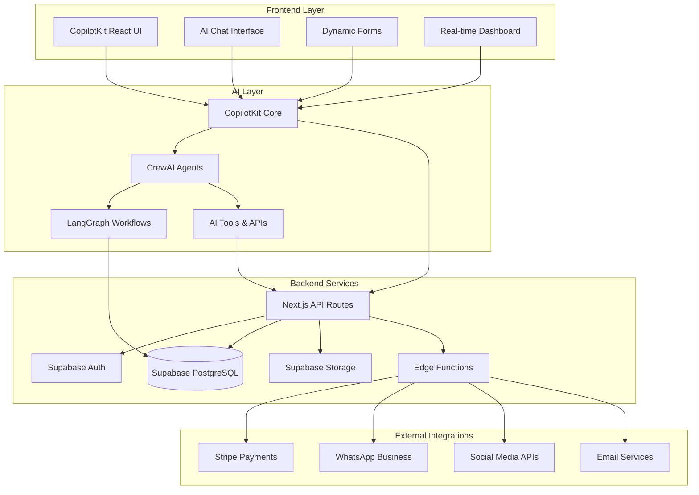

## Multi-Agent Crew Architecture

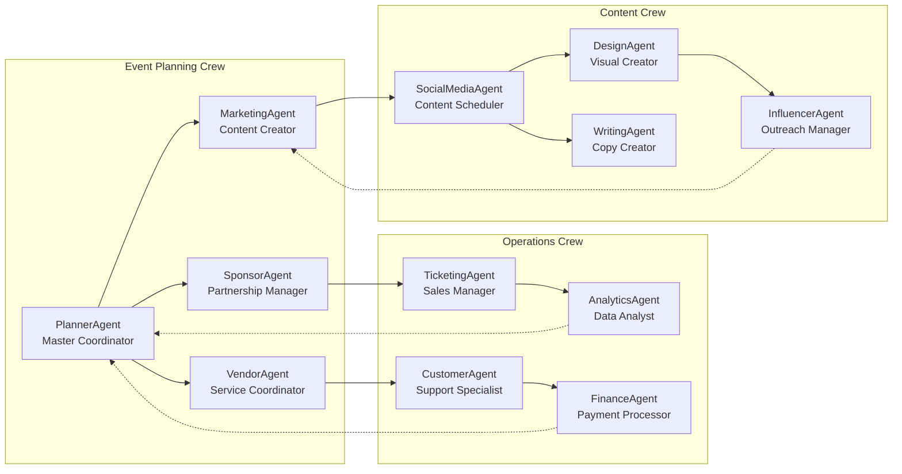

## Event Creation Workflow

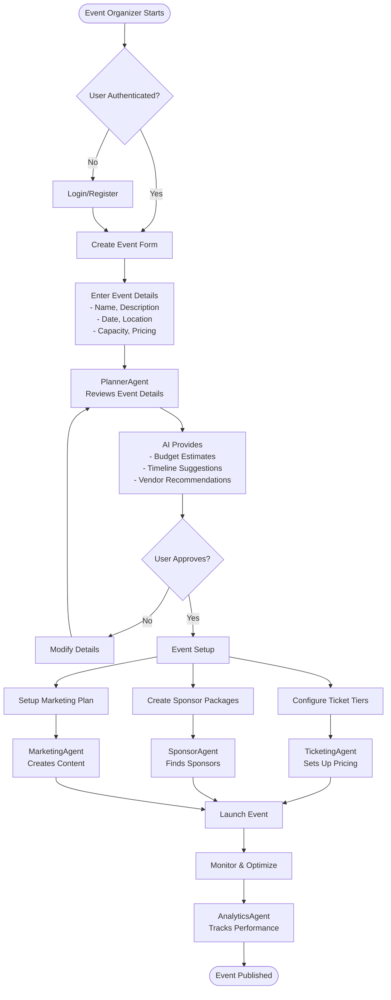

## Sponsor Discovery & Outreach Flow

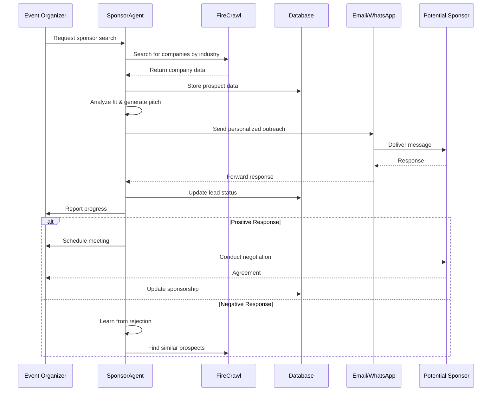

## Dynamic Pricing Algorithm

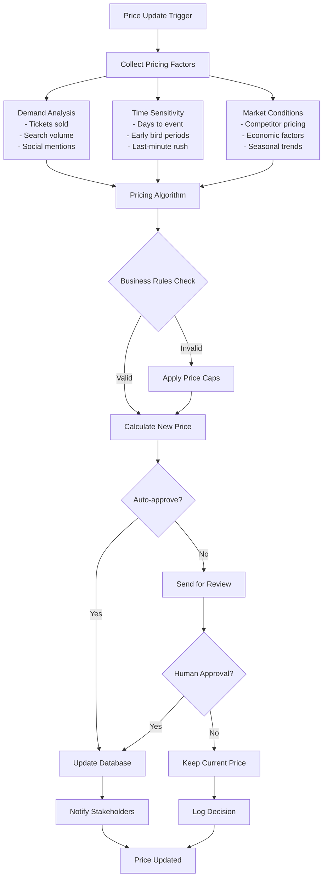

## Content Generation & Social Media Pipeline

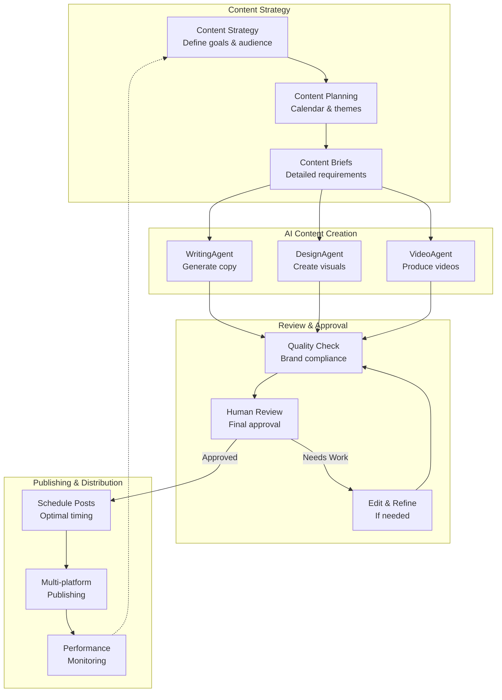

## Real-time Event Dashboard Data Flow

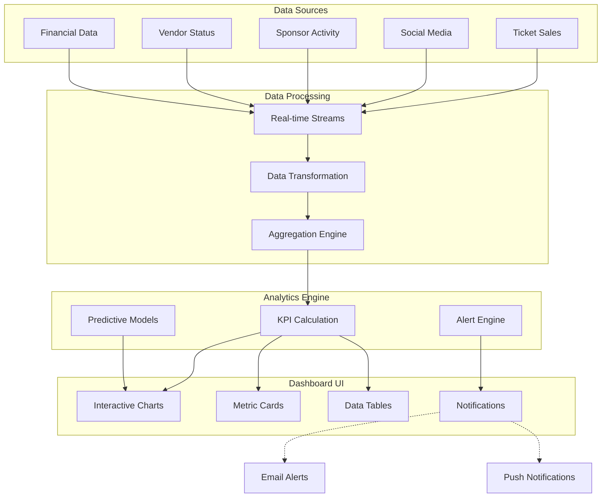

## Payment Processing Flow

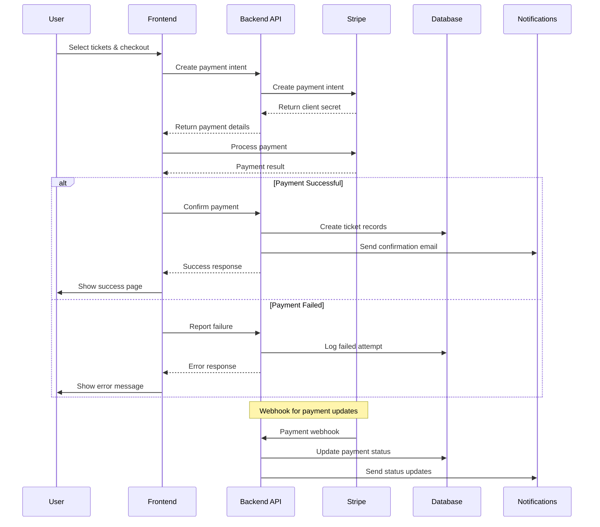

## Fashion Week Specific Workflow

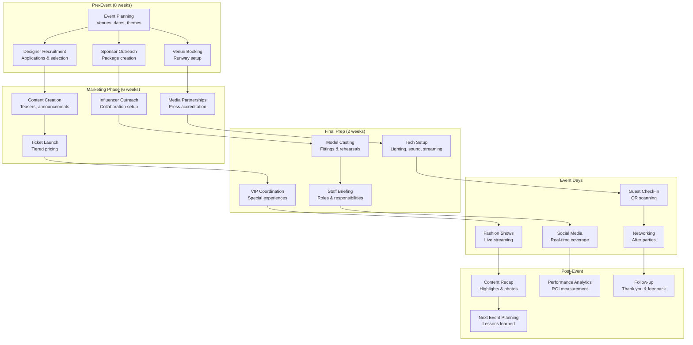

## Error Handling & Recovery Patterns

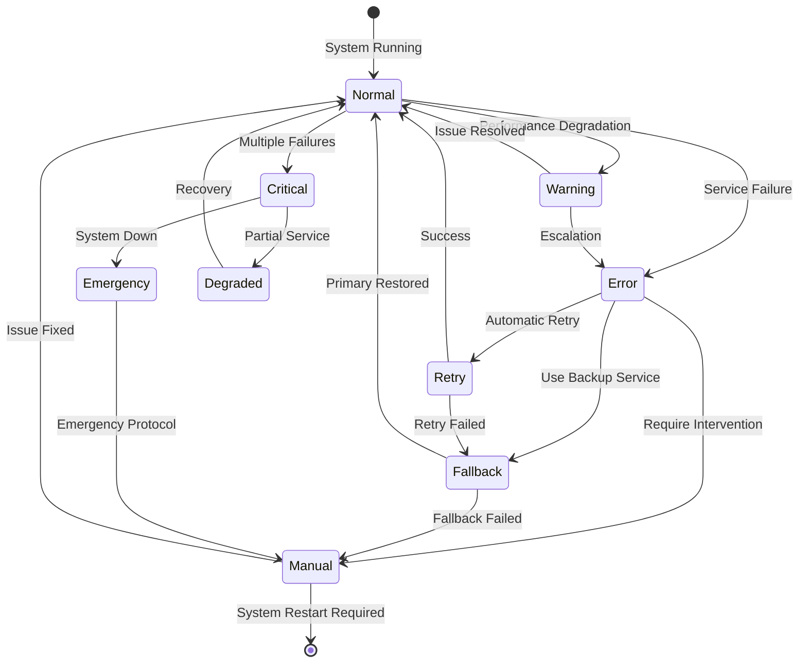

## Multi-Language Support Architecture

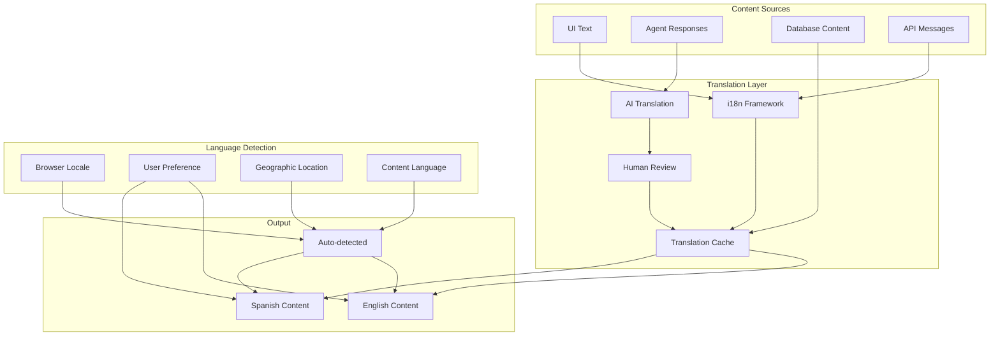

This comprehensive set of diagrams provides visual documentation for all major aspects of the CopilotKit + CrewAI event management system, from high-level architecture to specific workflows and error handling patterns.